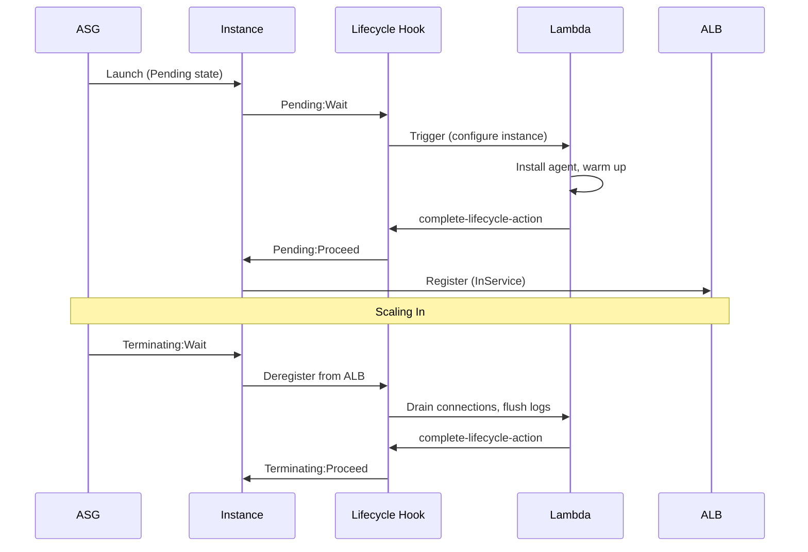

# Auto Scaling — Senior Interview Guide

## Core Concepts

### Launch Template vs Launch Configuration
| Feature | Launch Template | Launch Configuration |
|---------|----------------|---------------------|
| Versioning | ✅ Yes | ❌ No |
| Mixed instances | ✅ Yes | ❌ No |
| T2/T3 Unlimited | ✅ Yes | ❌ No |
| Instance refresh | ✅ Yes | ❌ No |
| Recommended | ✅ Current | ❌ Legacy |

### Scaling Policy Types

| Policy | Trigger | Response | Best For |
|--------|---------|---------|---------|
| Target Tracking | Metric deviates from target | Auto-adjusts | CPU/Request Count — simplest |
| Step Scaling | CloudWatch alarm breached | Add/remove N based on step | Fine-grained control |
| Simple Scaling | CloudWatch alarm | Add/remove N then wait cooldown | Legacy — avoid for new designs |
| Scheduled | Cron expression | Set desired/min/max | Predictable traffic patterns |
| Predictive | ML-based forecast | Pre-scales before spike | Recurring daily/weekly patterns |

### Scaling Flow with Lifecycle Hooks



### Cooldown vs Warm-Up
- **Cooldown** (Simple/Step Scaling): seconds ASG waits before another scaling activity — prevents thrashing
- **Instance Warm-up** (Target Tracking): time before new instance contributes metrics — prevents premature scale-out decisions
- Default cooldown: 300 seconds — often too long; tune based on your app startup time

### Warm Pools
- Pre-initialized instances in **Stopped** or **Running** state ready to join ASG quickly
- Reduces scale-out latency from minutes to seconds
- Cost: stopped instances pay for EBS only; running instances pay full EC2 cost
- Use when: app initialization takes >2 minutes (JVM warmup, large AMI)

---

## 🔥 Most Asked Senior Interview Questions

**Q1: What's the difference between desired capacity, minimum, and maximum?**
- Desired = current target; ASG maintains this count
- Min = never go below (even if scale-in); Max = never go above (even if scale-out)
- Changing desired directly does not change min/max
- **Trap**: "What happens if you set desired < min?" AWS clamps desired to min

**Q2: How does Target Tracking Scaling prevent thrashing?**
- Uses built-in scale-in cooldown (default 300s for scale-in, 0s for scale-out)
- Scale-out is aggressive (no cooldown); scale-in is conservative
- Does not scale in when metric has insufficient data
- **Trap**: "Can you use multiple Target Tracking policies?" Yes — ASG uses the one that results in higher capacity

**Q3: Explain the Lifecycle Hook timeout behavior**
- Default heartbeat timeout: 3600 seconds (1 hour)
- If Lambda doesn't respond, default action fires (CONTINUE or ABANDON)
- Extend with `RecordLifecycleActionHeartbeat` API call
- **Trap**: "What happens if lifecycle hook Lambda fails?" Instance gets stuck in Wait state until timeout; set DLQ on Lambda

**Q4: How do you handle a "thundering herd" when ASG triggers massive scale-out?**
- Pre-scale with Scheduled or Predictive scaling before expected spike
- Use Warm Pools to have pre-warmed instances ready
- Set step scaling with multiple steps (add 2 at 60%, add 5 at 80%, add 10 at 90%)
- **Follow-up**: "What if the spike is unexpected?" Predictive Scaling + aggressive step policy + Warm Pool is best combo

**Q5: Mixed Instance Policy — how do you configure Spot with On-Demand?**
```json
{
  "InstancesDistribution": {
    "OnDemandBaseCapacity": 2,
    "OnDemandPercentageAboveBaseCapacity": 20,
    "SpotAllocationStrategy": "capacity-optimized"
  },
  "LaunchTemplate": {
    "Overrides": [
      {"InstanceType": "m5.large"},
      {"InstanceType": "m5a.large"},
      {"InstanceType": "m4.large"}
    ]
  }
}
```
- `capacity-optimized`: picks Spot pool with most capacity — fewer interruptions (preferred over `lowest-price`)
- Always use 3+ instance types to reduce Spot interruption risk

**Q6: How does Instance Refresh work and when would you use it?**
- Performs rolling replacement of instances with new Launch Template version
- Respects `minHealthyPercentage` — waits for new instances to be healthy before replacing more
- `skipMatching`: skip instances already using the target template
- Use after: AMI updates, Launch Template changes, security patches
- **Trap**: "Does Instance Refresh replace instances one at a time?" No — replaces in batches based on `minHealthyPercentage`

**Q7: AZ Rebalancing — what triggers it and what are the risks?**
- ASG rebalances when AZ capacity is imbalanced (> threshold)
- **Risk**: launches new instance in under-capacity AZ *before* terminating in over-capacity AZ — brief capacity spike
- If MaxCapacity is tight, rebalancing can be blocked
- Can disable AZ rebalancing by removing AZs from ASG (not recommended) or setting `availabilityZoneRebalancing: disabled`

---

## 🧠 Scenario-Based Questions

**Scenario 1: API service that handles Black Friday traffic (10x normal)**
- Solution:
  1. Predictive Scaling enabled (learns weekly pattern)
  2. Warm Pool with 20% of normal capacity pre-warmed
  3. Step Scaling as safety net for unexpected spikes
  4. ALB slow start enabled (gradually ramp up to new instances)
  5. Target Tracking at 60% CPU (leaves headroom)
- Tradeoff: Predictive + Warm Pool adds cost (~10-15%) but prevents outages

**Scenario 2: You have a stateful app (in-memory session) in an ASG — scale-in is losing sessions**
- Problem: Terminating:Wait lifecycle hook not draining sessions
- Solution:
  1. Lifecycle hook on `autoscaling:EC2_INSTANCE_TERMINATING`
  2. Hook triggers Lambda: deregister from ALB, wait for connection drain (300s)
  3. Flush session to ElastiCache before CONTINUE
  4. Better long-term: move session to ElastiCache — make app stateless

---

## ⚠️ Real-world Failure Cases

**1. Flapping (repeated scale-out/scale-in)**
- Cause: cooldown too short; metric oscillates around threshold
- Fix: increase cooldown; use Target Tracking (has built-in dampening); tune metric threshold

**2. Instances stuck in Pending:Wait**
- Cause: Lifecycle hook Lambda failed / timed out
- Fix: set DLQ on Lambda; reduce heartbeat timeout; ensure Lambda has correct permissions

**3. ASG not scaling due to IAM limits**
- Cause: hit EC2 instance limit in account; ASG keeps trying but fails
- Fix: request limit increase in Service Quotas; set CloudWatch alarm on ASG `GroupTotalInstances` vs limit

**4. AZ imbalance after AZ failure**
- During AZ failure, ASG launches instances in remaining AZs
- After AZ recovery, rebalancing terminates newer instances in recovered AZ
- Fix: set AZ rebalancing to `disabled` or pre-accept the brief imbalance

---

## 💰 Cost Optimization

- **Spot via Mixed Instance Policy**: 60-80% cost savings for stateless workloads
- **Graviton instances**: add `m7g.large` to override list — 20% better price-performance
- **Scale-in aggressively**: don't keep idle instances; tune scale-in cooldown separately
- **Warm Pool state**: use Stopped (not Running) for Warm Pool — pay EBS only
- **Scheduled scaling**: scale in at night for predictable patterns

---

## 🔐 Security Considerations

- **Launch Template**: use versioned LT; never use LC (no version control)
- **IAM Instance Profile**: attach to ASG — instances get role automatically
- **SSM activation**: include SSM agent in AMI — no need for bastion/SSH
- **IMDSv2**: set `MetadataOptions.HttpTokens=required` in Launch Template
- **Golden AMI**: pre-bake security agents, patches into AMI — faster startup + known security posture

---

## ⚡ Quick Revision Bullets

- Launch Templates over Launch Configs — versioning, mixed instances, required for modern features
- Target Tracking = simplest, scale-in conservative; Step = fine-grained; Predictive = ML-based pre-scaling
- Lifecycle hooks pause launch/termination — use for bootstrap, drain, log flush
- Warm Pools = pre-initialized instances in Stopped state — fast scale-out
- `capacity-optimized` Spot strategy reduces interruptions over `lowest-price`
- Cooldown prevents thrashing; Instance Warm-up prevents false scale-out
- Instance Refresh = rolling replacement respecting minHealthyPercentage
