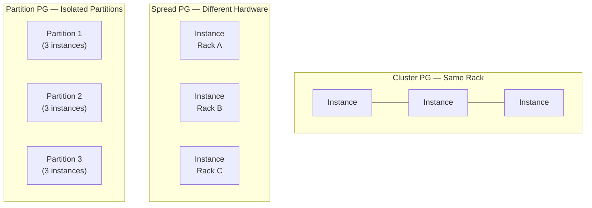

# EC2 — Senior Interview Guide

## Core Concepts

### Instance Families

| Family | Optimized For | Examples | Use Cases |
|--------|--------------|---------|-----------|
| M | General purpose | m6i, m7g | Web servers, app servers |
| C | Compute | c6i, c7g | HPC, batch, gaming |
| R | Memory | r6i, r7g | In-memory DB, SAP HANA |
| T | Burstable | t3, t4g | Dev/test, low-traffic web |
| G | GPU (graphics) | g4dn, g5 | ML inference, video encoding |
| P | GPU (ML) | p3, p4d | ML training |
| I | Storage IOPS | i3, i4i | High-IOPS NoSQL |
| D | Dense storage | d3 | Hadoop, data warehouse |
| Inf | ML inference | inf1, inf2 | Low-latency ML (Inferentia chip) |
| Trn | ML training | trn1 | Large model training (Trainium) |
| Hpc | HPC | hpc6a | Tightly-coupled HPC |

### Placement Groups



| Type | Max Instances | Network | Fault Domain | Use Case |
|------|--------------|---------|--------------|---------|
| Cluster | Unlimited | 10/25 Gbps, low latency | Single rack (high blast radius) | HPC, low-latency inter-node |
| Spread | 7 per AZ | Standard | Each on distinct hardware | Critical instances, HA |
| Partition | 7 partitions/AZ, unlimited instances | Standard | Partition-level isolation | Hadoop, Cassandra, Kafka |

### Instance Lifecycle
```
Pending → Running → Stopping → Stopped → Terminated
                 ↘ Rebooting ↗
                 ↘ Hibernating → Stopped (RAM preserved)
```

### Tenancy
- **Shared** (default): Multi-tenant hardware
- **Dedicated Instance**: Single-tenant hardware, may share with your other instances
- **Dedicated Host**: Physical server dedicated to you — needed for BYOL (Oracle, Windows Server)

---

## Purchasing Options

| Option | Commitment | Discount | Best For |
|--------|-----------|---------|---------|
| On-Demand | None | 0% | Unpredictable, short-term |
| Spot | None | Up to 90% | Fault-tolerant batch, CI/CD |
| Reserved (Standard) | 1 or 3 yr | Up to 72% | Steady-state workloads |
| Reserved (Convertible) | 1 or 3 yr | Up to 66% | Flexible instance type changes |
| Savings Plans (Compute) | 1 or 3 yr | Up to 66% | Most flexible — covers EC2, Lambda, Fargate |
| Savings Plans (EC2) | 1 or 3 yr | Up to 72% | Specific instance family |
| Dedicated Host | On-Demand or Reserved | BYOL savings | License compliance |

---

## 🔥 Most Asked Senior Interview Questions

**Q1: What happens when a Spot instance is interrupted mid-job?**
- AWS gives a 2-minute warning via instance metadata (`/latest/meta-data/spot/interruption-action`) and EventBridge
- You should checkpoint state to S3/EFS periodically
- Use Spot interruption handler (Lambda or DaemonSet in EKS) to drain gracefully
- **Follow-up trap**: "Can you configure the interruption action?" Yes — hibernate, stop, or terminate (only terminate for Spot Fleet by default)

**Q2: Dedicated Instance vs Dedicated Host — what's the difference?**
- Dedicated Instance: single-tenant hardware, AWS manages placement, no visibility into host
- Dedicated Host: you control the specific physical host, see sockets/cores, needed for per-socket BYOL licenses
- **Follow-up**: "When would you choose Dedicated Host over Dedicated Instance?" — Oracle/MSSQL BYOL, compliance requiring audit of physical host

**Q3: How does IMDSv2 improve security over IMDSv1?**
- IMDSv1: simple GET request — any process on the instance can call it (SSRF vulnerable)
- IMDSv2: session-oriented — requires a PUT to get a token first, then use token in subsequent GETs
- **Follow-up trap**: "Can you force IMDSv2?" Yes — set `HttpTokens=required` in instance metadata options or enforce via SCP
- Token TTL: 1 second to 6 hours

**Q4: Explain EC2 Enhanced Networking and when it matters**
- SR-IOV (Single Root I/O Virtualization): bypasses hypervisor for network I/O
- ENA (Elastic Network Adapter): up to 100 Gbps, available on most current instances
- EFA (Elastic Fabric Adapter): OS-bypass networking for HPC/MPI workloads — same latency as bare metal
- **Follow-up**: "What's the difference between ENA and EFA?" EFA adds libfabric OS-bypass, needed for tightly-coupled HPC

**Q5: How does EC2 hibernate work and what are its limitations?**
- RAM contents written to encrypted EBS root volume (must be encrypted)
- Instance retains its IP, instance ID, EBS volumes
- Limitations: max 150 GB RAM, instance uptime < 60 days, not all instance families supported
- **Trap**: "Does hibernate work with Spot?" Yes, but Spot can be interrupted — hibernation just preserves RAM to EBS

**Q6: What is CPU credit balance and how does it affect T-series instances?**
- T-series burstable: earn credits at baseline CPU, spend when bursting above baseline
- **Credit depletion**: instance throttled to baseline CPU (5% for t3.micro)
- T3 Unlimited mode: can burst indefinitely — charged for surplus credits at $0.05/vCPU-hour
- **Trap**: "What happens in Unlimited mode during sustained CPU?" You pay for it — can be more expensive than a fixed-performance M instance

**Q7: Cluster Placement Group — why can it cause launch failures?**
- AWS needs contiguous capacity on same physical rack
- Insufficient capacity error: AWS can't place all instances together
- Mitigation: use "stop and start" all instances in the group to trigger re-placement; or use multiple instance types
- **Trap**: "Can you mix instance families in a Cluster PG?" Yes but not recommended — different hardware generations may not achieve full bandwidth

**Q8: How do you achieve zero-downtime when replacing all instances in an ASG?**
- Instance Refresh with `minHealthyPercentage` (e.g., 90%)
- Instance Refresh uses rolling replacement respecting health checks
- Can specify `skipMatching: true` to skip already-updated instances
- Alternative: Blue/Green — new ASG with new launch template, swap ALB target group

---

## 🧠 Scenario-Based Questions

**Scenario 1: Your HPC job runs on 500 c5n.18xlarge instances and MPI communication is slow**
- Problem: likely network latency between instances
- Solution: Cluster Placement Group + EFA adapters
- All instances must be in same AZ; request capacity reservation first
- Tradeoff: single-AZ = single point of failure; accept for batch jobs

**Scenario 2: You run 1000 GPU instances for ML training at night only**
- Solution: Spot instances with EC2 Spot Fleet using `lowestPrice` allocation
- Use `checkpointing` to S3 every N minutes (PyTorch `torch.save`)
- Diversify across instance families (p3, p3dn, p4d) and AZs to reduce interruption risk
- Cost: ~10% of On-Demand for sustained Spot usage at night

**Scenario 3: You need to run a licensed Oracle DB on EC2 with per-socket licensing**
- Solution: Dedicated Host — Oracle licenses on per-physical-socket basis
- Choose host type with fewest sockets (e.g., 2-socket host)
- Use Host Resource Group with License Manager for compliance tracking
- Tradeoff: Dedicated Host costs more but Dedicated Instance doesn't satisfy per-socket BYOL

---

## ⚠️ Real-world Failure Cases

**1. Spot interruption during batch job**
- Detects: CloudWatch Events/EventBridge `EC2 Spot Instance Interruption Warning`
- Fix: implement checkpoint/resume; use SQS to requeue interrupted work units

**2. EBS volume not recovering after AZ failure**
- EBS is AZ-scoped; if AZ fails, EBS may be inaccessible
- Fix: run stateless instances; move state to S3/RDS/EFS which span AZs

**3. Instance launch failure in Cluster PG**
- Capacity constraint — AWS cannot fit all instances on same rack
- Fix: stop all instances → start all (forces re-evaluation); or delete/recreate PG; or split job

**4. IMDSv1 exploited via SSRF**
- Attacker sends HTTP request to 169.254.169.254 via SSRF vulnerability in app
- Steals IAM credentials from metadata
- Fix: enforce IMDSv2 (`HttpTokens=required`), restrict metadata hop limit to 1, use SCP

---

## 💰 Cost Optimization

- **Right-size first**: Use Compute Optimizer recommendations (analyzes 14 days of CloudWatch)
- **Savings Plans > RIs** for flexibility: Compute Savings Plans cover EC2, Fargate, Lambda
- **Spot for stateless workloads**: ASG with mixed instance policy, 20% On-Demand + 80% Spot
- **Graviton**: M7g/C7g/R7g give ~20% better price-performance than x86
- **Stop dev/test instances**: Lambda + EventBridge schedule to stop non-prod overnight
- **gp3 over gp2**: Same baseline IOPS cheaper, tunable without resizing

---

## 🔐 Security Considerations

- **IMDSv2 mandatory**: enforce via launch template or SCP `ec2:MetadataHttpTokens: required`
- **No public IPs** on application instances — use ALB + private subnets
- **Key pair rotation**: use SSM Session Manager instead of SSH key pairs — no port 22 needed
- **Security Groups**: stateful, least-privilege; avoid 0.0.0.0/0 ingress
- **NACLs**: stateless, subnet-level; use as backup defense layer
- **VPC endpoints**: don't route EC2→S3/STS traffic over internet NAT; use VPC endpoints

---

## ⚔️ EC2 vs Lambda vs ECS (When to Use What)

| Dimension | EC2 | Lambda | ECS Fargate |
|-----------|-----|--------|-------------|
| Max runtime | Unlimited | 15 min | Unlimited |
| Cold start | Slow (minutes) | ms to seconds | Seconds |
| Scaling speed | Minutes (ASG) | Immediate | ~30 seconds |
| State | Stateful OK | Stateless | Stateless |
| Cost model | Per-hour | Per-invocation | Per vCPU/memory-hour |
| Ops overhead | High | Very low | Low |

---

## ⚡ Quick Revision Bullets

- Cluster PG = low latency / high risk; Spread PG = max HA (7/AZ); Partition PG = big data
- IMDSv2 = PUT-then-GET token; enforce with `HttpTokens=required`
- Spot 2-min warning via metadata + EventBridge; checkpoint to S3
- Dedicated Host = per-socket BYOL; Dedicated Instance = single-tenant only
- T3 Unlimited = burst indefinitely but pay for surplus credits
- EFA = OS-bypass for HPC/MPI; ENA = SR-IOV enhanced networking
- Savings Plans > RIs for flexibility; Compute SP covers EC2+Lambda+Fargate
- Graviton3 = ~25% better perf/$ vs x86 for most workloads
