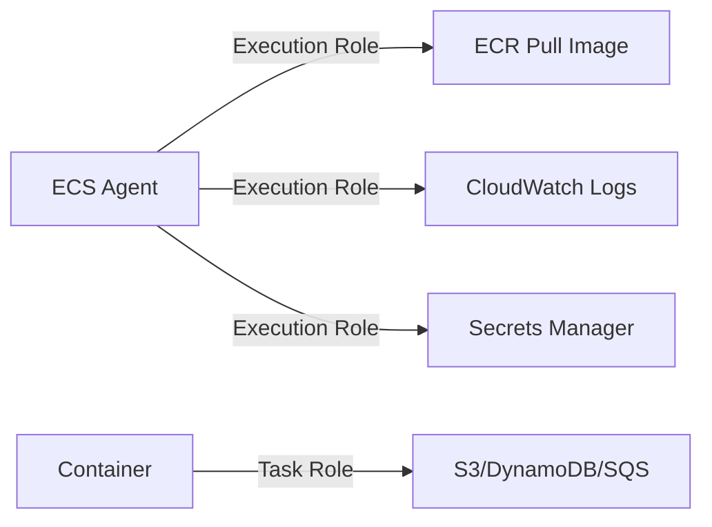
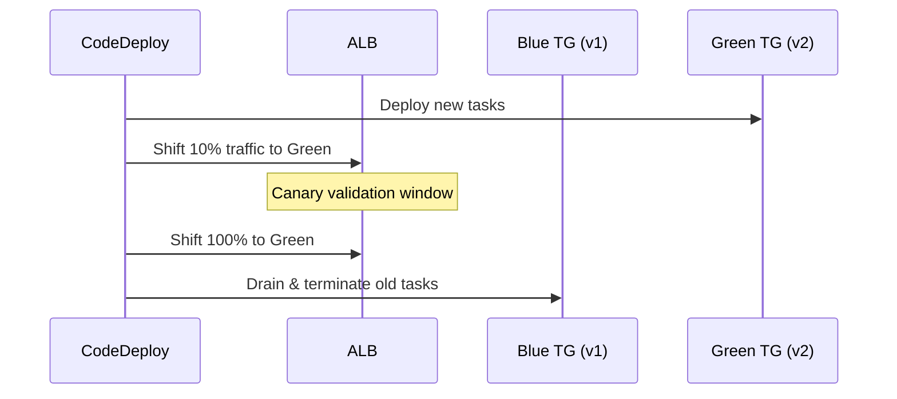

# ECS — Senior Interview Guide

## Core Concepts

- **Cluster**: logical grouping of tasks/services; can span AZs
- **Task Definition**: blueprint (Docker Compose-like) — image, CPU, memory, networking, IAM role
- **Task**: running instance of a task definition
- **Service**: maintains desired count of tasks; integrates with ALB; handles rolling deployments

### Fargate vs EC2 Launch Type

| Dimension | Fargate | EC2 |
|-----------|---------|-----|
| Server management | None | You patch/manage |
| Pricing | Per vCPU/memory-hour | EC2 instance + overhead |
| Scaling granularity | Per-task | Per-instance |
| Max task size | 16 vCPU, 120 GB | Instance size limit |
| GPU support | ❌ | ✅ |
| Windows containers | ✅ | ✅ |
| EFS support | ✅ | ✅ |
| Spot savings | Fargate Spot ~70% | EC2 Spot ~90% |
| Bin-packing efficiency | Lower | Higher |

### Task Role vs Execution Role
- **Task Role**: IAM role *the container code* uses (calls S3, DynamoDB, etc.)
- **Execution Role**: IAM role *ECS agent* uses to pull ECR image, send CloudWatch logs, get Secrets Manager values

---

## Service Discovery & Load Balancing

- **ALB**: path/host-based routing; dynamic port mapping (EC2); uses target group
- **NLB**: TCP/UDP; needed for non-HTTP or when static IP required
- **Cloud Map**: DNS-based service discovery (`service.namespace.local`)
- **ECS Service Connect**: built-in service mesh with Cloud Map — replaces some App Mesh use cases

---

## Deployment Strategies

| Strategy | Zero Downtime | Rollback Speed | ECS Support |
|----------|--------------|---------------|-------------|
| Rolling Update | ✅ | Slow (re-deploy) | Native |
| Blue/Green (CodeDeploy) | ✅ | Instant (swap back) | ✅ Fargate + EC2 |
| Canary | ✅ | Fast | Via CodeDeploy |

---

## ECS Anywhere

- Run ECS tasks on **on-premises** or **non-AWS** servers
- Install SSM Agent + ECS Anywhere agent on the server
- Use `EXTERNAL` launch type in task definitions
- Useful for: edge computing, data sovereignty, gradual cloud migration

---

## 🔥 Most Asked Senior Interview Questions

**Q1: How does ECS handle service health and replace unhealthy tasks?**
- ECS Service Scheduler watches task health via ALB health checks + ECS health checks
- Unhealthy task → stopped → new task launched to maintain `desiredCount`
- **Trap**: "What if tasks keep crash-looping?" ECS backs off (exponential) and raises `SERVICE_TASK_START_TIMEOUT` event — service stays degraded; need to fix the image

**Q2: How are secrets passed to ECS tasks securely?**
- Reference Secrets Manager or SSM Parameter Store in task definition `secrets` field
- ECS agent fetches at task startup using Execution Role — value injected as environment variable or file
- **Never** put secrets in environment variables directly in task definition
- **Trap**: "What if the secret rotates?" Task must restart to get new value (no live injection); use Secrets Manager with RDS rotation + connection retry in app code

**Q3: Explain ECS capacity provider and how it differs from just using an ASG**
- Capacity Provider links an ASG to ECS; enables managed scaling
- `FARGATE` and `FARGATE_SPOT` are built-in capacity providers
- Managed scaling: ECS calculates required EC2 capacity and signals ASG
- Capacity Provider Strategy: weighted blend of providers, e.g., 80% FARGATE_SPOT + 20% FARGATE
- **Trap**: "Can you have multiple capacity providers per cluster?" Yes — use strategy weights

**Q4: How does ECS networking differ between bridge, host, and awsvpc modes?**
| Mode | IP | Port mapping | Security Group | Use Case |
|------|----|----|------|------|
| bridge | Docker NAT | Dynamic host port | At EC2 level | Legacy |
| host | EC2 IP | Same as container | At EC2 level | Max network performance |
| awsvpc | Dedicated ENI per task | Container port = host port | Per-task SGs | **Recommended** — Fargate requires this |

- awsvpc = each task gets its own ENI = own private IP = SGs per task
- **Trap**: "What's the limit?" ENI limit per EC2 instance — use `vpc-lattice` or increase with trunk ENI

**Q5: How do you implement ECS task autoscaling?**
- Application Auto Scaling (separate from EC2 ASG)
- Target Tracking on: `ECSServiceAverageCPUUtilization`, `ECSServiceAverageMemoryUtilization`, `ALBRequestCountPerTarget`
- Step Scaling on custom CloudWatch metrics (queue depth, etc.)
- **Trap**: "Does ECS Service Auto Scaling also scale the underlying EC2 cluster?" No — you need ECS Capacity Provider with Managed Scaling for that

**Q6: What is the task placement strategy and constraint?**
- **Strategy**: `spread` (across AZ/instance), `binpack` (minimize instances), `random`
- **Constraint**: `distinctInstance` (each task on different EC2), `memberOf` (filter by attribute)
- Default: spread across AZs
- **Trap**: "Can you use placement strategies with Fargate?" No — Fargate manages placement; spread across AZs is automatic

**Q7: Explain sidecar pattern in ECS**
- Multiple containers in a task definition sharing same network/storage namespace
- Use cases: logging (Fluent Bit), proxy (Envoy), agents (Datadog), config sync
- `dependsOn`: control container startup order and health conditions
- **Essential** flag: if essential container exits, entire task stops

---

## 🧠 Scenario-Based Questions

**Scenario 1: Microservice that processes SQS messages needs to scale based on queue depth**
- Solution:
  1. ECS Service with Application Auto Scaling
  2. Custom CloudWatch metric: `ApproximateNumberOfMessagesVisible / RunningTaskCount`
  3. Target Tracking targeting 10 messages per task
  4. Fargate Spot for cost savings (stateless processing, retriable)
  5. SQS Dead Letter Queue for failed messages after 3 retries
- Tradeoff: Fargate Spot interruption → message back to SQS; ensure idempotency

**Scenario 2: Zero-downtime deployment for critical payment service on ECS**
- Solution:
  1. CodeDeploy Blue/Green with 10% canary shift
  2. CloudWatch alarms on error rate + latency wired to CodeDeploy
  3. Auto-rollback on alarm breach
  4. Bake time: 10 minutes before full traffic shift
  5. Use ALB access logs + X-Ray for deployment monitoring
- Tradeoff: double capacity cost during deployment window (brief)

---

## ⚠️ Real-world Failure Cases

**1. Tasks fail to start — ENI limit exhausted**
- Too many awsvpc tasks on a single EC2; hit ENI/IP limit
- Fix: use trunk ENI (ECS-managed) to increase per-instance task density; or scale EC2 cluster

**2. Image pull fails — ECR rate limiting or permissions**
- Execution Role missing `ecr:GetAuthorizationToken` or `ecr:BatchGetImage`
- Fix: correct execution role; use ECR in same region; VPC endpoint for ECR to avoid NAT costs

**3. Service stuck in rolling update — draining old tasks indefinitely**
- Cause: ALB deregistration delay too high (default 300s); or health check grace period mismatch
- Fix: reduce `deregistrationDelay` on target group to match actual connection drain time; tune `healthCheckGracePeriodSeconds`

**4. Secrets Manager throttling at scale**
- 10,000+ tasks starting simultaneously all call Secrets Manager
- Fix: use SSM Parameter Store (higher throughput); cache secrets in container init; or stagger task launches

---

## 💰 Cost Optimization

- **Fargate Spot**: 70% savings for stateless, retriable workloads
- **Capacity Provider with EC2**: better bin-packing than Fargate for compute-heavy workloads
- **Graviton (arm64)**: ECS supports multi-arch images; 20% cheaper on Fargate
- **Reduce over-provisioning**: use CloudWatch Container Insights to right-size task vCPU/memory
- **ECR lifecycle policies**: auto-delete old images to reduce storage costs

---

## 🔐 Security Considerations

- **Execution Role**: least-privilege — only ECR pull, CW logs, specific Secrets Manager ARNs
- **Task Role**: per-service roles; never use EC2 instance profile for container workloads
- **awsvpc mode**: enables per-task security groups — isolate frontend/backend tasks
- **ECR image scanning**: enable `scanOnPush`; Snyk/Trivy in CI pipeline
- **Read-only root filesystem**: set in task definition to prevent container escape
- **No `privileged` mode**: unless required for DaemonSet-style host access

---

## ⚔️ ECS vs EKS vs Lambda

| Dimension | ECS | EKS | Lambda |
|-----------|-----|-----|--------|
| Learning curve | Low | High (K8s) | Very low |
| Control plane cost | Free | $0.10/hr | Free |
| Ecosystem | AWS-native | K8s ecosystem | AWS-native |
| Multi-cloud | No | Yes (K8s) | No |
| Max task/function size | 16 vCPU 120GB | Node-limited | 10GB RAM, 6 vCPU |
| Runtime limit | Unlimited | Unlimited | 15 min |
| Service mesh | App Mesh / Service Connect | Istio / Linkerd | N/A |
| Best for | AWS-only microservices | K8s portability, large teams | Event-driven, short tasks |

---

## ⚡ Quick Revision Bullets

- Task Role = app permissions; Execution Role = ECS agent permissions (ECR, CW, Secrets)
- awsvpc mode = ENI per task = per-task SG = required for Fargate
- Capacity Providers link ASG to ECS managed scaling
- Blue/Green via CodeDeploy = instant rollback by re-swapping ALB target groups
- Fargate Spot = 70% savings; add restart logic + DLQ for safety
- ECS Anywhere = run tasks on-prem with EXTERNAL launch type
- Service Connect = built-in service discovery + metrics (replaces basic Cloud Map DNS)
