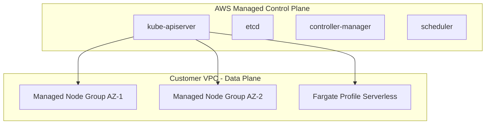
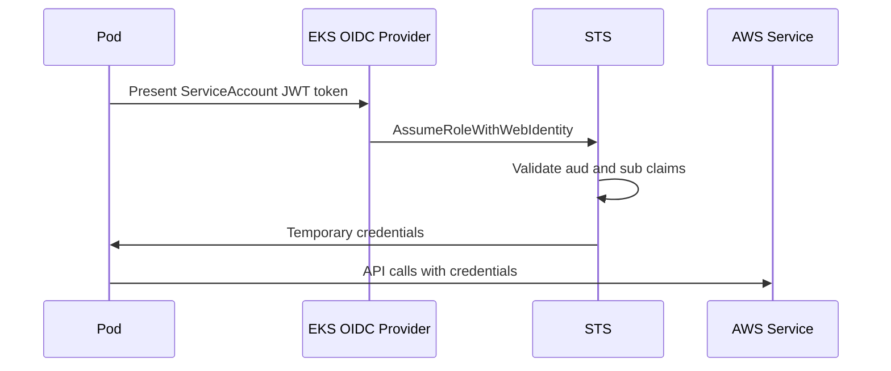

# EKS — Senior Interview Guide

## Core Concepts

### Architecture



### Node Options

| Type | Management | Spot Support | GPU | Best For |
|------|-----------|-------------|-----|---------|
| Managed Node Groups | AWS patches AMI | Yes | Yes | Standard workloads |
| Self-managed | You manage | Yes | Yes | Custom AMI, specialized config |
| Fargate | Serverless | No | No | Burst, isolation, no cluster mgmt |
| Karpenter | Auto-provisioning | Yes | Yes | Dynamic, cost-optimized |

---

## Networking: VPC CNI

- **AWS VPC CNI**: each pod gets a real VPC IP (ENI secondary IP)
- **Prefix delegation**: `/28` prefix per ENI slot = 16 IPs per slot = more pods per node
- **Security Groups for Pods**: assign SG directly to pods (requires VPC CNI branch ENI)
- **Custom networking**: pods use secondary ENI subnet (different CIDR from node)

**Max pods per instance** = (ENIs x IPs per ENI) - 1
With prefix delegation: (ENIs x 16) - 1

---

## IRSA — IAM Roles for Service Accounts



**Trust policy example:**
```json
{
  "Effect": "Allow",
  "Principal": {"Federated": "arn:aws:iam::ACCOUNT:oidc-provider/oidc.eks.REGION.amazonaws.com/id/OIDCID"},
  "Action": "sts:AssumeRoleWithWebIdentity",
  "Condition": {
    "StringEquals": {
      "oidc.eks.REGION.amazonaws.com/id/OIDCID:sub": "system:serviceaccount:NAMESPACE:SERVICE_ACCOUNT_NAME",
      "oidc.eks.REGION.amazonaws.com/id/OIDCID:aud": "sts.amazonaws.com"
    }
  }
}
```

---

## Cluster Autoscaler vs Karpenter

| Feature | Cluster Autoscaler | Karpenter |
|---------|-------------------|---------|
| Node provisioning | ASG-based | Direct EC2 API |
| Speed | 3-5 min | ~60 seconds |
| Instance diversity | Limited (one ASG per type) | Any EC2 type dynamically |
| Spot integration | Manual node groups | Native, diversified |
| Bin packing | Basic | Advanced (consolidation) |
| Recommendation | Legacy | Preferred for new clusters |

---

## EKS Add-ons

| Add-on | Purpose |
|--------|---------|
| VPC CNI | Pod networking |
| CoreDNS | Cluster DNS |
| kube-proxy | iptables/IPVS rules |
| EBS CSI Driver | EBS persistent volumes |
| EFS CSI Driver | EFS shared volumes |
| AWS Load Balancer Controller | ALB/NLB from K8s Ingress/Service |

---

## Multi-Tenant EKS Patterns

| Pattern | Isolation Level | Cost |
|---------|----------------|------|
| Namespace per tenant | Low (shared nodes) | Low |
| Node group per tenant | Medium (shared control plane) | Medium |
| Cluster per tenant | High (full isolation) | High |
| Fargate profile per tenant | High (no shared nodes) | Medium-High |

---

## Most Asked Senior Interview Questions

**Q1: How does EKS control plane differ from self-managed K8s?**
- EKS control plane is fully managed: HA across 3 AZs, automated etcd backups, version upgrades
- You do not have access to control plane nodes or etcd
- API server endpoint: can be private only, public only, or both
- **Trap**: "Who is responsible for patching worker nodes?" You are — use managed node groups for AWS to handle AMI updates

**Q2: Explain IRSA and why it's better than instance profiles**
- Instance profile: all pods on a node share the same IAM role — violates least privilege
- IRSA: per-pod IAM role via service account annotation and OIDC token projection
- Token is time-bound (1hr default) and audience-scoped
- **Trap**: "What if OIDC provider is deleted?" All IRSA stops working

**Q3: How does the AWS Load Balancer Controller work?**
- Kubernetes controller watches Ingress objects and creates ALBs
- Watches Service of type LoadBalancer and creates NLBs
- Uses pod IPs directly in ALB target groups (IP mode) — no kube-proxy overhead

**Q4: EKS upgrade strategy — how do you upgrade without downtime?**
1. Upgrade control plane first (automated, usually 10 min, no downtime)
2. Upgrade managed node groups: rolling replacement
3. Upgrade add-ons after node upgrade
4. **Trap**: "Can you skip minor versions?" No — must upgrade sequentially

**Q5: CoreDNS ndots issue — explain and fix**
- Default `ndots:5` causes every DNS lookup to try 5 search domains first
- Results in 5x DNS queries = CoreDNS overload at scale
- Fix: set `ndots: 2` in pod dnsConfig; or deploy NodeLocal DNSCache

**Q6: How do you implement pod security in EKS?**
- **Pod Security Admission (PSA)**: built-in since K8s 1.25; restricted, baseline, privileged modes
- **OPA Gatekeeper**: custom admission policies
- **Trap**: "What replaced PodSecurityPolicy?" PSA replaced PSP in K8s 1.25

**Q7: How does Fargate work with EKS vs EC2 nodes?**
- Fargate profile: namespace/label selector determines which pods run on Fargate
- Each pod = dedicated micro-VM; no shared nodes
- No DaemonSets on Fargate; no GPU; no privileged
- **Trap**: "Can you run a DaemonSet on Fargate?" No

**Q8: Cluster networking troubleshooting approach**
1. DNS? (`kubectl exec -it pod -- nslookup kubernetes.default`)
2. CNI? Check VPC CNI logs, ENI attachment, IP exhaustion
3. Network Policy blocking?
4. Security Group blocking?
5. kube-proxy iptables rules?

---

## Scenario-Based Questions

**Scenario 1: EKS cluster for multi-tenant SaaS, 50 tenants, strict isolation**
- Option A: Namespace per tenant + Network Policies + Resource Quotas + OPA (cost-effective, weaker isolation)
- Option B: Fargate profile per tenant namespace (no shared nodes, more expensive)
- Option C: Separate node groups per tenant with taints/tolerations (strongest isolation, highest cost)
- Recommended: Option B for regulated tenants; Option A for standard

**Scenario 2: EKS costs are 3x higher than expected**
- Investigation: over-provisioned ASGs, no Spot, Cluster Autoscaler not consolidating
- Solution: Karpenter with WhenUnderutilized consolidation + Spot + Graviton + VPA right-sizing
- Expected result: 50-60% cost reduction

---

## Real-world Failure Cases

**1. Pod IP exhaustion**
- Cause: ran out of VPC IPs
- Fix: enable prefix delegation; add subnet with larger CIDR

**2. IRSA stopped working after cluster recreation**
- Cause: OIDC provider ARN changed; role trust policies reference old ARN
- Fix: update trust policy in all IRSA roles

**3. Control plane upgrade caused API breakage**
- Cause: deprecated API version removed in newer K8s
- Fix: audit with `pluto` tool before upgrade; migrate manifests

**4. CoreDNS OOM kill under DNS storm**
- Fix: increase CoreDNS replicas; deploy NodeLocal DNSCache; fix ndots

---

## Cost Optimization

- Karpenter with Spot + consolidation: biggest savings lever (~50%)
- Graviton instances: 20% price-performance improvement
- Fargate only for burst; keep baseline on EC2
- Right-size with VPA recommendations
- Control plane: $0.10/hr/cluster — consolidate dev clusters overnight

---

## Security Considerations

- Private API endpoint: restrict publicAccessCidrs
- IRSA mandatory: no shared instance profiles for pods
- Pod Security Admission: restricted profile for production
- Network Policies: deny-all default
- Envelope encryption: enable KMS secret encryption
- Audit logs: enable EKS control plane logging to CloudWatch

---

## Quick Revision Bullets

- EKS control plane = AWS managed, HA across 3 AZs; you manage worker nodes
- VPC CNI = real VPC IPs for pods; prefix delegation = more pods per node
- IRSA = per-pod IAM via OIDC + service account; no shared instance profiles
- Karpenter > Cluster Autoscaler: faster, smarter, Spot-native
- Must upgrade K8s sequentially — no version skipping
- ndots:5 = DNS storm at scale; fix with NodeLocal DNSCache
- PSA replaced PodSecurityPolicy in K8s 1.25
- Fargate EKS = no DaemonSets, no GPU; good for isolation
