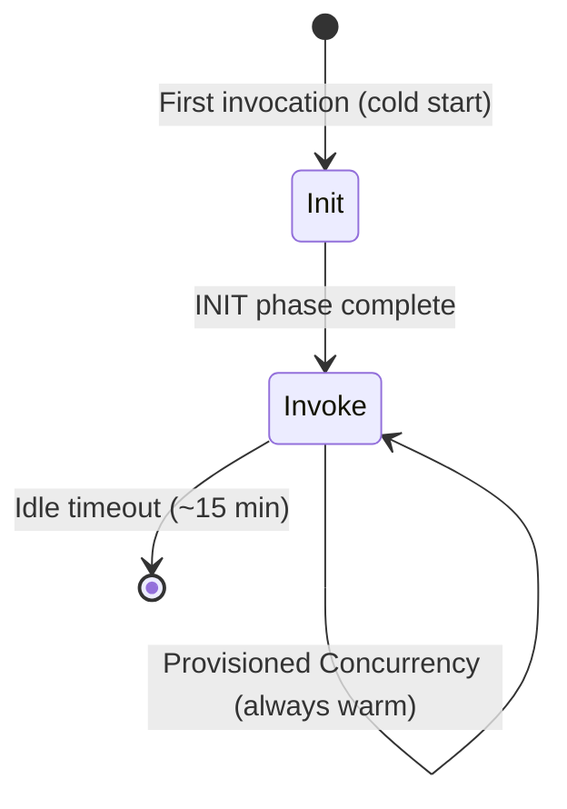
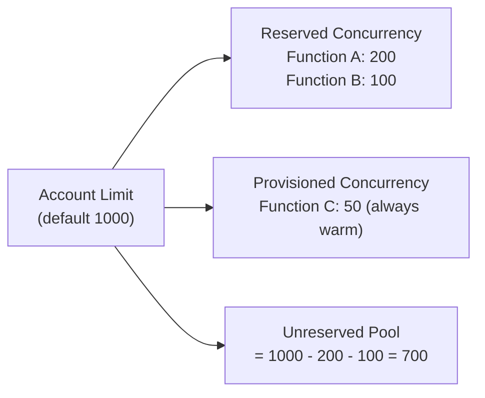
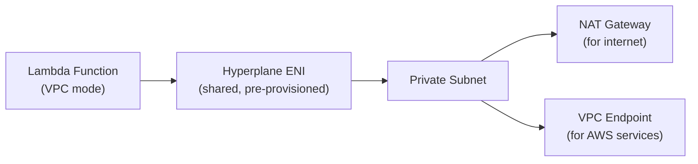

# Lambda — Senior Interview Guide

## Core Concepts

### Execution Model

- **Cold start**: Init phase = download code + start runtime + run INIT code (outside handler)
- **Warm start**: container reused, skip Init phase, run handler only
- **Provisioned Concurrency**: pre-initialized containers — eliminates cold start

### Cold Start Duration by Runtime

| Runtime | Typical Cold Start | Notes |
|---------|-------------------|-------|
| Python 3.x | 100-400ms | Fast init |
| Node.js 18/20 | 150-500ms | Fast |
| Java 17 (JVM) | 500ms-3s | JVM initialization heavy |
| Java 17 (SnapStart) | 10-200ms | Tiered compilation snapshot |
| Go | 100-300ms | Compiled binary |
| .NET 6 | 200-500ms | Moderate |
| Container image | 1-10s | Depends on image size |

### Concurrency

- **Reserved Concurrency**: hard cap on function; also guarantees capacity from pool
- **Provisioned Concurrency**: pre-warmed instances (costs money even when idle)
- **Burst limit**: initial 500-3000 (region-dependent), then +500/min

---

## Event Source Mappings

| Source | Trigger Type | Concurrency | Error Handling |
|--------|-------------|-------------|----------------|
| API Gateway | Push (sync) | 1 per request | Gateway returns error |
| SQS | Pull (async) | 1 per batch | Visibility timeout retry |
| Kinesis | Pull (async) | 1 per shard | Retry until success or discard |
| DynamoDB Streams | Pull (async) | 1 per shard | Same as Kinesis |
| S3 | Push (async) | Many parallel | DLQ for failures |
| EventBridge | Push (async) | Many parallel | DLQ for failures |
| Kafka/MSK | Pull (async) | 1 per partition | Like Kinesis |

### SQS Event Source — Critical Details
- Lambda polls SQS using **long polling**
- Batch size: 1-10,000 (standard), 1-10 (FIFO)
- **Partial batch failure**: use `ReportBatchItemFailures` response — only failed items return to queue
- Visibility timeout must be >= 6x Lambda timeout
- SQS DLQ is separate from Lambda DLQ

---

## Lambda Layers, Extensions, Destinations

- **Layers**: shared code/libraries; up to 5 layers; 250MB unzipped total
- **Extensions**: run alongside function (internal) or as separate process (external); for monitoring agents, secrets rotation
- **Destinations**: async invocation results → SNS, SQS, EventBridge, another Lambda
  - On Success destination + On Failure destination
  - Better than DLQ (includes full event context, not just failure)

---

## Lambda@Edge vs CloudFront Functions

| Feature | Lambda@Edge | CloudFront Functions |
|---------|------------|---------------------|
| Runtime | Node.js, Python | JavaScript (ES5.1) |
| Max execution time | 5s (viewer), 30s (origin) | 1ms |
| Max memory | 128MB-10GB | 2MB |
| Network access | Yes | No |
| Cost | Per invocation + duration | Per invocation (10x cheaper) |
| Use case | Auth, A/B, origin routing | Header manipulation, URL rewrites |
| Deployment | us-east-1 only, replicates | Per distribution |

---

## VPC Lambda — Hyperplane ENI Model

- Old model: dedicated ENI per Lambda instance = slow cold start (ENI provisioning 10-30s)
- **New Hyperplane model**: shared ENI per VPC+subnet+SG combination — cold start is just function init
- ENI is pre-provisioned when you attach VPC config, not per invocation
- **Trap**: Lambda in VPC needs NAT Gateway (or VPC endpoints) to reach internet/AWS services

---

## Most Asked Senior Interview Questions

**Q1: How do you eliminate Lambda cold starts for a latency-sensitive API?**
- Option 1: Provisioned Concurrency on the alias/version — keeps N instances warm
- Option 2: Lambda SnapStart (Java) — snapshot after init, restore from snapshot
- Option 3: Use a lighter runtime (Node.js/Python instead of Java)
- Option 4: Keep code outside handler to run once per container
- **Trap**: "Is Provisioned Concurrency free?" No — you pay per provisioned concurrency-hour even when idle

**Q2: SQS as Lambda trigger — what happens when Lambda fails processing?**
- Lambda throws error = messages become visible again after visibility timeout
- Retry indefinitely until success, message age expires, or max receive count reached
- After max receive count: moves to SQS DLQ
- **Partial batch failure**: without `ReportBatchItemFailures`, entire batch retries (duplicates for succeeded items)
- **Trap**: "Does Lambda DLQ and SQS DLQ serve the same purpose here?" No — they're different; SQS DLQ catches messages that exhausted retries; Lambda DLQ catches failures for async invocations (S3, SNS triggers)

**Q3: Explain Lambda concurrency and how to prevent throttling**
- Default account limit: 1000 concurrent executions (soft limit, can increase)
- Throttled invocations: 429 error (synchronous), retry behavior (asynchronous)
- Prevention:
  1. Set reserved concurrency on other functions to protect critical ones
  2. Request limit increase via Service Quotas
  3. Use SQS as buffer to smooth out traffic spikes
- **Trap**: "What is the effect of setting reserved concurrency to 0?" Disables the function (useful for emergency stop)

**Q4: How does Lambda handle Kinesis stream failures?**
- Lambda retries failed batches until they succeed or data expires (retention period)
- This can block shard processing indefinitely
- Solutions:
  1. `bisectBatchOnFunctionError: true` — splits batch to find bad record
  2. `maximumRetryAttempts` limit
  3. `destinationConfig.onFailure` → SQS/SNS DLQ
  4. `tumblingWindowInSeconds` for stateful stream processing

**Q5: Lambda function URL vs API Gateway — when to use each?**
| Feature | Function URL | API Gateway |
|---------|-------------|-------------|
| Cost | Free (Lambda pricing only) | $1-3.50/M requests |
| Auth | IAM or None | IAM, Cognito, Custom |
| Throttling | Account concurrency | 10K RPS default |
| Routing | Single function | Multi-route |
| CORS | Built-in | Configurable |
| Best for | Simple webhooks, single-function APIs | Complex APIs, auth, throttling |

**Q6: How do you manage Lambda environment variable secrets securely?**
- Never store plaintext secrets in env vars in function config
- Option 1: Secrets Manager in code (cache with TTL, rotate automatically)
- Option 2: SSM Parameter Store SecureString (cache with aws-parameters-and-secrets Lambda extension)
- Option 3: Reference Secrets Manager via env var + Lambda extension (no code change)
- **Trap**: "Are Lambda environment variables encrypted?" Yes, at rest with KMS (customer or AWS managed key)

**Q7: What is Lambda SnapStart and how does it work?**
- Available for Java 11+ corretto runtime
- Process: after first deployment, Lambda takes a snapshot of initialized execution environment (after INIT phase)
- Subsequent cold starts: restore from snapshot instead of running INIT phase
- Result: cold start reduced from 3s to ~200ms for typical Spring Boot apps
- **Limitation**: cannot use with Provisioned Concurrency simultaneously; snapshot is not refreshed on every invoke

**Q8: How do you implement fan-out with Lambda?**
- SNS → Lambda: parallel invocations, one per subscription
- EventBridge → multiple Lambda rules: event routing fan-out
- SQS → Lambda: sequential per queue; use multiple queues for parallel
- Lambda → async invoke multiple Lambdas: use async invocation or Step Functions
- **Trap**: "What if you need exactly-once fan-out?" Use SQS FIFO with deduplication

---

## Scenario-Based Questions

**Scenario 1: Lambda processing 10K events/sec from Kinesis — hot shard problem**
- Symptoms: some shards processing fast, others backing up; uneven partition key distribution
- Investigation: CloudWatch `IteratorAge` metric; check partition key cardinality
- Solution:
  1. Use high-cardinality partition keys (UUID, not user state)
  2. Enable enhanced fan-out if multiple consumers
  3. Increase shard count (reshard) for hot shards
  4. Use Lambda Kinesis parallelization factor (1-10 concurrent invocations per shard)

**Scenario 2: Serverless API with Java backend has 5s+ cold starts causing timeout**
- Root cause: JVM initialization + Spring context loading
- Solutions (in order of effectiveness):
  1. Lambda SnapStart (largest impact — reduces to ~200ms)
  2. Migrate to Quarkus/Micronaut (native compilation, no JVM warmup)
  3. Provisioned Concurrency (eliminates cold starts at cost)
  4. GraalVM native image in container runtime

**Scenario 3: Lambda costs unexpectedly high — investigation**
- Check: invocation count × duration × memory
- Common causes:
  1. Memory over-provisioned (use Lambda Power Tuning tool)
  2. Code making unnecessary API calls (check X-Ray traces)
  3. Long-polling overhead (Lambda calling SQS manually vs using ESM)
  4. VPC Lambda hitting NAT Gateway for S3 (use VPC endpoint instead — free)
  5. Recursive invocation bug (Lambda invoking itself)

---

## Real-world Failure Cases

**1. Lambda timeout causing data loss**
- 15-min max timeout hit during large S3 file processing
- Fix: split work into smaller chunks with S3 Event Notifications; use Step Functions for orchestration

**2. Concurrency limit reached — cascading failures**
- Burst of events exhausted account concurrency limit
- All functions throttled including critical payment processing
- Fix: set reserved concurrency on critical functions; use SQS buffer for non-critical

**3. VPC Lambda cold start regression**
- Migrated Lambda to VPC — cold starts jumped from 100ms to 20s
- Cause: ENI provisioning on every cold start (old ENI model)
- Fix: ensure Lambda runtime is using new Hyperplane model (upgrade runtime version); pre-provision by deploying and warming

**4. Circular invocation (infinite loop)**
- Lambda writes to S3 → S3 event triggers same Lambda → infinite loop
- Fix: use object key prefix/suffix filter in S3 event notification; write to different prefix; add idempotency check

---

## Cost Optimization

- **Lambda Power Tuning**: open-source tool that runs function at different memory levels to find optimal price-performance point
- **Provisioned Concurrency with Auto Scaling**: scale PC based on schedule (only pay during peak hours)
- **Arm64/Graviton2**: 20% cheaper and faster for most workloads — just change architecture setting
- **Optimize duration**: cache SDK clients outside handler; reduce package size; use layers
- **Reserved Concurrency**: prevents runaway Lambda costs (accidental infinite loops)
- **x86 → arm64 for Fargate/Lambda**: zero code change for most Python/Node apps

---

## Security Considerations

- **Least-privilege execution role**: only specific resources/actions needed
- **VPC for private resources**: Lambda accessing RDS must be in VPC; use security groups
- **No secrets in env vars**: use Secrets Manager extension or SSM
- **Resource-based policy**: control which services/accounts can invoke Lambda
- **Code signing**: ensure only signed packages are deployed (for compliance)
- **Runtime updates**: keep runtime current — deprecated runtimes stop receiving patches

---

## Lambda vs ECS vs EC2

| Dimension | Lambda | ECS Fargate | EC2 |
|-----------|--------|------------|-----|
| Max runtime | 15 min | Unlimited | Unlimited |
| Max memory | 10 GB | 120 GB | Instance limit |
| Cold start | ms-seconds | Seconds | Minutes |
| Pricing | Per invocation | Per vCPU-hour | Per instance-hour |
| Concurrency | Immediate scale | ~30s scale | ~5min scale |
| Operational overhead | Minimal | Low | High |
| Best for | Event-driven, short tasks | Long-running services | Stateful, custom OS |

---

## Quick Revision Bullets

- Cold start = INIT phase; warm start = skip INIT; Provisioned Concurrency = always warm
- SnapStart (Java) = snapshot after INIT, restore in ~200ms
- Reserved concurrency = hard cap; Provisioned concurrency = pre-warmed instances
- SQS: partial batch failure with `ReportBatchItemFailures` — only failed items retry
- Kinesis: iterator age metric for backlog; bisectBatchOnFunctionError for bad records
- Hyperplane ENI = shared ENI per VPC/subnet/SG combo — no per-invocation ENI provisioning
- Lambda@Edge = full runtime, 30s timeout; CloudFront Functions = 1ms, URL rewrites only
- VPC Lambda needs NAT or VPC endpoints for internet/AWS service access
- Arm64/Graviton = 20% cheaper — change one setting
