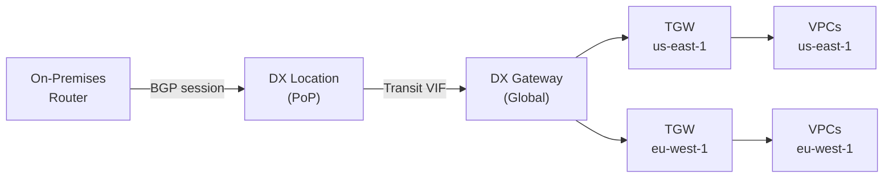
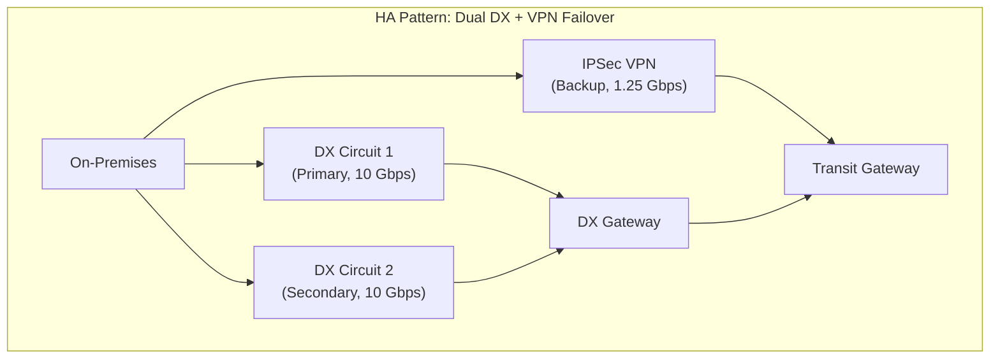

# Direct Connect — Senior Interview Guide

## Connection Types

| Type | Bandwidth | Provisioning | Physical |
|------|-----------|-------------|---------|
| Dedicated | 1, 10, 100 Gbps | Weeks (LOA-CFA process) | You own the port at DX location |
| Hosted | 50 Mbps - 10 Gbps | Faster (via APN partner) | Partner owns the port |

---

## Virtual Interfaces (VIFs)

| VIF Type | Connects To | Route Source | Use Case |
|----------|-------------|--------------|---------|
| Private VIF | VGW (attached to one VPC) | VPC CIDR | Single VPC private access |
| Public VIF | AWS public endpoints | Public AWS IPs | Access S3/DynamoDB public endpoints |
| Transit VIF | DX Gateway → TGW | VPC CIDRs via TGW | Multiple VPCs, multi-region |

### DX Gateway
- Single entity that connects your DX circuit to multiple VPCs across regions/accounts
- One DX connection → one DX Gateway → multiple VGWs/TGWs
- Eliminates need for separate private VIF per VPC

---

## BGP Deep Dive

### AS-PATH Prepending
- Add extra hops to BGP AS-PATH to make route less preferred
- Used to steer traffic to preferred DX circuit
- More AS-PATH hops = lower preference for that path

### MED (Multi-Exit Discriminator)
- Advertise lower MED on preferred path
- Only affects traffic from same AS
- Lower MED = preferred

### Local Preference
- Set on customer router
- Higher local preference = preferred outbound path from your network
- Does not cross AS boundaries

### BGP Communities (AWS-specific)
| Community | Meaning |
|-----------|---------|
| 7224:9100 | Local region (do not export) |
| 7224:9200 | North America regions |
| 7224:9300 | All AWS global regions |

---

## High Availability Patterns

| Pattern | Resilience | Cost | Notes |
|---------|-----------|------|-------|
| Single DX | No HA | Low | Dev/test only |
| Dual DX (same location) | Location failure risk | Medium | Better than single |
| Dual DX (different locations) | High | High | Recommended for production |
| DX + VPN failover | High | Medium | Asymmetric bandwidth; BGP controls preference |
| Dual DX + VPN | Maximum | Highest | Mission-critical |

---

## LAG (Link Aggregation Group)

- Bundle multiple DX connections into single logical link
- Up to 4 connections per LAG; all must be same bandwidth + same DX location
- Increases bandwidth and provides some redundancy (if one port fails, LAG stays up)
- LAG behaves as single connection from BGP perspective

---

## MACsec

- Layer 2 encryption between on-premises router and DX location
- Encrypts all traffic on the physical link (wire-speed encryption)
- Requires MACsec-capable router on customer side
- Available on dedicated 10/100 Gbps connections
- Stronger than IPSec for DX (no throughput penalty, hardware-based)

---

## Most Asked Senior Interview Questions

**Q1: DX vs VPN — how do you choose?**
| Factor | Direct Connect | VPN |
|--------|---------------|-----|
| Bandwidth | Up to 100 Gbps | Up to 1.25 Gbps per tunnel |
| Latency | Consistent, low | Variable (internet) |
| Cost | Higher (port fees) | Lower |
| Setup time | Weeks | Hours |
| Encryption | Optional (MACsec/IPSec VIF) | Built-in (IPSec) |
| HA | Requires dual circuits | Dual tunnels built-in |
| Use when | Consistent high bandwidth, low latency | Backup, smaller bandwidth, fast setup |

**Q2: How does BGP path selection work for DX?**
1. Highest Local Preference (set on your router)
2. Shortest AS-PATH (fewer hops = preferred)
3. Lowest MED (if same AS)
4. eBGP over iBGP
5. Lowest BGP router ID (tiebreaker)

To prefer DX over VPN backup:
- DX path: high local preference (200) or short AS-PATH
- VPN path: lower local preference (100) or longer AS-PATH

**Q3: What is the DX connection establishment process?**
1. Submit LOA-CFA (Letter of Authorization and Connecting Facility Assignment) from AWS console
2. Provide LOA-CFA to colocation provider or network carrier
3. Physical cross-connect installed at DX location
4. Create VIF (Private/Transit/Public) in AWS console
5. Configure BGP on customer router with AWS BGP ASN (64512 default)
6. Test connectivity

**Q4: How many VPCs can one DX connection reach?**
- Via Private VIF: 1 VGW = 1 VPC per Private VIF; max ~50 private VIFs per connection
- Via Transit VIF + DX Gateway + TGW: TGW can attach to thousands of VPCs
- Via DX Gateway: connect to up to 10 VGWs (not TGW) globally
- **Best practice**: Transit VIF → DX Gateway → TGW → all VPCs

**Q5: DX goes down — how do you route traffic to VPN backup automatically?**
- Both DX and VPN connect to same TGW (or VGW)
- BGP: DX advertises more specific routes or higher local preference
- When DX BGP session drops: routes withdrawn from TGW RT
- VPN route becomes active automatically
- **Key**: use same prefixes on both DX and VPN; BGP metrics control preference

**Q6: Explain Private VIF bandwidth sharing**
- Multiple Private VIFs on same DX connection share the total connection bandwidth
- e.g., 10 Gbps connection with 3 Private VIFs = 10 Gbps shared (not 10 Gbps each)
- VLAN tagging separates VIFs logically on same physical interface

**Q7: What is the DX location and why does it matter?**
- DX location = AWS-partnered colocation facility (Equinix, CyberGrotto, etc.)
- Your on-premises network must have presence there (via cross-connect or leased circuit)
- Choosing multiple DX locations = geographic redundancy
- **Trap**: "Two DX connections in same location = HA?" No — same location = single point of failure; use different locations for true HA

**Q8: MACsec vs IPSec for DX encryption**
- MACsec: Layer 2, between your router and DX PoP; doesn't encrypt AWS backbone transit
- IPSec: Layer 3, end-to-end; small overhead; can be applied on top of DX VIF
- For compliance requiring end-to-end encryption: use IPSec even over DX
- **Trap**: "Is DX encrypted by default?" No — traffic is unencrypted unless you add MACsec or IPSec

---

## Scenario-Based Questions

**Scenario 1: 10 Gbps DX circuit with failover, connecting 50 VPCs across 2 regions**
- Architecture:
  1. Dual DX at different locations (10 Gbps each)
  2. Transit VIF on both → single DX Gateway
  3. DX Gateway → TGW in us-east-1 and eu-west-1
  4. VPN backup on TGW for failover
  5. BGP: DX has shorter AS-PATH; VPN has longer AS-PATH
  6. Result: DX primary, VPN auto-failover

**Scenario 2: Customer needs consistent low latency for financial trading system**
- Dedicated DX 10 Gbps (not hosted — more consistent)
- Dual circuits in different locations (HA)
- MACsec for L2 encryption
- Private VIF to VPC (not Transit VIF — one less hop)
- Latency monitoring: CloudWatch Network Insights
- Colocation: customer trading systems in same DX location = minimal latency

---

## Real-world Failure Cases

**1. BGP session flap causing repeated failover**
- DX BGP session keeps dropping and re-establishing
- All traffic failing over to VPN repeatedly
- Cause: BGP timer mismatch; physical layer issue
- Fix: tune BGP timers (hold timer 90s, keepalive 30s); enable BFD (Bidirectional Forwarding Detection) for faster failure detection; check physical layer (fiber, SFP)

**2. Asymmetric routing — DX for one direction, VPN for return**
- Traffic leaving on-prem via DX; return via VPN
- Cause: BGP preference differs between on-prem and AWS
- Fix: align BGP metrics in both directions; ensure AS-PATH/MED consistent

**3. DX bandwidth exhaustion**
- 10 Gbps connection saturated; latency increasing
- Fix: add second DX in LAG for additional 10 Gbps; or migrate large transfers to S3 Transfer Acceleration (internet path)

**4. Private VIF misconfiguration — wrong VLAN**
- Physical connection works but BGP not establishing
- Cause: VLAN ID mismatch between customer config and AWS console
- Fix: verify VLAN ID in AWS VIF configuration matches customer router config

---

## Cost Optimization

- **Port hour**: $0.30/hr for 10 Gbps dedicated (varies by location)
- **Data transfer**: ingress free; egress from AWS = varies ($0.02-0.08/GB based on location)
- vs Internet egress: DX typically 30-40% cheaper for high volume
- **Hosted connection**: 50 Mbps-500 Mbps at lower cost via partner; no LOA-CFA process
- LAG: spread load across multiple connections without separate BGP sessions

---

## Security Considerations

- **MACsec**: L2 encryption on dedicated 10/100 Gbps connections
- **IPSec over DX**: for compliance requiring end-to-end encryption; small overhead
- **Public VIF**: exposes your IP to AWS public endpoints — ensure firewall rules in place
- **BGP MD5**: authenticate BGP sessions to prevent BGP hijacking
- **Monitoring**: DX Connection State change events → CloudWatch → SNS alerts

---

## Quick Revision Bullets

- Dedicated DX: you own the port (1/10/100 Gbps); Hosted: via partner (50 Mbps-10 Gbps)
- VIFs: Private (single VPC via VGW), Transit (TGW via DX GW), Public (AWS public services)
- DX Gateway: global resource connecting DX to multiple VGWs/TGWs across regions
- BGP preference: Local Preference > AS-PATH > MED
- DX + VPN: DX = primary (higher local preference); VPN = failover (lower preference)
- MACsec = L2 encryption; not end-to-end; need IPSec for end-to-end
- DX is not encrypted by default — always apply MACsec or IPSec for sensitive data
- Two DX at same location ≠ HA; need different physical locations
