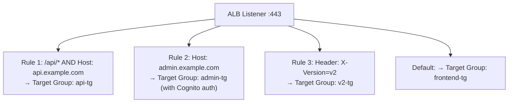
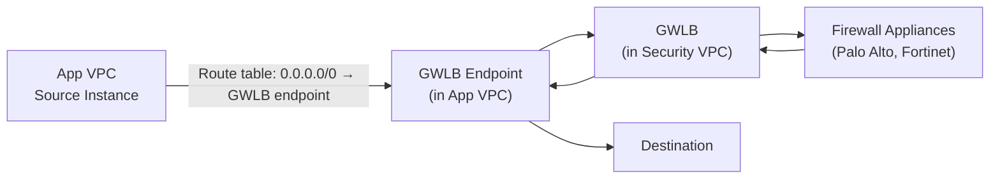

# AWS Load Balancers — Senior Interview Guide

## Comparison Table

| Feature | ALB | NLB | GWLB | CLB |
|---------|-----|-----|------|-----|
| Layer | 7 (HTTP/HTTPS) | 4 (TCP/UDP/TLS) | 3 (IP) | 4/7 |
| Latency | ~5ms | ~1ms | Inline | Highest |
| Static IP | No (use NLB in front) | Yes (per AZ) | Yes | No |
| WebSockets | Yes | Yes | N/A | Limited |
| Path/Host routing | Yes | No | No | No |
| WAF | Yes | No | No | No |
| Lambda target | Yes | No | No | No |
| gRPC | Yes | No | No | No |
| Protocols | HTTP, HTTPS, gRPC | TCP, UDP, TLS | GENEVE (6081) | HTTP, HTTPS, TCP |
| Cross-zone default | On (chargeable) | Off (free if off) | Off | N/A |
| Recommended | New HTTP APIs | Low-latency, static IP | Security appliances | Legacy only |

---

## ALB Deep Dive

### Listener Rules

**Conditions**: Host header, Path, HTTP method, Header, Query string, Source IP
**Actions**: Forward (weighted), Redirect (301/302), Fixed response, Authenticate (Cognito/OIDC)

### Target Types
| Type | Targets | Use Case |
|------|---------|---------|
| Instance | EC2 instance IDs | EC2, dynamic ports |
| IP | Private IPs | Fargate tasks, on-prem via DX/VPN, Lambda alternatives |
| Lambda | Lambda function ARN | Serverless backends |

### ALB Slow Start Mode
- New targets gradually receive traffic over 30-900 seconds
- Prevents cold targets from being overwhelmed; useful for JVM warmup

### Sticky Sessions
- **Duration-based**: ALB-generated cookie (`AWSALB`); duration 1s to 7 days
- **App-cookie**: use your app's existing cookie as stickiness key
- Problem: breaks even distribution; use only when truly needed (stateful apps)

---

## NLB Deep Dive

- Operates at Layer 4; no HTTP awareness
- **Static Elastic IPs**: one per AZ — required for whitelisting by IP
- **Preserves source IP**: targets see actual client IP (vs ALB which adds X-Forwarded-For)
- **TLS termination**: NLB can terminate TLS; forwards TCP to targets
- **Ultra-low latency**: ~1ms vs ALB ~5ms; use for financial trading, gaming
- **Zonal isolation**: each AZ's NLB targets are independent — prevents cross-AZ failures from cascading

### NLB Health Checks
- TCP: attempts connection
- HTTP/HTTPS: checks response code
- If target is unhealthy in one AZ, NLB in other AZ is not affected

---

## GWLB Deep Dive

- Inline network appliance insertion (IDS/IPS, firewall, deep packet inspection)
- Uses **GENEVE protocol** (port 6081) to encapsulate traffic with metadata
- **GWLB Endpoint**: in your VPC; traffic leaves via endpoint to GWLB
- **GWLB**: in security VPC; distributes to appliance fleet; returns traffic back
- Traffic flow: VPC → GWLB Endpoint → GWLB → Appliance → GWLB → GWLB Endpoint → Destination

---

## Connection Management

### Connection Draining / Deregistration Delay
- ALB/NLB: wait period while in-flight requests complete before deregistering target
- Default: 300s; range: 0-3600s
- Set to 30s for fast deployments if requests are short-lived
- Set to 0s to immediately terminate (not recommended for active sessions)

### Access Logs
- ALB: request logging (client IP, latency, status code, request URI, SSL cipher)
- NLB: connection logging
- Stored in S3; enable in LB attributes
- Critical for: debugging, compliance, anomaly detection

---

## Most Asked Senior Interview Questions

**Q1: ALB vs NLB — how do you choose?**
- Use ALB when: HTTP/HTTPS, need host/path routing, WAF, Lambda targets, gRPC, WebSocket
- Use NLB when: need static IP, ultra-low latency, non-HTTP (UDP/TCP), preserve source IP, higher TPS
- Use both: put NLB in front of ALB for static IP + HTTP routing
- **Trap**: "Can NLB route based on path?" No — Layer 4 only; no URL awareness

**Q2: How does cross-zone load balancing work and what are the cost implications?**
- Cross-zone enabled: each LB node distributes traffic equally across all registered targets in all AZs
- Cross-zone disabled: each LB node only routes to targets in its own AZ (uneven if AZ target counts differ)
- **ALB**: always enabled, cross-AZ data transfer is free for ALB
- **NLB**: disabled by default; if enabled, cross-AZ data = $0.01/GB
- **Trap**: "Should you enable cross-zone for NLB?" Depends — if targets are evenly distributed, leave off to avoid charges

**Q3: How does ALB handle WebSocket connections?**
- ALB supports WebSocket natively — once HTTP upgrade to WS, ALB maintains persistent connection
- Stickiness is automatic for WebSocket connections (same target until connection closed)
- **Trap**: "What about WS over NLB?" NLB handles TCP so WS works too — but no HTTP awareness for initial upgrade routing

**Q4: What is the ALB request tracing and how do you use it?**
- ALB adds `X-Amzn-Trace-Id` header to each request
- Unique trace ID per request; propagated to backend and X-Ray
- Use in app logs to correlate ALB access logs with application logs
- Enable X-Ray on Lambda/ECS targets for distributed tracing

**Q5: How do you migrate from CLB to ALB with zero downtime?**
1. Create ALB with same target group
2. Create listener rules matching CLB policies
3. Test ALB endpoint directly
4. Update Route 53: weighted routing — 10% to ALB, 90% to CLB
5. Monitor errors; gradually shift to 100% ALB
6. Remove CLB after validation

**Q6: Explain ALB authentication with Cognito**
- ALB listener rule with authenticate-cognito action
- Flow: client → ALB → redirect to Cognito hosted UI → user authenticates → tokens → ALB verifies → forward to target
- Claims passed to backend in headers (`x-amzn-oidc-identity`, `x-amzn-oidc-data`)
- **Trap**: "Does this work for API clients?" No — redirect flow requires browser; use Cognito token validation in Lambda/backend for APIs

**Q7: NLB with static IPs — how do customers whitelist your service?**
- Create NLB: automatically assigns one Elastic IP per AZ (or you can assign your own EIPs)
- Give customers the 3 EIPs (one per AZ) to whitelist in their firewall
- If AZ is removed, EIP disappears — communicate changes in advance
- **Trap**: "What if you need a single IP?" Put NLB in one AZ only (loses HA) or use Global Accelerator (provides 2 static anycast IPs)

**Q8: How do you secure ALB with WAF?**
- Attach WAF WebACL to ALB
- WAF inspects HTTP headers, body, URI
- Rules: AWS Managed Rules (OWASP Top 10), rate limiting, geo-blocking, custom rules
- WAF in count mode first to test before blocking
- **Trap**: "Does WAF work with NLB?" No — WAF only works with ALB, CloudFront, API Gateway

---

## Scenario-Based Questions

**Scenario 1: API with sudden traffic spikes causing ALB target group to become unhealthy**
- Investigation: check ALB access logs for 5xx spike; check target health
- Likely cause: targets overwhelmed; health check failing due to high CPU
- Solution:
  1. Enable ALB slow start (new targets warm up gradually)
  2. Increase ASG scale-out aggressiveness (lower CPU threshold)
  3. Add Lambda targets as overflow (ALB supports Lambda as target type)
  4. Enable SQS buffer in front for async processing

**Scenario 2: Need to expose gRPC microservices behind single load balancer**
- ALB supports gRPC: `content-type: application/grpc`
- Create one ALB with multiple target groups
- Routing: host header (`svc-a.internal`) or path (`/com.example.ServiceA/*`)
- Health checks: gRPC health check protocol (`grpc.health.v1.Health/Check`)
- Tradeoff: ALB terminates gRPC; if end-to-end gRPC encryption needed, use passthrough with NLB

---

## Real-world Failure Cases

**1. ALB 502 Bad Gateway spike during deployment**
- Cause: new targets failing health checks; ALB routing to unhealthy targets briefly
- Fix: use health check grace period; ensure rolling deployment deploys healthy targets before removing old

**2. NLB TCP connection from unexpected source IPs**
- Cause: NLB preserves source IP — security group rules must allow client IP ranges
- ALB uses LB IPs (well-known prefix) — different behavior
- Fix: use ALB; or update SG rules for NLB to allow VPC CIDR + client ranges

**3. Sticky sessions causing uneven load**
- 80% of traffic on 2 targets, 20% on 8 targets
- Popular users have long sessions pinned to same targets
- Fix: remove stickiness; make app stateless (session to ElastiCache); or use app-cookie with short expiry

**4. GWLB appliance bottleneck**
- All traffic routing through single appliance instance
- Fix: GWLB distributes across all healthy appliance instances (like any load balancer); ensure appliances are registered and healthy; use 5-tuple hash for flow stickiness

---

## Cost Optimization

- **LCU pricing (ALB)**: charged for highest of: new connections/s, active connections, bandwidth, rule evaluations
- Optimize: batch small requests, keep connections alive (reduce new connections/s)
- **NLB**: charged for LCUs; enable cross-zone only if needed (adds $0.01/GB)
- **CLB**: migrate to ALB — same or lower cost with more features
- **WAF**: $5/WebACL/month + $1/M requests — cost-effective for DDoS protection

---

## Security Considerations

- **SSL Policies**: use ELBSecurityPolicy-TLS13-1-2-2021-06 (TLS 1.3 preferred, TLS 1.2 minimum)
- **Certificate management**: ACM certificates on ALB — free and auto-renewing
- **mTLS**: ALB supports mutual TLS — client must present valid certificate
- **Security Headers**: add via ALB listener rule response headers or WAF
- **Access Logs**: enable on ALB for incident response and compliance
- **Deletion Protection**: enable on production LBs to prevent accidental deletion

---

## Quick Revision Bullets

- ALB = L7 HTTP/HTTPS, routing rules, WAF; NLB = L4 TCP/UDP, static IP, low latency
- NLB preserves source IP; ALB adds X-Forwarded-For header
- GWLB = inline network appliances using GENEVE encapsulation
- Cross-zone: ALB always on (free); NLB off by default (cross-AZ $0.01/GB if enabled)
- ALB slow start = gradual traffic ramp for new targets (JVM warmup)
- WAF only works with ALB, CloudFront, API Gateway — not NLB
- mTLS: ALB supports client certificate authentication
- Use Global Accelerator for single anycast static IPs across multiple LBs
