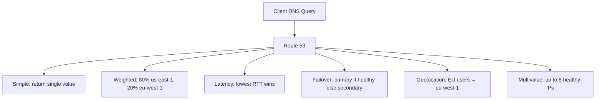
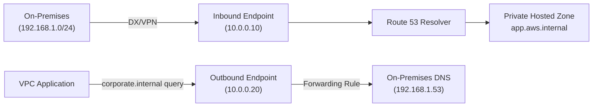

# Route 53 — Senior Interview Guide

## DNS Fundamentals

| Record Type | Purpose | Example |
|-------------|---------|---------|
| A | IPv4 address | `api.example.com → 1.2.3.4` |
| AAAA | IPv6 address | `api.example.com → 2001:db8::1` |
| CNAME | Alias to another hostname | `www → app.example.com` (not for zone apex) |
| ALIAS | AWS-specific alias to AWS resources | `example.com → alb.amazonaws.com` (works at apex) |
| MX | Mail server | Priority + hostname |
| TXT | Text (SPF, DKIM, verification) | `"v=spf1 include:..."` |
| NS | Name servers for zone | Delegation |
| SOA | Start of authority | Zone metadata |

**ALIAS vs CNAME**: ALIAS is free, works at zone apex (naked domain), resolves at Route53; CNAME costs per query, cannot be used at apex

---

## Routing Policies

| Policy | Use Case | Health Check Required |
|--------|---------|----------------------|
| Simple | Single resource | No |
| Weighted | A/B testing, gradual migration | Optional |
| Latency | Route to lowest latency region | Optional |
| Failover | Active-passive HA | Yes (Primary) |
| Geolocation | Compliance, region-specific content | Optional |
| Geoproximity | Fine-tune geographic routing with bias | Optional |
| Multivalue | Multiple IPs with health checking | Optional |



### Routing Policy Deep Dives

**Weighted**: Weight 0 = no traffic; all 0 = equal distribution
- Use: blue/green DNS cutover — gradually shift from 100/0 to 0/100

**Latency**: uses latency measurements from user location to AWS regions
- Not geographically deterministic — users close to one region may have better latency to another

**Geolocation**: matches by continent, country, state (US only); "Default" record for unmatched locations
- Strict geographic control; needed for data residency/compliance

**Geoproximity**: like Geolocation but with bias (-99 to +99) to expand or shrink region's effective area
- Requires Traffic Flow (premium feature)

**Failover**: Primary must have health check; Secondary serves if primary unhealthy
- TTL should be low (< 60s) for fast failover

**Multivalue**: returns up to 8 random healthy records — NOT a load balancer substitute
- Client chooses one; if it fails, client retries another

---

## Health Checks

| Type | What It Checks | Use Cases |
|------|---------------|---------|
| HTTP/HTTPS | Response code 2xx/3xx within 4s | Web endpoints |
| TCP | Connection establishment | Non-HTTP services |
| Calculated | Combination of other health checks | Composite logic |
| CloudWatch Alarm | CloudWatch metric state | Private resources |

- **Endpoint health check**: Route 53 checkers from ~15 global locations
- **Failure threshold**: 3 consecutive failures = unhealthy (default)
- **Interval**: 10s (fast, $1/month) or 30s (default, $0.50/month)
- **Private resources**: cannot reach VPC-internal resources directly — use CloudWatch alarm health check

---

## Private Hosted Zones

- DNS zone only resolvable within associated VPCs
- Multiple VPCs can be associated (including cross-account with `associate-vpc-with-hosted-zone` CLI)
- **Split-horizon DNS**: same domain name resolves differently inside vs outside VPC
  - Public hosted zone: `api.example.com → 1.2.3.4` (public ALB)
  - Private hosted zone: `api.example.com → 10.0.1.50` (internal ALB)

---

## Route 53 Resolver



- **Inbound Endpoint**: 2+ ENIs in VPC; on-premises DNS servers forward to these IPs
- **Outbound Endpoint**: VPC forwards specific domains to on-premises DNS
- **Forwarding Rules**: domain → target IP; shared via RAM (Resource Access Manager) across accounts

---

## DNSSEC

- Adds cryptographic signatures to DNS responses — prevents DNS spoofing
- Route 53 supports DNSSEC for public hosted zones
- Creates KSK (Key Signing Key) in KMS; ZSK (Zone Signing Key) managed by R53
- Enabling can break resolution if misconfigured — test in staging first

---

## Route 53 ARC (Application Recovery Controller)

- **Routing Controls**: on/off switches for Route 53 health checks
- Used for manual or automated regional failover
- Works independently of health check endpoints — can force failover even if endpoint is healthy
- **Safety Rules**: prevent turning off too many routing controls simultaneously

---

## Most Asked Senior Interview Questions

**Q1: Why use ALIAS records over CNAMEs for AWS resources?**
- ALIAS resolves within Route 53 — no extra DNS lookup cost
- Works at zone apex (example.com) — CNAME cannot be at apex
- ALIAS auto-updates when underlying resource IP changes (ELB, CloudFront)
- **Trap**: "Can you CNAME to an ELB?" Yes (subdomain only), but ALIAS is free and better

**Q2: How does Route 53 failover work and what are the timing considerations?**
- Health check detects failure in ~30s (3 × 10s fast interval) to ~90s (3 × 30s)
- After unhealthy: Route 53 stops returning primary record
- TTL of the DNS record: clients that already cached primary IP won't be affected until TTL expires
- **Total failover time**: health check detection + TTL expiry
- **Trap**: "If TTL is 300s, what's the worst-case failover time?" ~390s (90s detection + 300s TTL)

**Q3: What's the difference between Geolocation and Latency routing?**
- Geolocation: deterministic — EU users always go to eu-west-1 (compliance, localization)
- Latency: performance-based — routes to whichever region has lowest measured latency
- **Trap**: "Can a user in Germany be routed to us-east-1 with latency routing?" Yes, if latency to us-east-1 is lower

**Q4: How do you implement blue/green deployment at DNS level?**
- Create weighted records: blue=100, green=0
- Deploy to green
- Validate green (smoke tests)
- Gradually shift: blue=90 green=10 → 50/50 → 0/100
- Low TTL (30-60s) to allow fast rollback
- **Trap**: "What about stale DNS cache?" Clients caching old record don't change until TTL — use low TTL before migration

**Q5: How does private hosted zone association work across accounts?**
- Primary account: authorize VPC association (CLI or SDK)
- Secondary account: associate VPC with private hosted zone
- DNS queries from secondary account VPC resolve via primary account's private hosted zone
- Use case: centralized DNS in shared services account

**Q6: Explain Route 53 health check for private resources**
- Route 53 health checkers are in public internet — cannot reach private VPC resources
- Solution: CloudWatch Alarm health check
  1. Create CloudWatch alarm on app metric (ALB 5xx rate, custom metric)
  2. Create Route 53 health check linked to that alarm
  3. Alarm ALARM state = health check unhealthy = Route 53 stops routing to that endpoint

**Q7: TTL strategy for different scenarios**
| Scenario | TTL | Rationale |
|----------|-----|---------|
| Production stable record | 300-3600s | Reduce DNS query cost |
| Pre-migration | 60s | Allow fast cutover |
| During migration | 30-60s | Fast rollback |
| CloudFront/ELB ALIAS | 60s | Route53 ignores TTL for ALIAS |
| Active failover | 10-60s | Fast failover detection |

**Q8: How do you debug DNS resolution issues in AWS?**
1. `dig +trace api.example.com` — traces full resolution chain
2. Check hosted zone record exists and is correct
3. Check TTL — is cached answer stale?
4. For private PHZ: `enableDnsSupport` and `enableDnsHostnames` enabled?
5. For split-horizon: confirm VPC is associated with private hosted zone
6. For health check failover: check health check status in console

---

## Scenario-Based Questions

**Scenario 1: Multi-region active-passive failover for critical API**
```
Primary: us-east-1 ALB
Secondary: eu-west-1 ALB (warm standby)
```
- Create Failover routing policy: Primary record = us-east-1 ALB, health check enabled
- Secondary record = eu-west-1 ALB
- Health check: fast interval (10s), threshold 3
- TTL: 60s
- ARC Routing Controls for manual override if needed
- Expected failover time: ~30s detection + 60s TTL = ~90s worst case

**Scenario 2: On-premises application needs to resolve AWS internal DNS**
- Deploy Route 53 Inbound Resolver Endpoint in shared VPC
- Configure on-premises DNS server to forward `*.aws.internal` to inbound endpoint IPs
- On-premises clients now resolve AWS private hosted zone entries
- For on-prem resolution from AWS: create outbound endpoint + forwarding rule

---

## Real-world Failure Cases

**1. TTL not reduced before planned migration**
- Team migrates to new region but forgot old TTL = 86400s
- Users stuck hitting old endpoint for 24 hours
- Fix: always reduce TTL 48+ hours before planned DNS change

**2. Failover not triggering because health check checks wrong endpoint**
- Health check is checking /healthz which always returns 200 even when app is broken
- Fix: health check should verify actual business functionality; use calculated health check combining multiple metrics

**3. Split-brain DNS**
- VPC not associated with private hosted zone
- Apps in VPC resolve public IP instead of internal IP
- Fix: associate VPC with private hosted zone; verify with `dig` from within VPC

**4. DNSSEC misconfiguration**
- DNSSEC enabled but DS record not added to parent zone
- DNS resolution fails for all clients
- Fix: add DS record to parent registrar; test with `dig +dnssec` before going live

---

## Cost Optimization

- Hosted zone: $0.50/month per zone (first 25 free)
- Health checks: $0.50-1.00/month per check; use fast interval only for critical services
- DNS queries: $0.40/M queries first 1B; use longer TTLs where possible
- Latency/Geolocation/etc.: $0.70/M queries (premium routing)
- Consolidate zones: don't create per-environment zones unnecessarily

---

## Security Considerations

- DNSSEC for public zones: prevents DNS cache poisoning
- Private hosted zones: ensure VPCs are properly associated; no public exposure
- Lock domain registrar: enable domain lock to prevent unauthorized transfer
- MFA on AWS account: domain hijacking via account compromise
- Health check IAM: protect routing control changes with IAM policies

---

## Quick Revision Bullets

- ALIAS = free, works at apex, auto-updates; CNAME = chargeable, not at apex
- TTL is the primary lever for fast vs stable DNS changes; reduce 48h before migrations
- Failover timing = health check detection + TTL expiry; fast interval + low TTL = 40-90s
- Private hosted zone needs enableDnsSupport + enableDnsHostnames on VPC
- Health checks for private resources: use CloudWatch Alarm integration
- R53 Inbound Endpoint = on-prem → AWS DNS; Outbound = AWS → on-prem DNS
- Geolocation = deterministic (compliance); Latency = performance (fastest region)
- ARC Routing Controls = manual failover switch independent of health checks
