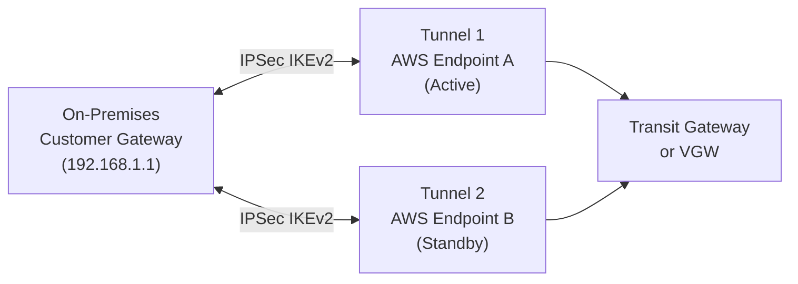

# Site-to-Site VPN — Senior Interview Guide

## Core Concepts

- IPSec VPN tunnel between on-premises Customer Gateway (CGW) and AWS
- Two tunnels per VPN connection (different AWS endpoints) for HA
- Attach to: Virtual Private Gateway (VGW, single VPC) or Transit Gateway (multiple VPCs)



---

## IPSec Fundamentals

### IKEv1 vs IKEv2

| Feature | IKEv1 | IKEv2 |
|---------|-------|-------|
| Message exchanges | More (6+3 in main mode) | Fewer (4 minimum) |
| Reliability | Less | Built-in reliability |
| NAT traversal | Manual (NAT-T) | Built-in |
| Dead Peer Detection | Extension | Built-in |
| Recommendation | Legacy | Use IKEv2 |

### Phase 1 (IKE SA — control channel)
- Negotiates: encryption (AES-128/256), hash (SHA-256/384/512), DH group, authentication
- Outputs: IKE Security Association
- Lifetime: 8 hours (default AWS)

### Phase 2 (IPSec SA — data channel)
- Negotiates: encryption (AES-128/256-GCM), PFS (Perfect Forward Secrecy)
- Outputs: IPSec Security Association (two: one each direction)
- Lifetime: 1 hour (default AWS)

### AWS Supported Algorithms
- Encryption: AES-128/256, AES-128-GCM/256-GCM
- Integrity: SHA-256/384/512
- DH Groups: 14, 15, 16, 17, 18, 19, 20, 21, 22, 23, 24
- DPD (Dead Peer Detection): enabled by default

---

## Routing: Static vs BGP

| Feature | Static Routing | BGP (Dynamic) |
|---------|---------------|---------------|
| Configuration | Manual CIDR entries | Automatic route advertisement |
| Route updates | Manual | Automatic on network change |
| Failover | Based on tunnel health | BGP route withdrawal |
| ECMP | Not supported | Supported (with TGW) |
| Recommended | Simple setups | Production, multi-path |

**BGP ASN**: Customer Gateway needs its own ASN (public or private 64512-65534)
**AWS BGP ASN**: 64512 (default), configurable on VGW/TGW

---

## ECMP for Bandwidth Aggregation

- Multiple VPN connections to same TGW with same BGP prefix = ECMP
- Each tunnel = 1.25 Gbps; 10 tunnels = ~12.5 Gbps aggregate
- Requires BGP + TGW (VGW does not support ECMP)
- Use for: high-bandwidth requirements before DX is provisioned

---

## Accelerated VPN

- VPN tunnel endpoints are AWS Global Accelerator anycast IPs
- Traffic from customer router → nearest GA PoP → AWS backbone → VGW/TGW
- Reduces latency by avoiding internet routing
- Additional cost: GA hourly + data charges
- Use when: customer is far from AWS region; needs lower latency over VPN

---

## VPN + Direct Connect Combination

```
Primary path:   On-Prem → DX → TGW → VPCs
Failover path:  On-Prem → Internet VPN → TGW → VPCs

BGP configuration:
- DX path: higher local preference (200) or shorter AS-PATH
- VPN path: lower local preference (100) or longer AS-PATH
```

When DX fails: BGP session drops → DX routes removed from TGW RT → VPN routes become active
Recovery: DX comes back → BGP re-establishes → more-preferred routes back → traffic shifts to DX

---

## MTU and MSS Clamping

- VPN tunnel adds overhead: IPSec header + ESP trailer = ~73 bytes overhead
- Standard Ethernet MTU: 1500 bytes
- VPN effective payload MTU: ~1427 bytes
- **MSS clamping**: prevents TCP SYN packets from advertising MSS > tunnel MTU
- Configure on customer gateway: `ip tcp adjust-mss 1379`
- Without clamping: large TCP packets fail; connection hangs or is slow
- **Trap**: HTTP works (small responses) but large file downloads fail = MTU issue

---

## Most Asked Senior Interview Questions

**Q1: Two tunnels per VPN connection — why and how does failover work?**
- AWS terminates each tunnel on different AWS physical endpoints for redundancy
- Both tunnels are active simultaneously (VGW: typically one active, one standby; TGW: both can be active with ECMP)
- If one tunnel's AWS endpoint fails: tunnel drops → other tunnel continues
- Customer must have redundant or floating routing for automatic failover

**Q2: BGP vs static routing — when do you choose static?**
- Static: small networks (< 10 subnets), simple setups, hardware doesn't support BGP
- BGP: any production environment — automatic failover, ECMP support, network changes don't require manual updates
- **Trap**: "Can you use ECMP with static routing on TGW?" No — ECMP requires BGP

**Q3: What bandwidth can you get from Site-to-Site VPN?**
- Single tunnel: up to 1.25 Gbps (AWS limit)
- ECMP via TGW: multiple connections × 1.25 Gbps (50 max = 62.5 Gbps theoretical)
- Real-world: depends on customer gateway throughput, internet path quality
- **Trap**: "Is 1.25 Gbps guaranteed?" No — it's a maximum; actual throughput depends on internet conditions

**Q4: Customer Gateway requirements — what does the on-premises device need?**
- Static IP or dynamic IP (Route 53 custom DNS)
- Must support IKEv1 or IKEv2
- Must support the negotiated encryption algorithms
- NAT-T support if behind NAT
- BGP support for dynamic routing (ASN required)
- Examples: Cisco ASA/ISR, Palo Alto, Juniper, pfSense, StrongSwan

**Q5: How do you troubleshoot a VPN tunnel that won't establish?**
1. Check Phase 1: verify PSK, IKE version, encryption algorithms match on both sides
2. Check Phase 2: verify encryption/hash, PFS settings match
3. Check routing: is "interesting traffic" being sent through the tunnel? (Phase 2 requires traffic to keep SA alive)
4. Check firewall: UDP 500 (IKE) and UDP 4500 (NAT-T) must be open
5. Check logs: customer gateway logs, AWS VPN tunnel details in console
6. Use CloudWatch metric: `TunnelState` = 1 (up), 0 (down)

**Q6: Accelerated VPN vs Standard VPN — what's the tradeoff?**
- Standard: customer's traffic takes internet routing to AWS endpoint — variable path
- Accelerated: traffic enters AWS Global Accelerator PoP (closer to customer) → AWS backbone
- Benefit: 50-60% lower latency, more stable throughput
- Cost: additional $0.025/hr per accelerator + data processing
- Use when: customer is in a region far from AWS (e.g., Australia connecting to us-east-1)

---

## Scenario-Based Questions

**Scenario 1: Enterprise needs 5 Gbps to AWS before DX is ready (3 months)**
- Solution: ECMP over TGW with 4 VPN connections = up to 5 Gbps
- BGP routing; all 4 connections advertise same prefixes
- TGW ECMP distributes traffic across all 8 tunnels (4 connections × 2 tunnels)
- When DX is ready: add DX with higher BGP preference; VPN remains as failover

**Scenario 2: Remote branch offices (20 sites) need to connect to AWS and each other**
- Hub-spoke via TGW:
  1. Each branch has one VPN connection to TGW
  2. TGW routes traffic between branches (transitive routing)
  3. Shared services VPC attached to TGW (AD, monitoring)
  4. Route tables control which branches can talk to each other
- Alternative: AWS CloudWAN (managed global network, abstracts TGW complexity)

---

## Real-world Failure Cases

**1. VPN tunnel up but traffic not passing**
- Cause: Phase 2 SA mismatch; MTU issues; routing not sending traffic through tunnel
- Fix: check Phase 2 encryption settings; add MSS clamping; verify routing table has VPN routes

**2. One tunnel always down**
- Cause: AWS DPD detecting dead peer; customer gateway not responding on that tunnel
- Fix: ensure customer gateway allows incoming IKE from both AWS tunnel endpoints; check firewall rules

**3. BGP routes not propagating to VPC route table**
- Cause: VGW route propagation not enabled on route table
- Fix: enable "Propagate Routes" on VPC route table; or add static routes manually

**4. VPN performance degradation at peak hours**
- Cause: internet congestion between customer and AWS endpoint
- Fix: switch to Accelerated VPN (uses AWS backbone); or prioritize DX provisioning

---

## Cost Optimization

- VPN connection: $0.05/hr per connection (~$36/month)
- Data transfer out: standard EC2 rates
- Multiple VPN connections for ECMP: 4 × $0.05/hr = $0.20/hr
- Accelerated VPN: adds GA cost (~$0.025/hr + data)
- Long-term: DX is typically more cost-effective for >100 Mbps sustained traffic (lower per-GB cost)

---

## Security Considerations

- **IKEv2**: always use IKEv2 over IKEv1
- **Strong algorithms**: AES-256-GCM, SHA-256+, DH Group 20+ (ECDH P-384)
- **PFS**: enable Perfect Forward Secrecy — each session has independent key
- **PSK rotation**: change pre-shared key periodically; automate via TGW VPN modification
- **BGP MD5**: authenticate BGP sessions to prevent route injection
- **Monitoring**: CloudWatch `TunnelState` and `TunnelDataIn/Out` metrics; alarm on tunnel down

---

## Quick Revision Bullets

- Two tunnels per VPN connection = HA; both terminate on different AWS endpoints
- IKEv2 = preferred; fewer exchanges, built-in DPD, NAT traversal
- Phase 1 = IKE SA (control); Phase 2 = IPSec SA (data); different lifetimes
- ECMP with TGW + BGP = aggregate bandwidth (up to 62.5 Gbps theoretical)
- Max single tunnel: 1.25 Gbps
- MSS clamping required to prevent fragmentation issues
- Accelerated VPN = GA PoP + AWS backbone; lower latency, extra cost
- DX + VPN: BGP local preference controls primary/failover
- VPN cost: $0.05/hr per connection; DX better for sustained high bandwidth
