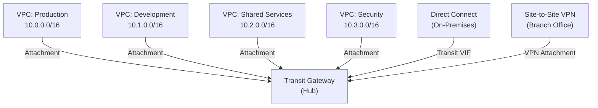

# Transit Gateway — Senior Interview Guide

## Core Architecture



## Key Concepts

### Attachments
| Type | Description |
|------|-------------|
| VPC | Attach a VPC (each subnet in different AZ = one ENI per AZ) |
| VPN | Site-to-site VPN connection |
| Direct Connect Gateway | Connect DX circuits to TGW |
| TGW Peering | Connect TGWs across regions or accounts |
| Connect | GRE tunnel over VPC attachment (SD-WAN) |

### Route Tables, Associations, Propagations
- Each TGW has route tables (can have multiple for segmentation)
- **Association**: attachment is associated with ONE route table (determines which RT the attachment uses for outbound routing)
- **Propagation**: attachment propagates its CIDR into a route table
- Default behavior: all attachments share one route table (full mesh)

### Network Segmentation with Multiple Route Tables

```
Prod RT:          Dev RT:
  Propagations:     Propagations:
    - Prod VPCs       - Dev VPCs  
    - Shared VPC      - Shared VPC
  NOT Dev VPCs     NOT Prod VPCs
```

Result: Prod and Dev cannot reach each other; both reach Shared Services

---

## ECMP for Bandwidth Aggregation

- Multiple VPN attachments to same TGW with same BGP prefix → ECMP distributes traffic
- Max: 50 VPN connections per TGW (× 1.25 Gbps each = up to 62.5 Gbps aggregate)
- Requires dynamic routing (BGP) — static routing doesn't support ECMP on TGW

---

## Inter-Region TGW Peering

- Peer TGWs across regions with encrypted inter-region peering
- Traffic goes over AWS backbone (not internet)
- Static routes only (no BGP between TGWs)
- No bandwidth limit; charged per GB transferred
- Latency: AWS backbone < public internet

---

## TGW Connect

- GRE tunnel over existing VPC attachment
- Supports BGP for dynamic routing
- Used for: SD-WAN appliances, third-party virtual routers
- Bandwidth: up to 20 Gbps per Connect attachment (vs 1.25 Gbps for VPN)

---

## TGW Network Manager

- Centralized view of global network topology
- Monitors on-premises networks via SD-WAN integration
- Route Analyzer: trace path between two resources
- Events: CloudWatch Events for topology changes

---

## Most Asked Senior Interview Questions

**Q1: When would you use TGW vs VPC Peering?**
| Scenario | Recommendation |
|----------|---------------|
| 2-3 VPCs, simple connectivity | VPC Peering (cheaper, simpler) |
| 5+ VPCs | TGW (avoids O(n^2) peering complexity) |
| Transitive routing needed | TGW (peering is non-transitive) |
| On-premises connectivity to many VPCs | TGW (one DX/VPN attachment, routes all VPCs) |
| Cross-region | Both work; TGW peering uses AWS backbone |
| Latency sensitive | VPC Peering (no hop through TGW) |

**Q2: How does TGW handle BGP with Direct Connect?**
- TGW attaches to DX Gateway via Transit VIF
- BGP session between customer router and DX
- TGW advertises VPC CIDRs to on-premises
- On-premises advertises prefixes to TGW
- **Trap**: "How many Transit VIFs can a DX connection have?" 1 Transit VIF per DX connection (but can connect to DX Gateway which connects to multiple TGWs)

**Q3: How do you prevent VPCs from routing to each other through TGW?**
- Create separate route tables per environment
- Prod RT: propagate only Prod VPCs + Shared Services
- Dev RT: propagate only Dev VPCs + Shared Services
- Neither Prod nor Dev propagated into each other's RT
- Associate each VPC attachment with appropriate RT
- **Trap**: "Does adding a VPC attachment automatically allow all traffic?" Only if default RT is used and all VPCs propagate to it

**Q4: What is the TGW bandwidth limit?**
- Per attachment: no documented limit (scales with demand)
- VPN attachment: 1.25 Gbps per tunnel (use ECMP for more)
- TGW itself: scales automatically
- **Trap**: "Is there a limit on concurrent flows?" Yes — TGW processes packets; very high connection rate can cause issues (use flow limits awareness)

**Q5: How do you implement centralized egress with TGW?**
- Create dedicated Egress VPC with NAT Gateway + IGW
- All other VPCs route 0.0.0.0/0 → TGW
- TGW routes 0.0.0.0/0 → Egress VPC attachment
- Egress VPC NAT GW → IGW → internet
- Benefit: single NAT GW (cost savings), centralized egress filtering

**Q6: Multi-account TGW — how do you share it?**
- Use AWS RAM (Resource Access Manager) to share TGW with other accounts
- Member accounts create VPC attachments to shared TGW
- Owner account controls route tables and routing
- **Trap**: "Can you share route tables?" No — route tables are managed by TGW owner; member accounts just attach VPCs

**Q7: TGW Connect vs VPN — when to use each?**
- VPN: IPSec encrypted, works over internet, 1.25 Gbps per tunnel
- TGW Connect: GRE tunnel, no native encryption, over existing VPC attachment, 20 Gbps
- Use Connect for: high-bandwidth SD-WAN; encryption handled at app layer or DX MACSec
- Use VPN for: internet-based connectivity needing IPSec encryption

**Q8: How does TGW handle AZ affinity?**
- TGW has ENIs in each AZ where VPC attachment is created
- Traffic flows through ENI in same AZ as source instance (avoids cross-AZ charges)
- If AZ ENI is unavailable, traffic uses another AZ (cross-AZ charges apply)
- Best practice: create TGW attachment in all AZs used by workloads

---

## Scenario-Based Questions

**Scenario 1: 30 VPCs (10 prod, 10 dev, 10 shared services) with strict environment isolation**
- Architecture:
  1. Single TGW (shared via RAM across accounts)
  2. Three route tables: Prod-RT, Dev-RT, Shared-RT
  3. Shared Services VPC propagates to all three RTs
  4. Prod VPCs propagate to Prod-RT only (not Dev-RT)
  5. Dev VPCs propagate to Dev-RT only (not Prod-RT)
  6. Centralized egress VPC in Shared — all VPCs route 0.0.0.0/0 via TGW to egress VPC
  7. Centralized inspection via GWLB in security VPC

**Scenario 2: On-premises needs to reach all 30 VPCs via single DX**
- DX → DX Gateway → TGW Transit VIF
- One BGP session advertises all VPC CIDRs to on-premises
- On-premises routes to TGW; TGW routes to all VPCs
- Without TGW: need private VIF per VPC = 30 private VIFs (maximum per DX = 50)

---

## Real-world Failure Cases

**1. Asymmetric routing via TGW**
- Traffic goes out via one path, returns via another (firewall sees half the flow)
- Cause: multiple paths exist; ECMP distributing flow asymmetrically
- Fix: use consistent routing; for stateful inspection, ensure same path both directions

**2. TGW route table misconfiguration — blackhole**
- VPC attachment created but not propagating to route table
- Traffic drops silently
- Fix: verify propagations in TGW Route Tables; use TGW Route Analyzer

**3. Cross-AZ data charges unexpected**
- TGW attachment only in 2 AZs but instances in 3rd AZ
- Traffic crosses AZ to reach TGW ENI
- Fix: create TGW attachment subnet in all AZs used by workloads

**4. BGP route flapping over DX via TGW**
- Unstable BGP session causing route flap
- All VPC traffic to on-premises affected
- Fix: improve DX physical connectivity; add second DX; add VPN as backup; BFD for fast failure detection

---

## Cost Optimization

- TGW: $0.05/hr per attachment + $0.02/GB data processed
- Cost comparison vs VPC Peering for 10 VPCs:
  - VPC Peering: 45 connections × $0.01/GB (cross-region) vs TGW $0.02/GB + attachment
  - Break-even depends on data volume; TGW wins at scale for management simplicity
- **Reduce data charges**: TGW charges per GB; minimize unnecessary cross-VPC traffic
- **Centralized NAT**: one NAT GW in egress VPC shared via TGW (fewer NAT GWs = savings)

---

## Security Considerations

- TGW route table isolation: primary security mechanism for multi-account environments
- Centralized inspection: route all traffic through security VPC with GWLB + firewall
- RAM sharing: only share with specific AWS Organization OUs, not entire internet
- Network ACLs on TGW attachment subnets: additional layer of protection
- Flow Logs on TGW attachments: visibility into inter-VPC traffic

---

## Quick Revision Bullets

- TGW = hub-spoke; each attachment associates with one route table, can propagate to multiple
- ECMP: multiple VPN tunnels with same BGP prefix = aggregated bandwidth
- Inter-region peering: static routes only, AWS backbone, encrypted
- TGW Connect = GRE over VPC attachment, 20 Gbps, for SD-WAN
- RAM sharing: share TGW with Organization accounts; owner manages route tables
- Centralized egress: route 0.0.0.0/0 to TGW → Egress VPC with NAT GW
- Association = outbound routing decision; Propagation = adds routes to RT
- TGW vs Peering: use TGW for 5+ VPCs or when transitive routing needed
