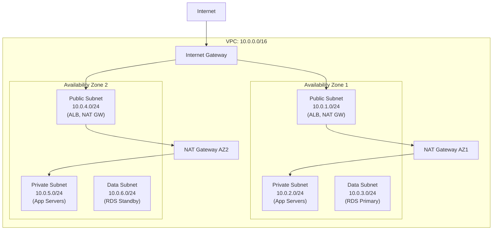
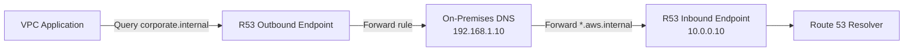

# VPC — Senior Interview Guide

## Core Concepts



### Subnet Types
- **Public**: route table has 0.0.0.0/0 → IGW; instances need public IP or EIP
- **Private**: route table has 0.0.0.0/0 → NAT Gateway; no direct internet access
- **Isolated (Data)**: no internet route; DB subnets, internal services only

### NAT Gateway vs NAT Instance
| Feature | NAT Gateway | NAT Instance |
|---------|------------|-------------|
| Management | AWS managed | Self-managed |
| Bandwidth | Up to 100 Gbps | Instance type limited |
| HA | AZ-resilient (per AZ) | Single point of failure |
| Security Groups | Cannot attach | Can attach |
| Cost | $0.045/hr + $0.045/GB | EC2 cost + bandwidth |
| Recommendation | Always preferred | Legacy/cost-sensitive only |

### VPC Endpoints

| Type | Protocol | Services | Private DNS |
|------|---------|---------|-------------|
| Gateway | S3, DynamoDB only | Free | No DNS override |
| Interface (PrivateLink) | All others | $0.01/hr + $0.01/GB | Yes (overrides public DNS) |

- **Gateway Endpoint**: adds route to route table; no ENI; free; only S3 and DynamoDB
- **Interface Endpoint**: ENI in your subnet with private IP; uses PrivateLink; supports all AWS services
- Use VPC endpoints to avoid NAT Gateway charges for AWS API calls

---

## Security Groups vs NACLs

| Feature | Security Group | NACL |
|---------|---------------|------|
| Level | Instance/ENI | Subnet |
| State | Stateful (return traffic auto-allowed) | Stateless (must allow both directions) |
| Rules | Allow only | Allow and Deny |
| Evaluation | All rules evaluated | Rule number order (lowest first) |
| Default | Deny all inbound, allow all outbound | Allow all in and out |
| Association | One or more per ENI | One per subnet |

**Evaluation order for inbound traffic:**
1. NACL checks (stateless, both directions)
2. Security Group checks (stateful, return traffic automatic)

---

## VPC Flow Logs

- Captures IP traffic metadata (not payload) at VPC, subnet, or ENI level
- Destinations: CloudWatch Logs, S3, Kinesis Data Firehose
- Useful Athena query pattern:
```sql
SELECT srcaddr, dstaddr, srcport, dstport, protocol, action, bytes
FROM vpc_flow_logs
WHERE action = 'REJECT' AND dstport = 443
ORDER BY bytes DESC LIMIT 20;
```
- Fields: srcaddr, dstaddr, srcport, dstport, protocol, packets, bytes, action (ACCEPT/REJECT)

---

## DNS in VPC

- `enableDnsHostnames`: assigns public DNS hostnames to instances with public IPs
- `enableDnsSupport`: enables Route 53 Resolver (169.254.169.253) — must be true for DNS to work
- Both must be true for private hosted zone to work in VPC

### Route 53 Resolver
- **Inbound Endpoint**: allows on-premises DNS to resolve AWS VPC DNS names
- **Outbound Endpoint**: allows VPC to resolve on-premises DNS names via forwarding rules



---

## CIDR Planning Best Practices

- Use RFC 1918 space: 10.0.0.0/8, 172.16.0.0/12, 192.168.0.0/16
- Avoid overlapping CIDRs across VPCs (peering/TGW won't work)
- Start with /16 for VPC (65,536 IPs); allocate /24 subnets per AZ per tier
- Reserve CIDR ranges for future expansion
- Secondary CIDRs: attach additional CIDR blocks to existing VPC (useful for running out of IP space)
- AWS reserves 5 IPs per subnet (first 4 + last 1)

---

## Most Asked Senior Interview Questions

**Q1: What is the difference between SG and NACL and which takes precedence?**
- Both must allow traffic — NACL and SG are AND conditions
- NACL is stateless: must allow ephemeral port range (1024-65535) on return path
- SG is stateful: return traffic automatically allowed
- **Trap**: "If SG allows traffic but NACL denies, does it pass?" No — NACL blocks first at subnet boundary

**Q2: Why would a private instance fail to reach the internet even with NAT Gateway configured?**
- Check 1: Route table of private subnet — does it have 0.0.0.0/0 → NAT GW in same AZ?
- Check 2: NAT GW is in public subnet with IGW route
- Check 3: Security group of instance allows outbound traffic
- Check 4: NACL allows outbound and inbound ephemeral ports (1024-65535)
- **Trap**: "NAT Gateway is AZ-specific" — routing to NAT GW in different AZ works but incurs cross-AZ data charges

**Q3: How do VPC endpoints reduce cost and improve security?**
- Without: EC2 → SG → NAT GW ($0.045/hr + $0.045/GB) → IGW → S3
- With Gateway Endpoint: EC2 → S3 via private path; no NAT charges; no internet exposure
- Bucket policy can restrict access to VPC endpoint only (`aws:sourceVpce` condition)
- **Trap**: "Does a Gateway Endpoint work across VPC peering?" No — the endpoint is local to the VPC

**Q4: Explain the DNS resolution flow for an Interface VPC Endpoint**
- Interface endpoint creates a private DNS entry that overrides the public service DNS
- e.g., `secretsmanager.us-east-1.amazonaws.com` resolves to the private ENI IP
- Requires `enableDnsHostnames` and `enableDnsSupport` = true
- From on-premises via DX/VPN: must use Route 53 Resolver inbound endpoint to reach private DNS

**Q5: How do you design a VPC for maximum HA and security?**
- 3 tiers (public/private/data) × 3 AZs = 9 subnets minimum
- One NAT GW per AZ (not one shared — AZ failure would take down outbound for other AZs)
- VPC endpoints for S3, DynamoDB, ECR, Secrets Manager (avoid NAT charges)
- Flow logs enabled on VPC level to S3 with Athena for analysis
- SGs on instances; NACLs as backup at subnet level
- Reachability Analyzer for troubleshooting

**Q6: What is VPC Reachability Analyzer?**
- Network troubleshooting tool: tests if network path exists between two resources
- Does NOT send actual traffic — analyzes route tables, SGs, NACLs, peering
- Results: reachable (with path details) or not reachable (with blocking component)
- Use case: validate after configuration changes; prove compliance (network isolation)

**Q7: How do you connect 20 VPCs efficiently?**
- NOT VPC Peering: O(n^2) connections, no transitive routing, complex route management
- Transit Gateway: hub-spoke model; one attachment per VPC; centralized route management
- TGW route tables: segment VPCs into environments (prod/dev/shared-services)

**Q8: What are the limits that commonly cause production issues?**
- ENIs per instance (varies by type: t3.medium = 3 ENIs max)
- Security group rules: 60 inbound + 60 outbound per SG; 5 SGs per ENI
- Route table entries: 1000 per route table
- Subnets: 200 per VPC
- **Trap**: "What happens when ENI limit is hit on EKS/ECS?" Pods/tasks fail to launch

---

## Scenario-Based Questions

**Scenario 1: On-premises application needs to access S3 without going over internet**
- Option A: VPC Gateway Endpoint + Direct Connect/VPN
  - Traffic from on-prem → DX/VPN → VPC → Gateway Endpoint → S3
  - BUT: Gateway Endpoints don't work over DX/VPN for on-prem clients
- Option B: S3 Interface Endpoint (PrivateLink) + Route 53 Inbound Resolver
  - Interface endpoint in VPC; on-prem DNS forwarded via R53 inbound endpoint
  - On-prem traffic → DX → Interface Endpoint → S3 private path
  - This is the correct solution

**Scenario 2: Multi-account architecture — 50 VPCs need to communicate with shared services**
- Shared Services VPC: Active Directory, internal NTP, monitoring
- TGW with route table segmentation:
  - Spoke VPCs → TGW → Shared Services VPC (allowed)
  - Spoke VPCs cannot reach each other (isolated route table)
- TGW attachments in each VPC; route propagation to shared services RT only

---

## Real-world Failure Cases

**1. NAT Gateway data processing charges surprise**
- EC2 instances downloading from S3 via NAT Gateway: $0.045/GB
- With S3 Gateway Endpoint: free
- Fix: add Gateway Endpoint for S3/DynamoDB; use Interface Endpoints for other AWS services

**2. Cross-AZ traffic costs escalating**
- NAT Gateway in AZ-1 routing traffic for instances in AZ-2
- Fix: deploy one NAT Gateway per AZ; update route tables to use local AZ NAT GW

**3. DNS resolution failing for PrivateLink endpoint**
- Interface endpoint created but not resolving
- Cause: `enableDnsHostnames` or `enableDnsSupport` set to false on VPC
- Fix: enable both; or manually configure DNS via Route 53 Resolver

**4. NACL blocking legitimate traffic**
- App works locally but fails in VPC
- Cause: NACL blocking ephemeral port return traffic (forgot stateless nature)
- Fix: add NACL rule allowing inbound 1024-65535 from 0.0.0.0/0 (or specific ranges)

---

## Cost Optimization

- NAT Gateway: biggest surprise cost — use VPC Endpoints for AWS services
- One NAT GW per AZ: necessary for HA but costs 2-3x; acceptable tradeoff
- Flow Logs: send to S3 (cheaper than CW Logs); use lifecycle to expire old logs
- Data transfer: keep traffic within AZ where possible; cross-AZ = $0.01/GB

---

## Security Considerations

- Never put instances with sensitive data in public subnets
- Block Public Access at VPC level where possible
- Use SGs as primary control; NACLs for bulk IP blocking
- VPC endpoint policies: restrict which S3 buckets/DynamoDB tables are accessible
- Flow logs to S3 with CloudTrail data events for full audit trail
- AWS Network Firewall: stateful inspection for VPC ingress/egress

---

## Quick Revision Bullets

- Public subnet = IGW route; Private = NAT GW route; Data = no internet route
- SG = stateful, instance-level, allow only; NACL = stateless, subnet-level, allow+deny
- NAT GW: AZ-specific — one per AZ for HA; $0.045/hr + $0.045/GB data
- Gateway Endpoint (S3/DynamoDB) = free, route table entry; Interface Endpoint = $0.01/hr, ENI
- enableDnsSupport + enableDnsHostnames both required for VPC DNS to work
- R53 Inbound Endpoint = on-prem resolves AWS DNS; Outbound = AWS resolves on-prem DNS
- VPC Peering = non-transitive; TGW = hub-spoke for 5+ VPCs
- Interface VPC Endpoints needed for S3 access from on-prem over DX/VPN
