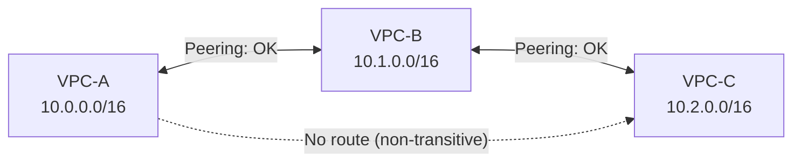

# VPC Peering — Senior Interview Guide

## How VPC Peering Works

- Direct network route between two VPCs using private IPs
- Traffic stays on AWS backbone — does not traverse internet
- **Non-transitive**: A↔B and B↔C does NOT mean A can reach C
- Available: same account, cross-account, same region, cross-region

## Setup Requirements

1. Create peering connection (requester initiates, accepter approves)
2. **Update route tables on BOTH sides**:
   - VPC-A route table: `10.1.0.0/16 → pcx-xxxxxx`
   - VPC-B route table: `10.0.0.0/16 → pcx-xxxxxx`
3. Update security groups to allow traffic from peer VPC CIDR (or SG reference for same-region)

---

## Cross-Account and Cross-Region Peering

- **Cross-account**: requester in Account A, accepter in Account B; both sides update routes
- **Cross-region**: supported; traffic encrypted in transit on AWS backbone
- Security group referencing across accounts requires specifying Account ID + SG ID
- Cross-region peering: slight latency increase; charged at inter-region data transfer rates

---

## Key Limitations

| Limitation | Detail |
|-----------|--------|
| Overlapping CIDRs | Cannot peer VPCs with overlapping CIDRs |
| Non-transitive | No routing through intermediate VPC |
| No gateway services | Cannot use Internet Gateway, NAT, VGW through peering |
| Limits | 125 peering connections per VPC |
| DNS resolution | Must explicitly enable DNS resolution for peered VPC |

---

## PrivateLink vs VPC Peering vs TGW

| Dimension | VPC Peering | Transit Gateway | PrivateLink |
|-----------|------------|----------------|-------------|
| Access | Full VPC CIDR | Full VPC CIDR | Specific service endpoint |
| Transitive | No | Yes | N/A (point-to-point) |
| Scale | Up to 125 peers | Thousands of attachments | Unlimited consumers |
| Overlapping CIDRs | Blocked | Blocked | Supported |
| Management | Complex at scale | Centralized | Simple (service = endpoint) |
| Cost | $0.01/GB (cross-AZ) | $0.05/hr + $0.02/GB | $0.01/hr + $0.01/GB |
| Best for | Few VPCs, full access | Many VPCs, hub-spoke | Expose service to other VPCs/accounts |

**Use PrivateLink when**: you want to expose a single service (not entire VPC) to consumers, especially overlapping CIDR environments.

---

## Most Asked Senior Interview Questions

**Q1: VPC Peering with overlapping CIDRs — is there a workaround?**
- No native solution for peering with overlapping CIDRs
- Workarounds: PrivateLink (service-specific, doesn't need IP routing), or redesign CIDR space
- **Trap**: "Can NAT help?" In theory, you can NAT on the instance level, but it's complex and brittle — redesign is better

**Q2: How many route table entries does VPC Peering add at scale?**
- 10 VPCs all peered with each other = full mesh = 45 peering connections
- Each VPC needs 9 route entries (one per peer)
- At 50 VPCs: 1225 connections, 49 route entries per VPC
- Route table limit: 1000 entries — becomes a problem at scale
- **Solution**: Use TGW with single default route (0.0.0.0/0 or supernet)

**Q3: DNS resolution across VPC peering — how do you enable it?**
- By default, DNS names of instances in peered VPC don't resolve to private IPs
- Enable: "Allow DNS resolution from peered VPC" option on peering connection (both sides)
- For private hosted zones: must associate PHZ with each VPC (peering doesn't automatically enable PHZ resolution)

**Q4: Security group references across peered VPCs**
- Same region: SG can reference another SG in peered VPC by `account-id/sg-id`
- Cross-region: cannot reference SG from different region; must use CIDR-based rules
- **Advantage of same-region SG reference**: dynamically tracks instances in the referenced SG; no need to update rules when IPs change

**Q5: Peering vs TGW for 3-VPC scenario — which is cheaper?**
- 3 VPCs: 3 peering connections vs 3 TGW attachments
- Peering: no hourly cost, only data transfer ($0.01/GB cross-AZ, free same-AZ)
- TGW: 3 × $0.05/hr = $3.60/day + $0.02/GB
- **At 3 VPCs with moderate traffic**: peering is cheaper
- **Crossover point**: ~5+ VPCs or when needing transitive routing

**Q6: What happens to peering if one VPC is deleted?**
- Peering connection becomes inactive/deleted automatically
- Route table entries remain (as blackholes) — must clean up manually
- Best practice: use IaC (Terraform/CloudFormation) so routes are removed when peering is removed

---

## Scenario-Based Questions

**Scenario 1: Shared services VPC needs to be reachable from 20 spoke VPCs, but spokes must NOT reach each other**
- Option A: 20 peering connections (hub to each spoke) + no spoke-to-spoke peering
  - Pros: spokes cannot reach each other (no transitive)
  - Cons: 20 peering connections to manage; won't scale
- Option B: TGW with route table isolation
  - Shared RT: all spokes propagated
  - Spoke RT: only shared services VPC propagated
  - Better at scale; TGW adds cost

**Scenario 2: Two accounts with accidentally overlapping CIDRs need to share a service**
- VPC Peering not possible (overlapping CIDR)
- Solution: PrivateLink
  1. Create NLB in Service VPC in front of service
  2. Create VPC Endpoint Service linked to NLB
  3. Consumer VPC creates Interface Endpoint to the service
  4. No route table changes needed; no CIDR overlap issue

---

## Real-world Failure Cases

**1. Asymmetric route causing traffic drop**
- Added peering but only updated route table on one side
- Outbound packets routed via peering; return packets take different path
- Fix: always update route tables on BOTH VPCs; test bidirectionally

**2. Security group not updated for new peered VPC**
- New VPC peered, routes in place, but traffic dropped
- Cause: SG rules still only allow known CIDR ranges
- Fix: add peered VPC CIDR to SG inbound rules; or use SG reference for same-region peers

**3. DNS names not resolving to private IPs across peering**
- App in VPC-A tries to connect to RDS in VPC-B using its DNS hostname
- DNS resolves to public IP; traffic goes through internet (expensive + insecure)
- Fix: enable DNS resolution option on the peering connection

---

## Cost Optimization

- Same-AZ traffic across peering: free
- Cross-AZ within same region: $0.01/GB
- Cross-region: inter-region data transfer rates apply
- To minimize: place communicating instances in same AZ; or use PrivateLink for specific service access

---

## Security Considerations

- Peering is not a security boundary by itself — SGs control what traffic is allowed
- Use SG references (not CIDR) for dynamic membership tracking
- Limit peering scope: don't peer unnecessarily; PrivateLink for service exposure
- Monitor with VPC Flow Logs on peering connections
- Cross-account peering: require explicit acceptance (no auto-approval)

---

## Quick Revision Bullets

- VPC Peering = non-transitive; A-B-C peering doesn't allow A-C traffic
- Both route tables must be updated; both SGs must allow the traffic
- Overlapping CIDRs = peering not possible; use PrivateLink instead
- DNS resolution across peering: must explicitly enable on connection
- Same-region SG can reference peer SG; cross-region must use CIDR
- 125 max peering connections per VPC; use TGW for large scale
- Cross-AZ traffic: $0.01/GB; same-AZ: free
