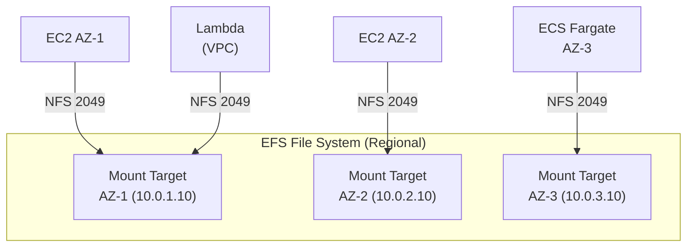

# EFS — Senior Interview Guide

## Core Concepts

- Fully managed **NFS v4.1/4.0** file system; POSIX-compliant
- **Multi-AZ** by default (Regional) — data stored across multiple AZs
- Automatically grows and shrinks — no pre-provisioning needed
- Accessible from: EC2, ECS (Fargate and EC2), Lambda, EKS, on-premises (via DX/VPN)



---

## Performance Modes

| Mode | Latency | Throughput | Use Case |
|------|---------|-----------|---------|
| General Purpose (default) | Lowest | Up to Elastic tier | Web, CMS, development |
| Max I/O | Higher | Higher (but deprecated for new) | Massively parallel (older guidance) |

**Note**: AWS recommends General Purpose with Elastic throughput for all new file systems (Max I/O is effectively legacy for new workloads)

---

## Throughput Modes

| Mode | How It Works | Best For |
|------|-------------|---------|
| Bursting | Throughput scales with storage size; burst credits | Spiky, smaller file systems |
| Provisioned | Fixed throughput regardless of storage | Consistent high throughput needs |
| Elastic (recommended) | Auto-scales 1 MB/s to 10 GB/s per file system | Unpredictable or spiky workloads |

**Elastic Throughput**: read: up to 10 GB/s; write: up to 3 GB/s; scales in/out instantly
**Bursting**: 1 MB/s per 1 GB stored (minimum 1 MB/s); burst to 100 MB/s for up to 12 hrs/day (for < 1 TB)

---

## Storage Classes

| Class | Use | Pricing |
|-------|-----|---------|
| Standard | Frequently accessed | ~$0.30/GB-month |
| Infrequent Access (IA) | Files not accessed in 30 days | ~$0.025/GB-month + retrieval fee |
| Archive | Files not accessed in 90 days | ~$0.008/GB-month + higher retrieval |

- **Intelligent-Tiering (EFS Lifecycle Management)**: automatically moves files to IA or Archive based on access pattern
- Access pattern monitor: 14, 30, 60, or 90 days without access = transition to IA/Archive
- Transition back to Standard: on next access (with retrieval fee)

---

## Access Points

- Named entry points that enforce POSIX user and group identity
- Override UID/GID for all operations through access point
- Restrict to specific directory path within file system
- **Use case**: separate application environments in same EFS; enforce security without modifying app

```json
{
  "PosixUser": {"Uid": 1000, "Gid": 1000},
  "RootDirectory": {
    "Path": "/app/tenant-a",
    "CreationInfo": {"OwnerUid": 1000, "OwnerGid": 1000, "Permissions": "755"}
  }
}
```

---

## EFS Replication

- One-way replication to another EFS file system (same or cross-region)
- RPO: seconds to minutes
- Failover: promote replica to primary (creates new writable file system)
- Cannot replicate to/from file systems already in a replication relationship

---

## Most Asked Senior Interview Questions

**Q1: EFS vs EBS — when do you choose EFS?**
- EFS: multiple EC2 instances need shared access; NFS protocol; no pre-provisioning; CMS, shared config
- EBS: single instance; block storage; databases; lowest latency; highest IOPS
- **Trap**: "Is EFS faster than EBS?" No — EFS has higher latency than EBS (NFS overhead); use EBS for databases

**Q2: EFS costs can be surprisingly high — how do you optimize?**
- EFS Standard: $0.30/GB-month vs EBS gp3: $0.08/GB-month (3.75x more expensive)
- Enable Lifecycle Management to move cold files to IA ($0.025/GB) or Archive ($0.008/GB)
- Use EFS Intelligent-Tiering (combined IA class)
- Monitor: CloudWatch `StorageBytes` by storage class; check what percentage is in Standard vs IA

**Q3: How do you mount EFS on Lambda?**
- Lambda must be in VPC (same as EFS mount target)
- Create EFS Access Point; attach to Lambda function
- Lambda execution role needs `elasticfilesystem:ClientMount` permission
- **Trap**: "Lambda in VPC has slower cold starts?" Yes — Hyperplane ENI mitigates this now; not as big an issue as before

**Q4: How do you implement multi-tenant isolation with EFS Access Points?**
- Create one EFS file system per environment
- Create one Access Point per tenant
- Each Access Point enforces: specific root path (`/tenant-id`), POSIX UID/GID
- Mount Access Point (not file system) in container task definition
- Tenant container cannot escape its `/tenant-id` directory

**Q5: What encryption options does EFS provide?**
- **Encryption at rest**: KMS; must be enabled at creation (cannot enable after)
- **Encryption in transit**: TLS (mount with `tls` option in mount command)
- Both recommended for production
- **Trap**: "Can you encrypt an existing unencrypted EFS?" No — must create new encrypted file system and migrate data

**Q6: How does EFS Bursting throughput work for small file systems?**
- Credit earned: 1 MB/s per 1 GB stored
- A 100 GB file system earns 100 MB/s credits/hr
- Burst throughput: 100 MB/s (limited by storage size)
- 1 TB+ file systems: earn 1,000 MB/s credits = unlimited burst
- **Solution for small file systems needing high throughput**: use Elastic Throughput mode

---

## Scenario-Based Questions

**Scenario 1: WordPress running on 3 EC2 instances in different AZs — shared media uploads**
- EFS is ideal: all EC2 instances mount same EFS via NFS
- Mount target in each AZ subnet
- Lifecycle Management: move older media files to IA after 30 days
- Consider: CloudFront + S3 for static content delivery (better performance + cheaper)
- EFS for: PHP code, plugins (writable, shared)

**Scenario 2: Container workload on ECS Fargate needing shared configuration files**
- EFS volume in task definition (mount point + access point)
- Access Point enforces POSIX user = container UID
- Lifecycle: EFS Standard (config files are small and frequently accessed)
- Security: SG allows NFS (2049) from Fargate task SG to EFS mount target SG
- **Trap**: Fargate tasks need EFS mount target in same AZ for performance; cross-AZ NFS adds latency + cost

---

## Real-world Failure Cases

**1. NFS mount performance degradation**
- Symptom: file operations slow, high latency
- Causes: wrong throughput mode (Bursting with depleted credits); too many small file operations
- Fix: switch to Elastic throughput; batch small file operations; use General Purpose mode

**2. EFS running out of burst credits**
- Small file system (<500 GB); sustained write workload depletes credits
- After depletion: throughput drops to baseline (low MB/s)
- Fix: switch to Elastic or Provisioned throughput mode

**3. Lambda cannot mount EFS**
- Lambda timeout when accessing EFS
- Cause: Lambda not in same VPC/subnet as EFS mount target; SG blocking port 2049
- Fix: Lambda in VPC; SG allows outbound 2049 to EFS mount target SG; correct IAM permissions

**4. EFS replication lag during region outage**
- RPO exceeded: replication queue backed up before outage
- Replicated data is slightly behind primary
- Fix: monitor `ReplicationLag` CloudWatch metric; set alarm if lag > threshold; accept RPO > 0

---

## Cost Optimization

| Approach | Saving |
|---------|--------|
| Lifecycle to IA (Standard → IA) | ~92% cheaper per GB |
| Lifecycle to Archive | ~97% cheaper per GB |
| Elastic throughput (pay per GB transferred) | Only pay for actual IO; cheaper for spiky |
| Provisioned throughput (if consistently high) | Predictable cost for steady workloads |
| One Zone EFS (single AZ) | 47% cheaper than Regional; no multi-AZ HA |

**One Zone EFS**: same performance, 47% cheaper, single AZ only — fine for dev/test or resilient workloads

---

## Security Considerations

- **Mount target SG**: allow inbound NFS (TCP 2049) from EC2/task SG only
- **IAM for NFS**: EFS resource policy + IAM conditions (`elasticfilesystem:ClientMount`, `ClientWrite`)
- **POSIX permissions**: Access Points enforce POSIX user; prevents directory traversal
- **Encryption at rest**: KMS; required for HIPAA/PCI
- **Encryption in transit**: always mount with `tls` option: `mount -t efs -o tls fs-xxx:/ /mnt/efs`
- **VPC-only access**: EFS is inherently VPC-bound; no public endpoint

---

## EFS vs EBS vs S3

| Feature | EFS | EBS | S3 |
|---------|-----|-----|-----|
| Protocol | NFS | Block (NVMe) | REST/HTTP |
| Access | Multi-instance, multi-AZ | Single instance (io2: 16 instances) | Unlimited clients |
| Persistence | Yes | Yes | Yes |
| Throughput | Up to 10 GB/s | Up to 4 GB/s (io2 BE) | Very high |
| Latency | ms (NFS overhead) | sub-ms | ms-seconds |
| Scalability | Auto | Fixed (resize needed) | Infinite |
| Cost (hot data) | $0.30/GB | $0.08/GB | $0.023/GB |
| POSIX compliant | Yes | Yes | No |
| Best for | Shared FS, CMS | Databases, OS | Object store, backups, static |

---

## Quick Revision Bullets

- EFS = managed NFS, multi-AZ, auto-scales, POSIX-compliant
- Performance modes: General Purpose (default); Max I/O (legacy)
- Throughput modes: Elastic (recommended, auto-scales), Bursting (credit-based), Provisioned
- Lifecycle: Standard → IA (30+ days idle) → Archive (90+ days idle); 92-97% cost savings
- Encryption at rest must be set at creation; cannot enable after
- Access Points: POSIX user enforcement + directory scoping = multi-tenant isolation
- One Zone EFS: 47% cheaper, single AZ — dev/test, resilient workloads
- EFS vs EBS: EFS = shared multi-instance; EBS = single instance highest IOPS
