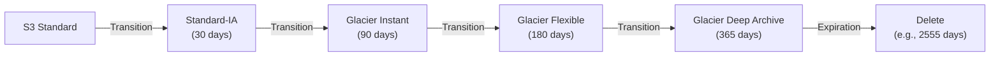

# S3 — Senior Interview Guide

## Storage Classes Comparison

| Class | Min Duration | Retrieval Time | Min Object Size | Use Case |
|-------|-------------|----------------|----------------|---------|
| Standard | None | Immediate | None | Frequently accessed |
| Standard-IA | 30 days | Immediate | 128 KB | Infrequent, needs fast access |
| One-Zone-IA | 30 days | Immediate | 128 KB | Re-creatable infrequent data |
| Glacier Instant | 90 days | Milliseconds | 128 KB | Archive with instant access |
| Glacier Flexible | 90 days | 1-12 hrs (Std), 3-5 hr (Bulk), 1-5 min (Expedited) | 40 KB | Long-term archive |
| Glacier Deep Archive | 180 days | 12-48 hrs | 40 KB | Compliance, 7-10 yr retention |
| Intelligent-Tiering | None | Depends on tier | None | Unknown/changing access pattern |

---

## Lifecycle Policies



- **Minimum duration charges**: moving to IA class before 30 days still charges for 30 days
- **Non-current versions**: separate lifecycle rules for versioned objects
- **Multipart uploads**: expire incomplete multipart uploads (free storage cleanup)

---

## Versioning and Object Lock

### Versioning
- Once enabled, cannot be disabled (only suspended)
- Every PUT/DELETE creates a new version; delete adds a delete marker
- MFA Delete: requires MFA token to delete versions or change versioning state — protects against ransomware

### S3 Object Lock
| Mode | Who Can Delete | Duration |
|------|---------------|---------|
| Governance | Users with `s3:BypassGovernanceRetention` | Configurable |
| Compliance | No one (including root) until expiry | Configurable |
| Legal Hold | Users with `s3:PutObjectLegalHold` | Indefinite (until released) |

- WORM (Write Once Read Many) — required for SEC 17a-4, FINRA, HIPAA compliance

---

## Replication

| Feature | CRR (Cross-Region) | SRR (Same-Region) |
|---------|-------------------|-------------------|
| Replication | Different region | Same region |
| Use case | DR, latency, compliance | Log aggregation, dev/test |
| Existing objects | Not replicated by default (use Batch Replication) | Same |
| Delete markers | Optional | Optional |
| RTC (Replication Time Control) | 99.99% replicated in 15 min, guaranteed | Same |

- Requires versioning enabled on both source and destination
- IAM role for replication must have permissions on both buckets

---

## Performance

- **Default limits**: 3,500 PUT/COPY/POST/DELETE + 5,500 GET/HEAD per second **per prefix**
- **Scale**: use multiple prefixes (e.g., randomize prefix, not sequential date-based)
- **Multipart Upload**: recommended for objects >100 MB; required conceptually for >5 GB; parallel upload
- **S3 Transfer Acceleration**: CloudFront edge → AWS backbone → S3; useful for global uploads
- **Byte-range fetch**: parallel downloads; also useful for partial content (e.g., resume downloads)

---

## Access Controls

### Block Public Access (BPA)
- 4 settings at account and bucket level
- **BlockPublicAcls**: blocks all ACL-based public access
- **IgnorePublicAcls**: ignores existing public ACLs
- **BlockPublicPolicy**: blocks bucket policies granting public access
- **RestrictPublicBuckets**: restricts any public access
- Best practice: enable all 4 at account level; disable selectively only for public buckets

### Policy Hierarchy (evaluated in order)
1. SCP (deny trumps all)
2. Bucket policy
3. IAM user/role policy
4. ACL (legacy — avoid)
5. VPC endpoint policy

---

## Advanced Features

### S3 Access Points
- Named entry points with their own policies + VPC restriction
- Simplifies management for shared buckets with many access patterns
- Each access point can restrict to specific VPC

### S3 Object Lambda
- Intercept GetObject → transform response with Lambda function
- Use cases: on-the-fly redaction, format conversion, content enrichment

### S3 Event Notifications
- Destinations: SNS, SQS, Lambda, EventBridge
- EventBridge: more routing options; can filter on object metadata
- Delivery: at-least-once; not ordered

### S3 Lens
- Storage analytics: usage, activity, cost optimization recommendations
- Organization-wide visibility
- Free tier: summary metrics; Advanced tier: $0.20/M objects/month

---

## Most Asked Senior Interview Questions

**Q1: S3 is not infinitely scalable in all dimensions — what are the limits?**
- Per-prefix throughput: 3,500 PUT + 5,500 GET per second
- Max object size: 5 TB (5 GB via single PUT; >5 GB requires multipart)
- Bucket limit: 100 per account (soft limit, can increase to 1000)
- **Trap**: "How do you overcome prefix limits?" Use randomized prefixes or hash-based prefixes; avoid date-sequential prefixes

**Q2: S3 Consistency Model — what changed in 2020?**
- Before 2020: eventual consistency for overwrite PUTs and DELETEs
- Since December 2020: **strong read-after-write consistency** for all operations
- PUT → immediate read returns new object (no more stale reads)
- **Trap**: "What about LIST consistency?" Also strongly consistent now

**Q3: How do you secure an S3 bucket that should only be accessed from a VPC?**
```json
{
  "Effect": "Deny",
  "Principal": "*",
  "Action": "s3:*",
  "Resource": ["arn:aws:s3:::my-bucket", "arn:aws:s3:::my-bucket/*"],
  "Condition": {
    "StringNotEquals": {
      "aws:sourceVpce": "vpce-xxxxxxxx"
    }
  }
}
```
- Add S3 Gateway Endpoint to VPC
- Bucket policy denies unless request comes from the VPC endpoint
- Block Public Access enabled at bucket level

**Q4: Explain the SSE options and when to use each**
| Option | Key Management | Performance | Use Case |
|--------|---------------|-------------|---------|
| SSE-S3 | AWS managed, opaque | Fastest | Default; no compliance requirement |
| SSE-KMS | KMS CMK; audit in CloudTrail | Slight overhead; KMS throttle | Compliance, key rotation, audit |
| SSE-C | Customer provided | No KMS throttle | Customer retains keys on-prem |
| DSSE-KMS | Dual-layer KMS | Most overhead | Compliance requiring double encryption |

- **Trap**: "SSE-KMS at scale has what issue?" KMS throttle (5,500-30,000 req/s default); use S3 Bucket Key to reduce KMS calls by ~99%

**Q5: S3 Lifecycle — what are common gotchas?**
- Objects must be at least 30 days in Standard before transitioning to Standard-IA (minimum)
- Glacier transitions: charged for minimum 90-day storage even if deleted earlier
- Lifecycle doesn't apply retroactively to existing objects (only new objects)
- Delete markers from versioning need explicit lifecycle rule to be removed

**Q6: CRR vs SRR — when do you need each?**
- CRR: DR in different region, compliance (data must be in EU), serve closer to users
- SRR: log aggregation from multiple buckets to central, dev/test copying from prod, same-region replication for compliance
- **Trap**: "Does replication guarantee RPO = 0?" No — async; RTC gives 15-minute SLA for 99.99% of objects

**Q7: How do you transfer 100 TB of data from on-premises to S3?**
- Option 1: AWS DataSync over DX/VPN (online; consistent incremental sync)
- Option 2: AWS Snowball Edge (offline; for large one-time transfers or limited bandwidth)
- Decision: if 100 TB over 1 Gbps DX = ~9 days; over 100 Mbps internet = ~90 days → Snowball wins
- For ongoing sync: DataSync; for one-time migration with limited network: Snowball

**Q8: How do Presigned URLs work and what are security considerations?**
- Generated by IAM principal; inherit the principal's permissions at time of generation
- Contains: bucket, key, expiry, signature
- Expiry: up to 7 days (IAM user); up to 1 hour (STS/federated/role) — short-lived session token
- **Security trap**: if the IAM role is revoked, presigned URL still works until expiry
- Best practice: use short TTLs; use S3 Object Lambda to add validation logic

---

## Scenario-Based Questions

**Scenario 1: Media company storing 1 PB of video; 90% not accessed after 30 days, 5% never after 1 year**
- Solution:
  1. S3 Intelligent-Tiering (IT) for all new uploads (handles unknown access patterns)
  2. Or: Lifecycle rule: Standard → Standard-IA after 30 days → Glacier Flexible after 90 days
  3. S3 Lens: identify buckets with no access in 90 days → move to Deep Archive
  4. Enable S3 Bucket Key: reduce KMS costs if SSE-KMS used
- Cost: Glacier Deep Archive = $0.00099/GB/month vs Standard $0.023/GB = 23x cheaper

**Scenario 2: Regulatory compliance — logs must be immutable for 7 years**
- Solution:
  1. S3 Object Lock in Compliance mode (no one can delete until retention expires)
  2. Versioning enabled (prerequisite for Object Lock)
  3. MFA Delete enabled on bucket
  4. Lifecycle: after 7 years, auto-delete (or convert to non-compliant mode)
  5. CloudTrail + S3 access logs for audit trail

---

## Real-world Failure Cases

**1. Accidental bucket deletion**
- Prevention: enable bucket versioning + Object Lock; use MFA Delete
- Enable Bucket Versioning: objects can be recovered; bucket itself cannot be
- Enable AWS Backup for S3 for additional protection

**2. S3 throttling — 503 SlowDown errors**
- Cause: hitting per-prefix throughput limit
- Fix: randomize prefix (hash of user ID, not date); spread across multiple prefixes

**3. SSE-KMS causing throttling**
- Cause: KMS limit reached (5,500 req/s default) when large S3 workload
- Fix: enable S3 Bucket Key (reduces KMS calls by ~99%); or request KMS limit increase

**4. Replication not working for existing objects**
- Cause: CRR/SRR only applies to new objects after replication configuration
- Fix: use S3 Batch Operations to replicate existing objects; or enable "Replicate existing objects" option

---

## Cost Optimization

- **Intelligent-Tiering**: automates cost optimization; charges monitoring fee but saves on IA/Glacier transition management
- **S3 Bucket Key**: reduces SSE-KMS costs by ~99% (batches KMS requests)
- **S3 Lens**: identify under-accessed buckets; find buckets without lifecycle policies
- **Glacier Deep Archive**: $0.00099/GB — cheapest storage in AWS; 23x cheaper than Standard
- **Multipart upload cleanup**: lifecycle rule to delete incomplete multipart uploads after 7 days
- **Request costs**: Glacier retrieval is expensive (Expedited: $0.03/GB); use Bulk ($0.0025/GB) for large restores

---

## Security Considerations

- Block Public Access: enable at account level; override per bucket only when needed
- Bucket policies: use `aws:SecureTransport: true` condition to enforce HTTPS
- SSE-KMS + S3 Bucket Key: encryption with audit + cost efficiency
- Access Points: simplify cross-team bucket access with per-team policies
- S3 Access Logs + CloudTrail Data Events: full audit trail for data access
- MFA Delete: protect against ransomware/accidental deletion (requires root user to enable)

---

## Quick Revision Bullets

- S3 consistency: strong read-after-write for all operations since Dec 2020
- Per-prefix limit: 3,500 PUT + 5,500 GET/sec; use randomized prefixes at scale
- Object Lock Compliance = immutable until expiry even for root; Governance = bypassable
- SSE-KMS at scale: use S3 Bucket Key to reduce KMS API calls by ~99%
- CRR/SRR: only new objects; use Batch Replication for existing
- RTC: 99.99% replicated within 15 minutes (SLA)
- Presigned URL expiry: 7 days (IAM user), 1 hour (STS role) — based on credential expiry
- Glacier Deep Archive = $0.00099/GB; cheapest; 12-48hr retrieval
