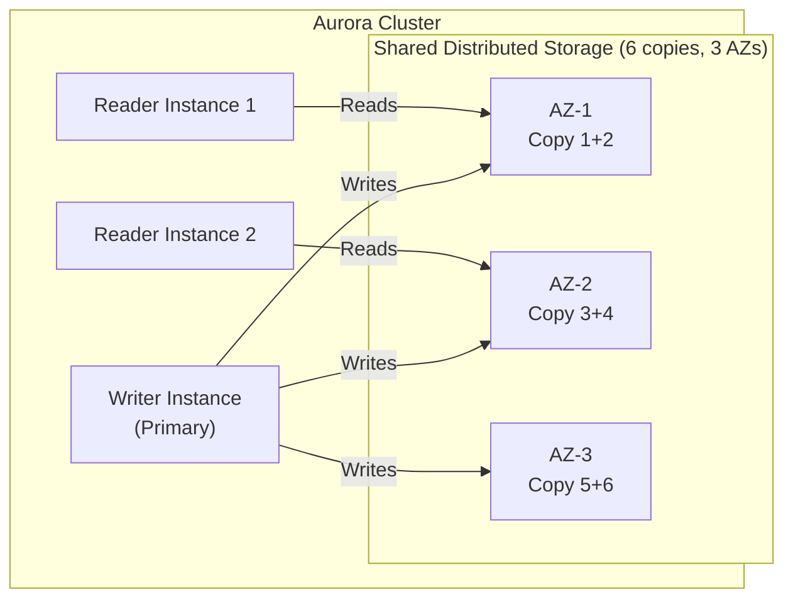
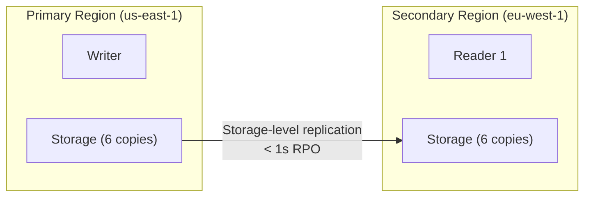

# Aurora — Senior Interview Guide

## Architecture

**Key insight**: Writer only needs 4/6 copies to acknowledge a write (quorum). Can survive loss of 1 entire AZ + 1 additional node.

---

## Why Aurora is Not Just RDS with SSD

| Feature | RDS (MySQL/PG) | Aurora |
|---------|---------------|--------|
| Storage | EBS per instance | Shared distributed storage |
| Replication | Log-based async | Storage-level (no log shipping) |
| Failover time | 60-120s | < 30s (typically < 15s) |
| Read Replicas | Up to 5 (async) | Up to 15 (same storage, no lag) |
| Storage growth | Manual resize | Auto 10 GB increments, up to 128 TB |
| Recovery | Restore from snapshot | Near-instant (no restore needed) |
| IOPS | EBS-limited | Distributed, higher |

**Aurora Read Replicas**: share the same storage as writer — no replication lag; reads are always consistent

---

## Aurora Global Database

- **RPO**: < 1 second (storage-level replication, not log shipping)
- **RTO**: < 1 minute managed failover (promote secondary to primary)
- Write forwarding: secondary can accept writes and forward to primary (higher latency)
- Up to 5 secondary regions
- Use case: DR, global reads with low latency

---

## Aurora Serverless

| Feature | Serverless v1 | Serverless v2 |
|---------|--------------|--------------|
| Scale unit | ACU (Aurora Capacity Unit) | ACU (0.5 ACU increments) |
| Scale speed | Minutes (cold start) | Seconds (near-instant) |
| Scale to zero | Yes (pauses after N minutes) | No (minimum 0.5 ACU) |
| VPC | Optional | Required |
| Reads from Replicas | No | Yes |
| Global DB | No | Yes |
| Multi-AZ | No | Yes |
| Use case | Infrequent, unpredictable | Variable load, dev/prod |
| Recommendation | Legacy / very infrequent | New deployments |

**ACU**: 1 ACU ≈ 2 GB RAM; CPU and network scale proportionally
**v2 pricing**: $0.12/ACU-hour (vs provisioned instance)

---

## Cluster Endpoints

| Endpoint | Routes To | Use Case |
|----------|-----------|---------|
| Cluster (Writer) | Current primary writer | All read/write operations |
| Reader | Load-balanced across replicas | Read-only operations |
| Instance-specific | Specific instance | Direct connection, maintenance |
| Custom | User-defined subset of instances | Analytics replicas, specific workloads |

---

## Backtrack (MySQL Only)

- Rewind database to a specific point in time **without restoring from snapshot**
- Window: up to 72 hours
- Near-instantaneous vs snapshot restore (which creates new DB instance)
- Use case: undo accidental data modification during deployments
- Cost: $0.012/GiB-hour for change records stored

---

## Database Cloning

- Copy-on-write clone of Aurora cluster
- **Near-instant**: no data copy — shares original cluster's pages until modified
- **Use case**: create dev/staging environment from production without copying TB of data
- Clone diverges from original over time as writes occur
- Cheaper: only pay for storage changes, not full copy

---

## Aurora Parallel Query

- Pushes down query processing to the distributed storage layer
- Scans run in parallel across storage nodes
- Use case: analytical queries on OLTP Aurora cluster without read replicas
- Limitation: available for Aurora MySQL only; some SQL features unsupported

---

## Most Asked Senior Interview Questions

**Q1: Why are Aurora Read Replicas different from RDS Read Replicas?**
- RDS Read Replicas: async log shipping from primary; can have replication lag
- Aurora Read Replicas: share the same storage as writer; no replication lag; reads are always consistent
- Aurora failover to reader: just redirect DNS (storage already shared) = < 30s
- **Trap**: "Can you promote an Aurora Read Replica to primary?" Yes — it's the failover mechanism; < 30s

**Q2: Aurora Global Database — how is the < 1s RPO achieved?**
- Replication at storage layer (not log shipping)
- Storage replication happens before write ACK returns to application
- Cross-region dedicated replication infrastructure (not over internet)
- **Trap**: "Is it synchronous across regions?" No — writes ACK when 4/6 copies in primary region confirm; secondary region receives asynchronously but nearly instantly

**Q3: Explain Aurora failover priority tiers**
- Set `failover priority` (0-15) on each Aurora replica
- Lower number = higher priority for failover promotion
- Tiers 0 < Tier 1 < ... < Tier 15
- Within same tier: largest instance size promoted first
- Use: prioritize same-AZ replica for faster failover; or specific capacity

**Q4: Aurora Serverless v2 — when would you choose over provisioned?**
- Serverless v2: variable workloads; don't want to pre-provision capacity; pays per ACU-second
- Provisioned: predictable, steady load; reserved instances for cost
- Break-even: v2 costs more than provisioned at sustained load but cheaper for spiky
- **Trap**: "Does v2 scale to zero?" No — minimum 0.5 ACU; use v1 for true scale-to-zero (but accept cold start)

**Q5: How does Aurora Multi-Master work?**
- Multiple writer nodes (up to 4) — all can accept writes
- **Conflict detection**: storage-level; first write wins; others get error
- Application must handle write conflicts
- Use case: very high write availability (one writer going down doesn't stop writes)
- **Not the same as active-active globally**: still single-region

**Q6: Aurora storage automatically grows — is there a limit?**
- Starts at 10 GB; auto-grows in 10 GB increments
- Maximum: 128 TB (Aurora Serverless v1: 128 TB; v2 and provisioned: 128 TB)
- **Cannot shrink**: storage never decreases even if you delete data
- Monitoring: `FreeLocalStorage` metric; alert before hitting limits
- **Trap**: "Is Aurora storage unlimited?" No — 128 TB max

**Q7: How do you use Aurora custom endpoints?**
- Create custom endpoint pointing to specific subset of instances
- Example: 2 large replicas for analytics; 3 medium replicas for app reads
- Route analytics app to custom endpoint → hits only large instances
- Route production app to reader endpoint → load-balanced across all
- Allows workload isolation without separate clusters

**Q8: Explain the Aurora storage layer's quorum mechanism**
- 6 storage copies across 3 AZs (2 per AZ)
- Write quorum: 4/6 copies must acknowledge
- Read quorum: 3/6 copies (ensures at least one overlap with write quorum)
- Survives: loss of 1 AZ (loses 2 copies), or 2 additional individual node failures
- **Trap**: "What if 3 nodes in same AZ fail?" If spread across different AZs, still survive

---

## Scenario-Based Questions

**Scenario 1: Financial application needs < 1 minute RTO for regional disaster**
- Aurora Global Database:
  1. Primary in us-east-1 (read/write)
  2. Secondary in eu-west-1 (read-only; can forward writes)
  3. Global DB replication: < 1s RPO
  4. Managed failover: < 1 min RTO
  5. ARC (Route 53 Application Recovery Controller) for application-level DNS cutover
  6. Test failover in staging quarterly

**Scenario 2: Migrate Oracle 12c to Aurora PostgreSQL for cost savings**
- Tool chain:
  1. AWS SCT: analyze and convert schema/code
  2. DMS: migrate data + CDC for cutover
  3. Address: sequence handling (Oracle sequences → PostgreSQL sequences), data types, stored procedures
  4. Run parallel: Oracle and Aurora for validation period
  5. Performance test: Aurora should be comparable or faster for most OLTP
  6. Cost: Aurora ~20% less than Oracle licenses + EC2

---

## Real-world Failure Cases

**1. Aurora Serverless v1 cold start causing timeout**
- v1 pauses after 5 minutes of inactivity; resume takes 25-30 seconds
- API calls timeout during resume
- Fix: switch to Serverless v2 (no pause); or use scheduled Lambda to keep v1 warm; or use provisioned for latency-sensitive

**2. Global Database replication latency spike**
- Secondary region replica lag > 1s during write-heavy period
- Fix: monitor `AuroraGlobalDBReplicationLag`; if consistently high, scale up primary writer; check cross-region network

**3. Storage growth causing cost surprise**
- Aurora auto-grows to 50 TB; can't shrink
- Fix: export data to S3/Redshift for archival; use `SELECT INTO OUTFILE S3`; delete old data; but storage allocation doesn't reduce

**4. Backtrack window exceeded**
- Ran backtrack to recover from data corruption but window was only set to 24h
- Corruption was 3 days old — backtrack can't reach it
- Fix: increase backtrack window (up to 72h); also use PITR + snapshots for longer recovery windows

---

## Cost Optimization

- **Reserved Instances on Aurora**: 1 or 3-year, up to 60% savings
- **Aurora Serverless v2**: right-priced for variable loads; no reserved instances
- **Storage**: $0.10/GB-month (vs EBS gp3 $0.08/GB); justified by HA and auto-scaling
- **Auto Scaling readers**: scale in during low-traffic periods
- **Clone instead of copy**: dev/staging clones are nearly free (copy-on-write)
- **Snapshot export to S3**: Parquet format in S3 for Athena analysis (cheaper than running Aurora for analytics)

---

## Security Considerations

- **Encryption**: enabled at creation; uses KMS; cannot enable after
- **IAM database auth**: generate auth token instead of password (valid 15 minutes)
- **VPC only**: Aurora cluster is always in VPC; no public access by default
- **Security Groups**: only specific app SGs should reach Aurora port
- **Activity Streams**: real-time audit log of database activity (for compliance)
- **Secrets Manager**: native integration for credential rotation

---

## Quick Revision Bullets

- Aurora storage: 6 copies across 3 AZs; write quorum = 4/6; survives 1 full AZ loss
- Aurora replicas: share storage with writer; zero replication lag; max 15
- Failover: < 30s (DNS flip; storage already shared)
- Aurora Global DB: < 1s RPO (storage replication); < 1min RTO (managed failover)
- Serverless v2: instant scaling, no scale-to-zero, minimum 0.5 ACU; recommended over v1
- Backtrack: rewind MySQL Aurora up to 72h without restore (near-instant)
- Clone: copy-on-write; near-instant; only pay for diverged data
- Storage grows to 128 TB max; never shrinks
