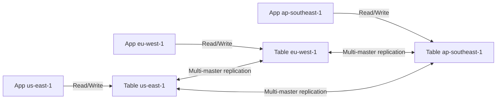

# DynamoDB — Senior Interview Guide

## Data Model

- **Table**: collection of items
- **Item**: collection of attributes (max 400 KB)
- **Partition Key**: required; determines which partition stores the item
- **Sort Key**: optional; enables range queries within a partition
- **Attributes**: schema-less; each item can have different attributes

### Partition Behavior
- Each partition: 10 GB storage, 3,000 RCU, 1,000 WCU
- Items with same partition key → same partition
- Hot partition: single PK gets all traffic = throttling

---

## Capacity Modes

| Mode | Pricing | Scaling | Use Case |
|------|---------|---------|---------|
| Provisioned | Per RCU/WCU/hour | Manual or Auto Scaling | Predictable traffic |
| On-Demand | Per read/write request | Instant | Unpredictable, new tables |

### RCU/WCU Math
- **1 RCU** = 1 strongly consistent read of 4 KB item (or 2 eventually consistent reads)
- **1 WCU** = 1 write of 1 KB item
- Example: 10 KB item, 100 reads/sec (strongly consistent) = 3 × 100 = 300 RCU (ceil(10/4) = 3)
- Example: 3 KB item, 50 writes/sec = 3 × 50 = 150 WCU (ceil(3/1) = 3)

### Burst Capacity
- DynamoDB retains up to 5 minutes of unused capacity for bursting
- After burst capacity exhausted: throttling (`ProvisionedThroughputExceededException`)
- On-Demand: no throttling up to 2x previous peak

---

## GSI vs LSI

| Feature | GSI | LSI |
|---------|-----|-----|
| Partition key | Different from table | Same as table |
| Sort key | Optional | Must be different from table sort key |
| Creation | Any time | Only at table creation |
| Capacity | Separate (own RCU/WCU) | Shares table capacity |
| Limit | 20 per table | 5 per table |
| Strong consistency | No (eventually consistent) | Yes (strongly consistent reads) |
| Projections | Custom | Custom |

**GSI use case**: query by non-primary-key attribute (e.g., query orders by customer email)
**LSI use case**: different sort key within same partition (e.g., items sorted by date within same user)

---

## DynamoDB Streams

- Ordered stream of item-level changes in a table
- Each record: NEW_IMAGE, OLD_IMAGE, NEW_AND_OLD_IMAGES, or KEYS_ONLY
- Retention: 24 hours
- Shards scale with table throughput
- **Use cases**: event-driven architectures, Lambda triggers, replication, audit logs

---

## Global Tables



- **Active-active**: writes to any region replicated to all others
- **Conflict resolution**: last-writer-wins (based on timestamp)
- **RPO**: seconds; **RTO**: immediate (all regions are active)
- Requires: on-demand capacity mode or provisioned with auto-scaling; streams enabled
- Cost: replicated write WCUs charged in all replica regions

---

## DAX (DynamoDB Accelerator)

- In-memory cache; microsecond read latency (vs milliseconds for DynamoDB)
- Write-through cache: writes go to DynamoDB first, then cache
- **Item cache**: individual item lookups (GetItem, BatchGetItem)
- **Query cache**: query/scan results
- TTL: 5 minutes default; configurable per operation
- VPC-based; multi-AZ cluster (3-node minimum for HA)
- Consistency: eventually consistent reads from cache; strongly consistent = bypass cache

---

## Transactions

- **TransactWriteItems**: up to 100 items, atomically; all-or-nothing
- **TransactGetItems**: up to 100 items, atomically consistent reads
- **Cost**: 2x WCU/RCU (two-phase commit internally)
- Use cases: financial transfers, order placement (multi-table atomicity)
- Limitations: cannot span multiple AWS accounts or tables with different throughput modes

---

## Hot Partition Problem and Solutions

**Causes**: low-cardinality partition key; time-series data with sequential keys; popular items

**Solutions**:
1. **Write sharding**: add random suffix to partition key (`user-123-shard-3`)
2. **Spread writes**: use EventBridge → multiple Lambda → multiple partition keys
3. **Cache hot items**: DAX or ElastiCache in front of DynamoDB
4. **On-Demand mode**: handles sudden spikes without pre-provisioning
5. **Adaptive capacity**: DynamoDB automatically shifts capacity to hot partitions (built-in, takes time)

---

## Single-Table Design

Store multiple entity types in one table using compound sort keys:

```
PK                  SK                  Type
USER#user123        PROFILE             User profile
USER#user123        ORDER#2024-001      Order
USER#user123        ORDER#2024-002      Order
ORDER#2024-001      ITEM#prod-a         Order item
PRODUCT#prod-a      DETAILS             Product
```

- Access patterns drive design (not normalization)
- GSIs provide alternate access patterns
- Advantages: single table = fewer round trips; atomic transactions

---

## Most Asked Senior Interview Questions

**Q1: DynamoDB partition key design — what makes a good partition key?**
- High cardinality: many unique values (UUID, user ID with millions of users)
- Uniform distribution: no hot partitions
- Aligns with access patterns: queries target single partition when possible
- Bad examples: status (active/inactive), date (hot today), boolean
- **Trap**: "Can you use composite sort key to solve hot partition?" No — partition key determines partition; sort key only affects ordering within partition

**Q2: When would you choose DynamoDB over RDS?**
| Choose DynamoDB | Choose RDS |
|----------------|-----------|
| Massive scale (millions of req/s) | Complex queries (JOINs, aggregations) |
| Simple access patterns | Relational data model |
| Known access patterns | Ad-hoc queries |
| Serverless, auto-scale | ACID transactions across tables |
| Global active-active | Strong consistency by default |
| Single-digit ms latency | Reporting/analytics |

**Q3: How do DynamoDB GSIs work and what are their limitations?**
- GSI has its own partition key and sort key
- DynamoDB asynchronously replicates changes to GSI
- **GSI throttling**: if GSI throughput is insufficient, writes to table can be throttled
- **Sparse index**: items without GSI attribute are not in GSI (useful for conditional indexing)
- **Trap**: "Can you do strongly consistent reads from GSI?" No — GSIs only support eventual consistency

**Q4: DynamoDB vs DynamoDB + DAX — when does DAX help?**
- DAX helps: read-heavy workloads, same items accessed repeatedly, latency-sensitive reads
- DAX doesn't help: write-heavy workloads (writes go to DynamoDB first), rarely accessed items, strongly consistent reads (bypass cache)
- **Cost**: DAX cluster starts at ~$0.25/hr per node (3 nodes min = ~$540/month) — only worth it for high read volume

**Q5: Global Tables conflict resolution — what is "last writer wins"?**
- If two regions write to same item simultaneously, the write with the latest timestamp wins
- Application must handle this: if order status written in us-east-1 (SHIPPED) and eu-west-1 (CANCELLED) simultaneously, one will overwrite the other
- Use conditional writes or optimistic locking (`ConditionExpression: attribute_equals(version, current)`) to prevent conflicts

**Q6: DynamoDB Streams vs Kinesis Data Streams for DynamoDB**
- DynamoDB Streams: free, 24h retention, tight DynamoDB integration, Lambda trigger
- Kinesis Data Streams (KDS): $0.015/shard/hr, configurable retention (1-365 days), fan-out with EFO, custom consumers
- Use KDS for: longer retention, multiple consumers, complex analytics pipelines
- Use DynamoDB Streams for: simple Lambda triggers, Global Tables replication

**Q7: How do you handle a table scan at scale?**
- Full table scan = reads every item = expensive and slow at TB scale
- Avoid scans in production: design access patterns to use Query (not Scan)
- If scan required: use `FilterExpression` to reduce returned data; use `Limit` + pagination
- Parallel scan: divide table into segments, scan in parallel with worker fleet
- Prefer: use GSI or ElasticSearch for ad-hoc query patterns

**Q8: DynamoDB TTL — how does it work and what are the guarantees?**
- Add `TTL` attribute (Unix epoch timestamp) to items
- DynamoDB deletes expired items within **48 hours** of expiration
- Deletions appear in Streams (can trigger cleanup in related systems)
- Not guaranteed at exact second — use for approximate cleanup, not precise expiration
- **Trap**: "Does TTL deletion charge WCU?" No — TTL deletions are free

---

## Scenario-Based Questions

**Scenario 1: Gaming leaderboard for 10 million players, real-time reads/writes**
- Design:
  1. DynamoDB Global Table (active-active, low latency globally)
  2. Table: PK = `GAME#id`, SK = `SCORE#<padded score>#USER#id` (reverse order)
  3. LSI or GSI by score for top-N queries
  4. DAX in front for leaderboard reads (microsecond latency, cache top-1000)
  5. DynamoDB Streams → Lambda → update ElastiCache Sorted Set for real-time leaderboard
  6. On-Demand capacity: spike-proof

**Scenario 2: E-commerce single-table design for orders, products, users**
```
PK=USER#123, SK=PROFILE — user details
PK=USER#123, SK=ORDER#2024-01-15#001 — order (query: user's orders by date)
PK=ORDER#001, SK=ITEM#prod-a — order line items
PK=PRODUCT#prod-a, SK=DETAILS — product

GSI1: PK=ORDER_STATUS, SK=CREATED_AT — query orders by status (admin)
GSI2: PK=CATEGORY, SK=PRICE — query products by category/price
```
- All user data in one Query call (PK=USER#123, SK between PROFILE and Z)
- Transactional order placement: create order + deduct inventory atomically

---

## Real-world Failure Cases

**1. ProvisionedThroughputExceededException on specific partition**
- Hot partition: single popular item (e.g., viral product)
- Cause: adaptive capacity not sufficient; partition limit exceeded
- Fix: DAX in front for read hot items; write sharding for write hot items; On-Demand mode

**2. GSI causing table write throttling**
- GSI has insufficient WCU; table writes backing up
- Fix: increase GSI WCU; match GSI capacity to table capacity

**3. Global Table conflict corrupting data**
- Two regions wrote different values to same item at same second
- One value silently overwritten
- Fix: implement optimistic locking with version attribute and ConditionExpression

**4. Scan operation degrading production performance**
- Ad-hoc analytics query doing full table scan
- Consuming all RCU; production read requests throttled
- Fix: separate analytics pipeline (export to S3 + Athena); or use separate table for analytics; or rate-limit scans

---

## Cost Optimization

- **On-Demand for variable loads**: no capacity planning; pay per request
- **Provisioned + Auto Scaling for predictable loads**: cheaper at scale
- **Compress large items**: JSON compression before storing (reduces WCU for large items)
- **Sparse GSIs**: only index items that need the access pattern
- **TTL cleanup**: free item deletion; keep table lean
- **Table Export to S3**: for analytics; export to Parquet + query with Athena (cheaper than DynamoDB scans)
- **Reserved Capacity**: up to 53% discount for 1-year commitment (provisioned mode only)

---

## Security Considerations

- **Fine-grained access control**: IAM conditions on `dynamodb:LeadingKeys` (only access own items)
- **VPC Endpoint**: route DynamoDB traffic within VPC (no internet/NAT charges)
- **Encryption at rest**: default (AWS-owned key) or CMK for audit/compliance
- **Point-in-time recovery (PITR)**: enable on production tables; 35-day recovery window; $0.20/GB-month
- **CloudTrail**: audit all DynamoDB API calls (control plane); use DynamoDB streams for data-plane audit

---

## Quick Revision Bullets

- RCU: 1 strongly consistent read of 4 KB; WCU: 1 write of 1 KB
- GSI: different partition key, eventually consistent, created anytime, own capacity
- LSI: same partition key, different sort key, must be created at table creation
- Hot partition: low-cardinality PK; fix with write sharding or On-Demand
- Global Tables: active-active; last-writer-wins; RPO seconds
- DAX: microsecond reads; write-through; doesn't help strongly consistent reads
- Transactions: 2x cost; 100 items max; all-or-nothing
- TTL deletions are free; 48h eventual deletion; appear in Streams
- On-Demand: instant scaling, 2x peak; Provisioned: cheaper at steady state
