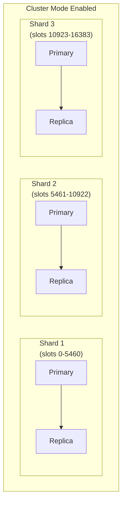

# ElastiCache — Senior Interview Guide

## Redis vs Memcached

| Feature | Redis | Memcached |
|---------|-------|-----------|
| Data structures | Strings, Lists, Sets, Sorted Sets, Hashes, Streams, HyperLogLog | Strings only |
| Persistence | AOF + RDB snapshots | None |
| Replication | Yes (primary + replicas) | No |
| Pub/Sub | Yes | No |
| Transactions | Yes (MULTI/EXEC) | No |
| Lua scripting | Yes | No |
| Cluster mode | Yes (hash slots) | Yes (client-side sharding) |
| Multi-threaded | No (single-threaded commands) | Yes |
| Use case | Caching + sessions + leaderboards + queues + pub/sub | Simple high-throughput caching only |
| Recommendation | Almost always | Only when multi-threaded needed for simple caching |

---

## Redis Cluster Mode

### Cluster Mode Disabled
- Single shard (primary + up to 5 replicas)
- All data on one node
- Scale: vertical only (instance type)
- Replicas for read scaling and HA

### Cluster Mode Enabled
- Data partitioned across 1-500 shards
- Each shard = primary + replicas
- **Hash slots**: 16,384 total; evenly distributed across shards
- Scale: horizontal (add/remove shards) + vertical
- Resharding: online, no downtime



---

## Eviction Policies

| Policy | Behavior | Best For |
|--------|---------|---------|
| noeviction | Error on write when full | Session store (never lose data) |
| allkeys-lru | Evict least recently used from all keys | General caching |
| volatile-lru | Evict LRU only from keys with TTL set | Mixed TTL and non-TTL |
| allkeys-lfu | Evict least frequently used from all keys | Access pattern-based |
| volatile-lfu | Evict LFU from keys with TTL | Mixed |
| allkeys-random | Evict random key | When all keys are equal value |
| volatile-random | Evict random key with TTL | Mixed |
| volatile-ttl | Evict key with lowest TTL first | Want shortest-lived to go first |

---

## Caching Patterns

### Cache-Aside (Lazy Loading)
```
1. App checks cache → miss
2. App reads from DB
3. App writes to cache
4. Next request: cache hit
```
- Pros: only cache what's needed; resilient (cache failure = fallback to DB)
- Cons: first access always misses; stale data risk

### Write-Through
```
1. App writes to DB
2. App immediately writes to cache
```
- Pros: cache always fresh
- Cons: write latency increased; wasted writes for rarely-read data

### Write-Behind (Write-Back)
```
1. App writes to cache
2. Cache asynchronously writes to DB
```
- Pros: lowest write latency
- Cons: data loss risk if cache fails before write to DB; complex

### Read-Through
```
1. App reads from cache
2. Cache miss: cache fetches from DB, caches, returns
```
- Pros: app doesn't need DB logic
- Cons: first access slow; cache misses under load = DB spike

---

## ElastiCache Serverless

- No cluster management; auto-scales capacity
- Pay per ECU (ElastiCache Compute Unit) + data stored
- Minimum latency vs provisioned: slightly higher
- Use when: variable workload, don't want to right-size clusters
- Not available for all regions; Redis protocol compatible

---

## Most Asked Senior Interview Questions

**Q1: Cache-aside vs write-through — which handles cache miss better?**
- Cache-aside: on miss, app queries DB and populates cache — DB hit for every new key
- Write-through: data is always in cache when it's in DB — no misses for recent writes
- **Thundering herd**: cache-aside + cache restart → all requests hit DB simultaneously
- Fix: use **cache warming** (pre-populate cache before bringing back online); or jitter on TTL

**Q2: How does Redis Cluster Mode handle a shard failure?**
- If primary fails: replica promoted to primary automatically (~15-30s)
- If replica fails: cluster continues (degraded mode); auto-repair provisions new replica
- If entire shard unavailable: keys in that shard's hash slots are inaccessible (partial outage)
- For global HA: use Global Datastore (cross-region replication) — can failover to replica region

**Q3: What causes cache stampede and how do you prevent it?**
- Scenario: popular key expires; 1000 concurrent requests all miss; all query DB simultaneously
- Prevention:
  1. **Probabilistic early expiration**: randomly refresh slightly before expiry
  2. **Mutex lock**: first miss acquires lock, fetches DB, populates cache; others wait
  3. **Background refresh**: refresh cache before TTL expires (never let popular keys expire)
  4. **Jitter on TTL**: add random variation to expiry times to spread misses

**Q4: When would you use ElastiCache over DAX for DynamoDB caching?**
- Use DAX when: DynamoDB-native; transparent caching; no code changes; compatible API
- Use ElastiCache when: caching multiple data sources; need complex data structures; existing Redis knowledge; need Pub/Sub or Sorted Sets
- ElastiCache is more flexible but requires explicit cache management in code

**Q5: Redis Sorted Sets — explain the leaderboard use case**
- ZADD: `ZADD leaderboard <score> <member>`
- ZREVRANK: rank of member (0-indexed, highest score first)
- ZREVRANGE: top N members with scores
- ZINCRBY: increment score atomically
- All operations: O(log N) — very fast for millions of players
- **Interview favorite**: explain O(log N) operations and why this beats DynamoDB for real-time leaderboards

**Q6: How do you handle Redis node failure with minimal data loss?**
- Enable **AOF (Append-Only File)** persistence: every write command logged
- AOF sync options: `always` (every write, slowest), `everysec` (default, max 1s data loss), `no` (OS decides)
- Enable **RDB snapshots** as backup
- Enable replication: data loss limited to replication lag at time of failure
- Multi-AZ: automatic failover if primary AZ fails

**Q7: What is Redis key expiration and what are the two mechanisms?**
- **Lazy expiration**: key checked only when accessed; expired key deleted on access
- **Active expiration**: Redis periodically scans a random subset of keys with TTL; deletes expired
- Memory implication: expired keys not accessed may consume memory until active scan deletes them
- For large TTL sets: ensure active expiration frequency sufficient; or use keyspace notifications + Lambda for immediate cleanup

**Q8: How do you scale ElastiCache Redis for 10x traffic spike?**
- Cluster Mode Enabled: add shards (online resharding); no downtime
- Cluster Mode Disabled: read scaling with replicas (reads); write scaling requires cluster migration
- **Read-heavy spike**: add read replicas (5 max per shard in CME; higher per cluster in CMD)
- **Write-heavy spike**: only cluster mode horizontal sharding; or vertical scale
- Pre-scale: use ElastiCache Auto Scaling or manual shard addition before expected spike

---

## Scenario-Based Questions

**Scenario 1: 50,000 concurrent users, session store needed, auto-scale**
- Redis cluster mode disabled (small data, simple key-value sessions)
- TTL per session key (e.g., 30 minutes idle timeout)
- Eviction policy: `noeviction` (never lose active sessions)
- Multi-AZ with automatic failover
- Redis AUTH + encryption in transit
- Session key: `session:{user_id}:{session_token}` (prefix for SCAN patterns)

**Scenario 2: API rate limiting with Redis for 1 million requests/second**
- Redis INCR + EXPIRE (sliding window counter)
- Or: Redis Sorted Sets for sliding window (ZADD, ZREMRANGEBYSCORE, ZCARD)
- Or: Token bucket with Lua script (atomic increment + check)
- Cluster Mode Enabled: distribute rate limit keys across shards
- Lua script ensures atomicity (read + write in single operation)

---

## Real-world Failure Cases

**1. Thundering herd after cache flush**
- DB received 100x normal traffic when cache cleared
- Fix: warm cache before opening traffic; use staggered cache warm-up; circuit breaker to limit DB requests

**2. Memory full — eviction causing unexpected data loss**
- `allkeys-lru` evicted critical session keys
- Fix: use `noeviction` for session store; increase memory; use separate cluster for sessions vs general cache

**3. Cluster split-brain**
- Network partition causes two nodes to believe they're primary
- Redis Sentinel/Cluster handles this via election; but temporary split can cause dual writes
- Fix: use ElastiCache managed mode (AWS handles sentinel/cluster); enable Multi-AZ for automatic failover

**4. High latency on specific Redis commands**
- KEYS * command (O(N) full scan) called in production
- Blocks Redis's single thread; all other commands queued
- Fix: never use KEYS in production; use SCAN (non-blocking); audit commands with SLOWLOG

---

## Cost Optimization

- **Right-size**: use ElastiCache Reserved Nodes (up to 55% discount)
- **Graviton instances**: r7g/m7g for ElastiCache — 20% better price-performance
- **ElastiCache Serverless**: no over-provisioning; pay per actual usage
- **Eviction tuning**: `allkeys-lru` keeps cache full of useful data; reduces DB load

---

## Security Considerations

- **Redis AUTH**: `requirepass` in parameter group; or AUTH token
- **Redis RBAC** (ACLs): user-based permissions on commands and key patterns
- **Encryption in transit**: TLS enabled on cluster; clients must support TLS
- **Encryption at rest**: AES-256 for Redis data
- **VPC only**: ElastiCache never publicly accessible; subnet group in private subnets
- **Security Groups**: only allow port 6379 from specific app SGs

---

## ElastiCache vs MemoryDB vs DynamoDB DAX

| Feature | ElastiCache Redis | MemoryDB for Redis | DynamoDB DAX |
|---------|-----------------|-------------------|-------------|
| Compatibility | Redis | Redis (full) | DynamoDB API |
| Durability | Optional (AOF) | Yes (Multi-AZ log) | DynamoDB is durable |
| Primary store | No (cache) | Yes (durable) | No (cache) |
| Use as DB | No | Yes | No |
| Latency | Microseconds | Microseconds | Microseconds |
| Cost | Lower | Higher | Per node |
| Best for | Caching, sessions | Primary Redis database | DynamoDB read acceleration |

---

## Quick Revision Bullets

- Redis > Memcached for almost all use cases; Memcached only for simple multi-threaded cache
- Cluster Mode Enabled: 16,384 hash slots distributed across shards; horizontal scale
- eviction `noeviction` for sessions; `allkeys-lru` for general cache
- Cache stampede: jitter TTL + probabilistic early expiration + mutex lock
- Write-through: cache always fresh; cache-aside: only cache what's read
- Redis KEYS blocked thread; use SCAN for production
- AOF persistence: max 1s data loss with `everysec`; RDB for full snapshot
- Sorted Sets: O(log N) for leaderboards, rate limiting, real-time rankings
