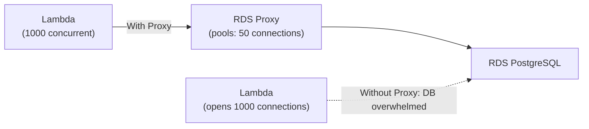

# RDS — Senior Interview Guide

## Core Architecture

```mermaid
graph TB
  subgraph MultiAZ["Multi-AZ Deployment"]
    Primary["Primary DB\nAZ-1 (Read/Write)"]
    Standby["Standby DB\nAZ-2 (Synchronous Replica)"]
    Primary -->|Synchronous replication\n(before commit ACK)| Standby
  end
  subgraph ReadReplicas["Read Replicas"]
    RR1["Read Replica\nAZ-2 (Async)"]
    RR2["Read Replica\nus-west-2 (Cross-Region, Async)"]
  end
  Primary -->|Async| RR1
  Primary -->|Async| RR2
  App["Application"] -->|Read/Write| Primary
  App -->|Reads| RR1
```

---

## Multi-AZ vs Read Replicas

| Feature | Multi-AZ | Read Replica |
|---------|---------|-------------|
| Purpose | High Availability | Read Scaling |
| Replication | Synchronous | Asynchronous |
| Standby readable? | No (standby is hot spare) | Yes |
| Failover | Automatic (~60-120s) | Manual promotion |
| Cross-region | No (same region) | Yes |
| Lag | None (synchronous) | Replication lag exists |
| Cost | 2x instance cost | Additional instance cost |
| DNS change on failover | Yes (same endpoint) | New endpoint needed after promotion |

**Trap**: "Can you use Multi-AZ for read scaling?" No — standby is not readable. Use Read Replicas for read scaling.

---

## RDS Proxy

- Fully managed connection pooler between app and RDS/Aurora
- **Reduces connection overhead**: pools and reuses DB connections; critical for Lambda (opens new connection per invocation)
- **Failover**: reduces failover time by 66% (maintains connections; transparent to app)
- **IAM Authentication**: enforce IAM auth for DB connections (no passwords stored in app)
- **Secrets Manager Integration**: auto-rotates credentials



---

## Storage Options

| Type | IOPS | Throughput | Use Case |
|------|------|-----------|---------|
| gp2 | 3 IOPS/GiB (burst to 3,000) | 250 MB/s | Dev/test, light production |
| gp3 | 3,000 baseline, up to 64,000 | 1,000 MB/s | Most production workloads |
| io1 | Up to 256,000 | 1,000 MB/s | High-performance legacy |
| io2 (Aurora) | Higher | Higher | Aurora storage (not user-managed) |

**Storage autoscaling**: enable to auto-expand when free space < 10%; set maximum threshold

---

## Backups and Recovery

| Feature | Automated Backup | Manual Snapshot |
|---------|----------------|----------------|
| Retention | 0-35 days | Indefinite |
| PITR | Yes (to any second within window) | No |
| Deletion with DB | Deleted (optionally retained) | Persists |
| Cost | Included (1x storage) | Charged per GB |

- **PITR**: restore to any point within retention period; creates new DB instance
- **Cross-region snapshot copy**: for DR; copy to another region; restore there
- Backup window: daily 30-min window; backup during this window

---

## Performance Insights

- Visual query profiling; identify top SQL queries by load
- **Database Load**: metric aggregating active sessions by wait event
- Free for 7 days retention; paid for up to 2 years
- **Enhanced Monitoring**: OS-level metrics (CPU, memory, disk) at 1-60 second granularity
- Works alongside CloudWatch (which has coarser granularity)

---

## Most Asked Senior Interview Questions

**Q1: What exactly happens during an RDS Multi-AZ failover?**
1. AWS detects primary failure (storage, networking, or OS)
2. Flips the CNAME of the endpoint to the standby
3. Standby is promoted to primary
4. Estimated time: 60-120 seconds (can be up to 3 minutes)
5. Application must handle connection retry (DNS TTL caching issue)
- **Trap**: "Does the application need to reconnect?" Yes — TCP connections to old primary break; app must retry. Solution: RDS Proxy absorbs the failover.

**Q2: Read Replica — what can go wrong with replication lag?**
- Replication is async; replica can lag behind primary
- Causes: long transactions on primary, high write volume
- Impact: app reads stale data from replica
- Mitigation: monitor `ReplicaLag` CloudWatch metric; implement read-your-writes consistency at app level (route writes + immediate reads to primary)
- **Trap**: "Can you promote a Read Replica instantly?" Yes, but it becomes an independent DB; not in sync after promotion

**Q3: Parameter groups vs option groups — what's the difference?**
- **Parameter Group**: DB engine configuration parameters (e.g., `max_connections`, `query_cache_size`, `innodb_buffer_pool_size`)
- **Option Group**: additional features (e.g., Oracle TDE, SQL Server SSRS, memcached option for MySQL)
- Parameter group change: some require reboot (static), some apply immediately (dynamic)
- **Trap**: "What happens if you modify a static parameter?" It's pending restart — DB needs reboot to apply

**Q4: How do you handle connection exhaustion on RDS?**
- Problem: Lambda/ECS creates new connection per invocation → exhausts max_connections
- Solution 1: RDS Proxy (connection pooling)
- Solution 2: Increase `max_connections` via parameter group (limited by instance memory)
- Solution 3: Application-level connection pooling (e.g., PgBouncer, HikariCP)
- `max_connections` formula for PostgreSQL: `LEAST({DBInstanceClassMemory/9531392}, 5000)`

**Q5: How do you migrate from RDS MySQL to RDS PostgreSQL?**
- AWS Database Migration Service (DMS) for online migration
- Schema conversion: AWS Schema Conversion Tool (SCT)
- Process:
  1. SCT: convert schema (tables, indexes, procedures)
  2. DMS: full-load migration
  3. DMS: CDC (Change Data Capture) for ongoing replication
  4. Cutover: application switch during maintenance window
  5. Parallel run: validate data integrity before cutover
- **Trap**: "Is DMS zero-downtime?" Near-zero; brief cutover window needed for final sync

**Q6: RDS storage autoscaling — what are the risks?**
- Automatically expands when free space < 10% of allocated storage or < 5 GB
- Risk: can expand indefinitely if misconfigured app writes runaway data
- Set maximum storage limit to cap costs
- Cannot shrink: EBS can only grow; to reduce size, dump and restore to smaller instance

**Q7: How does RDS handle OS patching and maintenance?**
- **Maintenance window**: weekly window where AWS applies patches, upgrades
- Minor version upgrades: applied during maintenance window if `AutoMinorVersionUpgrade=true`
- Major version upgrades: manual; you initiate
- Multi-AZ: failover to standby during maintenance = minimal downtime
- Single-AZ: brief downtime during maintenance
- **Trap**: "How do you minimize downtime during RDS patch?" Enable Multi-AZ; patch applies to standby first, then failover

**Q8: How do you achieve encryption for an existing unencrypted RDS instance?**
1. Create snapshot of unencrypted DB
2. Copy snapshot with encryption enabled
3. Restore from encrypted snapshot to new DB instance
4. Update connection strings to point to new instance
5. Verify data integrity; terminate old instance
- **Cannot enable encryption in-place on existing RDS**

**Q9: RDS read replica for cross-region DR — what are the RPO/RTO considerations?**
- RPO: seconds to minutes (async replication lag)
- RTO: time to promote replica + application connection change (~minutes)
- For stricter RPO/RTO: consider Aurora Global Database (RPO <1s, managed failover ~1min)

---

## Scenario-Based Questions

**Scenario 1: E-commerce app with RDS MySQL — peak traffic causes connection exhaustion**
- Problem: Lambda functions each opening new DB connections; hitting max_connections
- Solution:
  1. Deploy RDS Proxy in front of RDS
  2. Lambda connects to Proxy endpoint
  3. Proxy pools connections (e.g., 100 DB connections for 1000 Lambda invocations)
  4. Proxy IAM auth: no passwords in Lambda env vars
  5. Enable Multi-AZ: proxy handles failover transparently

**Scenario 2: Need to run analytics queries without impacting production RDS**
- Solution:
  1. Create Read Replica for analytics
  2. Route analytics queries to replica endpoint
  3. Monitor `ReplicaLag` to know data freshness
  4. For heavy analytics: promote replica and use it as isolated analytics DB
  5. Long-term: ETL to Redshift for complex analytics (RDS not optimized for OLAP)

---

## Real-world Failure Cases

**1. Multi-AZ failover takes > 2 minutes — app timeout**
- Cause: app has 30s connection timeout; 120s failover exceeds it
- Fix: RDS Proxy; or increase app timeout; or implement retry logic

**2. Read Replica lag causing stale reads**
- Users write a record then immediately read it via replica — record not there yet
- Fix: route all read-your-write operations to primary endpoint; use session stickiness to primary post-write

**3. Storage full — DB stops accepting writes**
- gp2 auto-scaling not enabled; storage reached maximum
- Fix: enable auto-scaling with max limit; monitor `FreeStorageSpace` CloudWatch alarm < 10%

**4. Parameter group change not taking effect**
- Changed static parameter (e.g., `max_connections`); still showing old value
- Cause: static parameters require reboot; forgot to reboot
- Fix: schedule reboot during maintenance window; use dynamic parameters where possible

---

## Cost Optimization

- **Reserved Instances**: 40-60% discount for 1-3 year commitment on stable workloads
- **Read Replicas for read-heavy workloads**: smaller primary instance + read replicas
- **Graviton instances**: r6g/m6g for RDS — ~20% cheaper, faster for most workloads
- **Stop dev/test instances**: can stop RDS for up to 7 days (then auto-starts)
- **gp3 over gp2**: 20% cheaper, tunable IOPS
- **Right-size**: use Performance Insights to identify under-utilized instances

---

## Security Considerations

- **Encryption at rest**: enable at creation (cannot enable after); uses KMS
- **Encryption in transit**: force SSL in parameter group (`rds.force_ssl=1` for PostgreSQL)
- **Private subnets only**: RDS should never be in public subnet
- **Security Groups**: only allow DB port from specific app server SGs
- **IAM database authentication**: for PostgreSQL/MySQL; generate token instead of password
- **Secrets Manager**: store and auto-rotate DB credentials; RDS native integration
- **Enhanced Monitoring + CloudTrail**: audit all API calls

---

## RDS vs Aurora

| Feature | RDS | Aurora |
|---------|-----|--------|
| Storage | EBS (gp3/io1) | Shared, distributed, auto-grow |
| Max IOPS | 256,000 (io1) | Higher (distributed storage) |
| Failover | 60-120s | < 30s (typically < 15s) |
| Read Replicas | Up to 5 | Up to 15 (Aurora Replicas) |
| Storage auto-grow | Optional | Automatic (10 GB increments) |
| Global DB | No | Yes (< 1s RPO) |
| Serverless | No | Aurora Serverless v2 |
| Price | Lower | ~20% higher |
| Best for | Existing MySQL/PostgreSQL | New applications, need HA/scale |

---

## Quick Revision Bullets

- Multi-AZ = HA (sync replication, not readable); Read Replica = read scaling (async, readable)
- Failover: Multi-AZ CNAME flip in 60-120s; app needs retry logic
- RDS Proxy: connection pooling; reduces Lambda connection exhaustion + failover time
- PITR: restore to any second within 0-35 day retention window
- Parameter group: dynamic = immediate; static = requires reboot
- Cannot encrypt in-place: snapshot → encrypted copy → restore
- max_connections based on instance memory; use Proxy for Lambda workloads
- Performance Insights: top SQL queries by wait time; 7 days free
