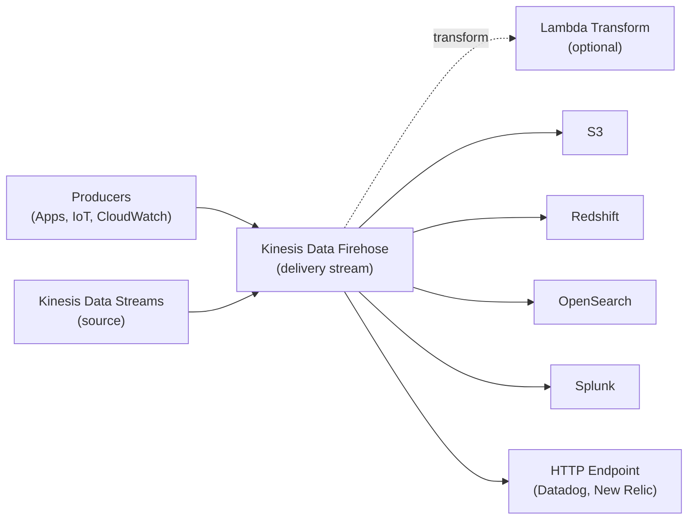

# Kinesis Data Firehose — Senior Interview Guide

## Architecture

---

## Key Characteristics

- **Serverless**: fully managed; no shards to manage; auto-scales
- **Near real-time**: not real-time; buffers before delivering (minimum 60s or 1 MB)
- **At-least-once delivery**: S3 backup for failed deliveries
- **No replay**: unlike KDS, delivered records cannot be re-consumed
- **Automatic scaling**: no capacity planning needed

---

## Destinations

| Destination | Format | Notes |
|-------------|--------|-------|
| S3 | Any (JSON, Parquet, ORC) | Primary destination; format conversion available |
| Amazon Redshift | COPY command | Delivers to S3 first, then COPY to Redshift |
| OpenSearch Service | JSON | Index + type |
| Splunk | Splunk HEC | Enterprise logging |
| HTTP Endpoint | JSON | Datadog, New Relic, Dynatrace, custom |

---

## Buffering Hints

- Buffer size: 1 MB - 128 MB (for S3)
- Buffer interval: 60 - 900 seconds
- Firehose delivers when **either** condition is met (whichever comes first)
- Smaller buffer: lower latency, more S3 objects (higher cost, more files to compact)
- Larger buffer: higher latency, fewer larger files (better for Athena queries)

---

## Lambda Transformation

- Invoke Lambda for each buffer batch before delivery
- Lambda receives records → transforms → returns records back to Firehose
- **Transformation contract**:
  - Input: up to 500 records or 6 MB per invocation
  - Output: same number of records (1:1 mapping or drop)
  - Record result: `Ok`, `Dropped`, `ProcessingFailed`
- Use cases: JSON → Parquet, PII masking, data enrichment, filtering

---

## Dynamic Partitioning

- Partition S3 output based on record content (not just delivery time)
- Extract field from record using JQ expression: `$.userId` → `user_id/123/`
- Enables per-tenant, per-customer, per-category partitioning
- Requires Lambda or inline parsing with Firehose JQ processor
- S3 path: `s3://bucket/data/user_id=!{partitionKeyFromQuery:userId}/year=!{timestamp:yyyy}/`

---

## Format Conversion (S3 only)

- Convert incoming JSON to Parquet or ORC on the fly
- Requires Glue Data Catalog schema for conversion
- Parquet/ORC: 3-5x compression, faster Athena queries
- No Lambda needed for format conversion alone

---

## Most Asked Senior Interview Questions

**Q1: Kinesis Firehose vs Kinesis Data Streams — when do you use each?**
| Scenario | Firehose | KDS |
|----------|---------|-----|
| Need to store data in S3 with no code | Yes | No |
| Need multiple independent consumers | No | Yes |
| Need real-time processing (<1s) | No | Yes |
| Need data replay | No | Yes |
| Ops overhead tolerance | Very low | Medium |
| Custom consumer code | Not needed | Required |

**Q2: Why does Firehose have a 60-second minimum delivery latency?**
- Firehose buffers data before delivery for efficiency
- Minimum buffer interval = 60 seconds
- There is no way to get sub-60s delivery from Firehose natively
- For lower latency: use KDS → Lambda → direct S3 write (real-time)
- **Trap**: "Is Firehose real-time?" No — it's near-real-time (60s+ latency)

**Q3: How does Firehose handle delivery failures?**
- Failed deliveries: retried for configurable period (0-7200 seconds)
- After retry period: sent to S3 error bucket (if configured)
- For Redshift: failed events go to S3 error prefix
- S3 backup: enable to retain all records even if primary destination fails

**Q4: How do you partition Firehose data efficiently for Athena queries?**
- Use dynamic partitioning with date-based S3 path:
  `s3://bucket/logs/year=2024/month=01/day=15/hour=14/`
- Firehose built-in: `!{timestamp:yyyy}/!{timestamp:MM}/!{timestamp:dd}/`
- Dynamic partitioning on data fields: extract userId, region from record
- Result: Athena partition pruning → only scan relevant partitions

**Q5: Firehose Lambda transformation — what are the error scenarios?**
- Lambda timeout: record goes to error (ProcessingFailed)
- Lambda returns wrong record count: Firehose treats as failure
- Lambda throws exception: entire batch fails; retry with backoff
- **Best practice**: process records individually within Lambda; return result per record; never throw for individual record failures

**Q6: How do you send CloudWatch Logs to Firehose?**
- CloudWatch Logs subscription filter → Kinesis Data Firehose
- Or: CloudWatch Logs → Kinesis Data Streams → Firehose
- Data is base64-encoded + gzip-compressed; Lambda transformer to decode
- Use case: centralized log archival to S3 + OpenSearch

---

## Scenario-Based Questions

**Scenario 1: Ingest 100 GB/day of application logs, store in S3 as Parquet for Athena**
- Solution:
  1. Application → Firehose delivery stream
  2. Enable format conversion: JSON → Parquet (uses Glue Data Catalog schema)
  3. Buffering: 128 MB / 300 seconds (fewer files, better query performance)
  4. Dynamic partitioning: `year/month/day/hour` from timestamp
  5. S3 destination with lifecycle: Standard → Glacier after 90 days
  6. Cost: Firehose $0.029/GB + Parquet conversion; vs raw JSON + Athena scans = cheaper

**Scenario 2: Real-time metrics from 10,000 IoT devices to Elasticsearch/OpenSearch**
- Solution:
  1. IoT Rule → Firehose (IoT Rule can directly target Firehose)
  2. Lambda transformer: enrich with device metadata, validate
  3. Destination: Amazon OpenSearch Service
  4. Buffer: 5 MB / 60 seconds (small buffer for near-real-time)
  5. S3 backup enabled (retain all data; OpenSearch stores hot 30 days)

---

## Real-world Failure Cases

**1. Small files problem in S3 (Firehose creating too many small files)**
- Cause: small buffer (1 MB / 60s) + low throughput = many tiny files
- Impact: slow Athena queries (file open overhead per file)
- Fix: increase buffer to 128 MB / 300s; use S3 Inventory + Batch Operations to compact periodically

**2. Lambda transform timeout causing data loss**
- Lambda timeout (15s limit per batch) + large batch size
- Fix: reduce buffer size so batches are smaller; optimize Lambda processing time; increase Lambda timeout

**3. Firehose to Redshift failing (COPY command errors)**
- S3 intermediate data format doesn't match Redshift COPY format
- Fix: check Firehose error output in S3; verify column mapping; fix Lambda transform output format

**4. Dynamic partitioning causing S3 throttling**
- Too many unique partition values → many parallel S3 PUTs to different prefixes
- Fix: coarser partitioning (hour instead of minute); request S3 prefix limit increase

---

## Cost Optimization

- **Firehose**: $0.029/GB ingested (first 500 TB/month); cheaper than KDS for simple delivery
- **Format conversion**: included in Firehose pricing; Parquet reduces downstream Athena query cost
- **Buffer size**: larger buffers = fewer S3 requests = lower S3 PUT costs
- **Lambda transform**: additional Lambda invocation cost; use Firehose built-in processors where possible
- vs KDS + Lambda + S3: Firehose simpler and cheaper for delivery-only use cases

---

## Security Considerations

- **Encryption at rest**: SSE-S3 or SSE-KMS on destination S3
- **Encryption in transit**: TLS by default
- **IAM role**: Firehose needs permissions to write to destination; Lambda invoke; Glue access
- **VPC delivery**: for OpenSearch in VPC; Firehose can deliver to VPC endpoint
- **Source record backup**: always enable S3 backup for audit trail and recovery

---

## Quick Revision Bullets

- Firehose = managed, serverless, near-real-time (60s+ latency), no replay
- KDS = real-time, consumer code needed, replay supported, ordered per shard
- Buffering: size (MB) or time (seconds) — whichever triggers first
- Lambda transform: 1:1 record mapping; drop or process; never throw per-record errors
- Format conversion: JSON → Parquet/ORC in-flight using Glue schema (no Lambda needed)
- Dynamic partitioning: extract record fields for S3 path (userId, region, etc.)
- Firehose to Redshift: delivers to S3 first, then issues COPY command
- S3 backup: always enable; protects against destination failures
