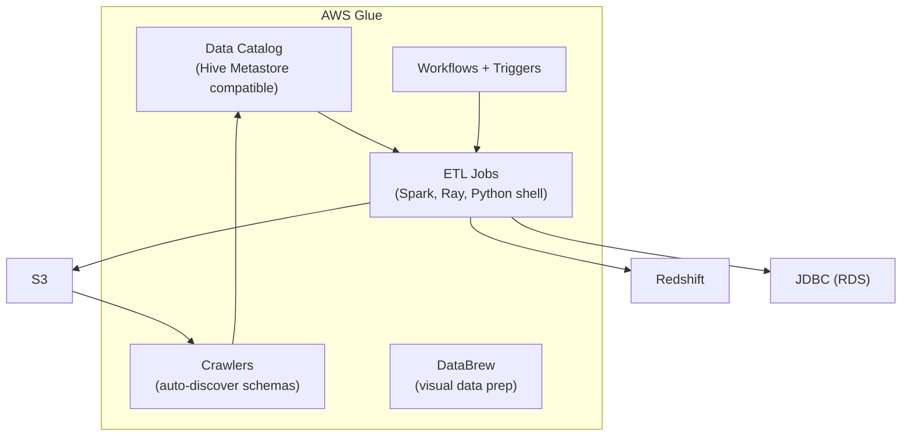

# AWS Glue — Senior Interview Guide

## Core Components

---

## Glue Data Catalog

- Centralized metadata repository (databases, tables, schemas, partitions)
- **Hive Metastore compatible**: Spark/Athena/EMR can use it as metastore
- Schema versioning: track schema evolution over time
- Lake Formation integration: fine-grained access control on catalog objects
- Cross-account catalog access via RAM

---

## Glue ETL Jobs

| Job Type | Runtime | Use Case | Max DPU |
|----------|---------|---------|---------|
| Spark (Scala/Python) | Apache Spark | Large-scale ETL | 100+ |
| Ray (Python) | Ray | ML preprocessing, parallel Python | 100+ |
| Python Shell | Python 3 | Small scripts, API calls | 1 |
| Streaming | Spark Structured Streaming | Real-time ETL from Kinesis/Kafka | Configured |

**DPU (Data Processing Unit)**: 4 vCPU + 16 GB RAM; smallest unit of Glue compute
- G.1X worker: 1 DPU
- G.2X worker: 2 DPU (memory-intensive transforms)
- G.025X worker: 1/4 DPU (low-cost for small jobs)

---

## DynamicFrame vs DataFrame

| Feature | DynamicFrame | Spark DataFrame |
|---------|-------------|----------------|
| Schema | Inferred dynamically | Fixed schema required |
| Nested types | Natively supported | Requires flattening |
| Transformations | Glue-specific (Relationalize, ResolveChoice) | Standard Spark |
| Choice type | Resolves ambiguous types | Schema mismatch errors |
| Performance | Slightly lower | Higher (optimized Spark) |
| Convert | `toDF()` and `fromDF()` | Available |

**Recommendation**: use DynamicFrame for data discovery/ingestion; convert to DataFrame for heavy transforms

---

## Glue Crawlers

- Automatically discover data schema in S3, JDBC, DynamoDB
- Create/update Glue catalog tables
- Incremental crawl: only crawl new/modified partitions (much faster)
- Schedule: on-demand or cron
- **Limitation**: can miss complex schemas; sometimes incorrectly infers types
- Alternative: manually define schema in catalog or use Glue ETL to define schema explicitly

---

## Job Bookmarks

- Tracks previously processed data to enable incremental ETL
- Only processes new data since last successful run
- Works for: S3 (tracks files), JDBC (tracks primary key or modified timestamp)
- **Trap**: "Does bookmark work with all sources?" Best with S3 and JDBC; not DynamoDB streams

---

## Glue Workflows and Triggers

| Trigger Type | Description |
|-------------|-------------|
| On-demand | Manually invoked |
| Scheduled | Cron expression |
| Event | Completed job/crawler triggers next |
| EventBridge | External events trigger workflow |

- Workflows: DAG of crawlers + ETL jobs; monitor as single unit
- Conditional triggers: only run next job if previous succeeded

---

## Most Asked Senior Interview Questions

**Q1: Glue vs EMR vs Athena — when do you use each?**
| Factor | Glue | EMR | Athena |
|--------|------|-----|--------|
| ETL complexity | Simple-medium | High | No ETL (query only) |
| Spark expertise needed | Minimal | Expert | None |
| Ops overhead | Low (managed) | Medium (managed cluster) | Zero |
| Custom Spark config | Limited | Full control | N/A |
| Cost | Per DPU-hour | Per instance-hour | Per TB scanned |
| Best for | Standard ETL pipelines | Custom Spark/Hadoop | Ad-hoc SQL queries |

**Q2: How do you optimize Glue Spark job performance?**
1. **Enable Spark UI**: use `--enable-spark-ui` for profiling
2. **Partitioning**: repartition data for parallel processing
3. **Push-down predicates**: filter early (`pushDownPredicate` for S3 reads)
4. **G.2X workers**: for memory-intensive transforms (joins, window functions)
5. **Worker count**: scale workers for large datasets; auto-scaling feature
6. **Job bookmarks**: process only new data; reduce job runtime

**Q3: What is ResolveChoice and when do you need it?**
- Problem: JSON source has field `price` as string in some records, number in others
- DynamicFrame detects this as `ChoiceType`
- `ResolveChoice`: resolve ambiguity — cast to single type, project as struct, or make VARCHAR
- Without resolution: downstream operations may fail on type mismatch
- **Trap**: "What happens if you don't resolve choices?" Writing to Parquet fails; most typed destinations require consistent schema

**Q4: How does Glue Streaming ETL work?**
- Continuous job running against Kinesis Data Streams or Kafka
- Uses Spark Structured Streaming under the hood
- Micro-batch: processes records every 100ms (configurable)
- Window operations: tumbling windows for aggregations
- Checkpointing: S3 for fault tolerance
- **vs Lambda**: Glue Streaming for complex Spark transforms; Lambda for simple record-level processing

**Q5: Glue Data Quality — what is it and how does it work?**
- Define rules on data quality (completeness, uniqueness, value ranges)
- Evaluate rules within ETL job or standalone
- Results: pass/fail per rule; can halt ETL on quality failure
- Integration: rules defined in DQDL (Data Quality Definition Language)
- Use case: catch bad data before loading to Redshift/data warehouse

**Q6: How do you handle schema evolution in Glue ETL?**
- Source adds new column: DynamicFrame handles automatically; DataFrame needs schema merge
- Source changes column type: ResolveChoice or explicit cast
- Use `mergeSchema = true` for Parquet source: auto-merge evolving schemas
- Store schema versions in Glue Catalog: audit history of schema changes

---

## Scenario-Based Questions

**Scenario 1: Daily ETL pipeline: S3 (raw JSON) → S3 (Parquet) → Redshift**
- Architecture:
  1. Glue Crawler: discover raw JSON schema → Glue Catalog
  2. Glue ETL Job (Spark): read JSON DynamicFrame → ResolveChoice → write Parquet to S3
  3. Job bookmark: incremental (only today's new files)
  4. Second ETL Job: COPY Parquet from S3 to Redshift
  5. Glue Workflow: trigger job 2 on success of job 1
  6. CloudWatch Events + SNS: alert on job failure

**Scenario 2: Real-time data quality validation before data warehouse load**
- Kinesis Data Streams → Glue Streaming ETL
- Glue Data Quality rules evaluated on each micro-batch
- Pass: write to Redshift via JDBC
- Fail: write to S3 quarantine bucket + send SQS alert
- DLQ processing: human review + re-process or discard

---

## Real-world Failure Cases

**1. Glue job OOM (Out of Memory)**
- Large dataset; insufficient DPU; skewed partitions
- Fix: increase G.2X workers; repartition to spread data; reduce data early with filter pushdown

**2. Crawler creates wrong table schema (all strings)**
- Crawler infers from first 1000 rows; rest have different types
- Fix: define schema manually in catalog; or use Glue ETL with explicit types

**3. Job bookmark not incrementing correctly**
- After failure and retry, bookmark reprocesses all data
- Fix: bookmarks track successful runs; on failure, data is reprocessed (at-least-once); implement idempotency at destination

**4. JDBC source bottleneck**
- Glue reading from RDS with single reader thread
- Fix: use `hashfield` and `hashpartitions` in JDBC connection for parallel reads

---

## Cost Optimization

- **DPU sizing**: start with 10 workers for small jobs; scale up only as needed
- **G.025X workers**: 4x cheaper for simple Python shell jobs
- **Job bookmarks**: process incrementally instead of full scans
- **Glue DataBrew**: pay per node-hour for visual data prep; expensive for automation (use Spark ETL instead)
- **Glue catalog**: first million objects free; $1/100K objects after

---

## Security Considerations

- **IAM roles for jobs**: least-privilege; only S3 paths needed, specific catalog databases
- **VPC connections**: Glue can run in VPC for private JDBC connections to RDS
- **Encryption**: job bookmarks encrypted; catalog metadata encrypted at rest; S3 output encrypted
- **Lake Formation**: govern access to catalog tables at column/row level
- **Secrets Manager**: store JDBC credentials; Glue natively integrates with Secrets Manager

---

## Quick Revision Bullets

- Glue Catalog = Hive Metastore compatible; used by Athena, Redshift Spectrum, EMR
- DPU = 4 vCPU + 16 GB; G.1X = 1 DPU; G.2X = 2 DPU (memory-heavy)
- DynamicFrame: schema-flexible; ChoiceType for ambiguous types; ResolveChoice to fix
- Job Bookmarks: incremental processing; tracks state in S3
- Crawlers: auto-discover schema; can be inaccurate; prefer manual schema for production
- Glue vs EMR: Glue = managed, simpler; EMR = full Spark control, custom configs
- Glue Streaming: Spark Structured Streaming on Kinesis/Kafka; micro-batch processing
- Data Quality: DQDL rules evaluated in ETL; halt or quarantine on failure
