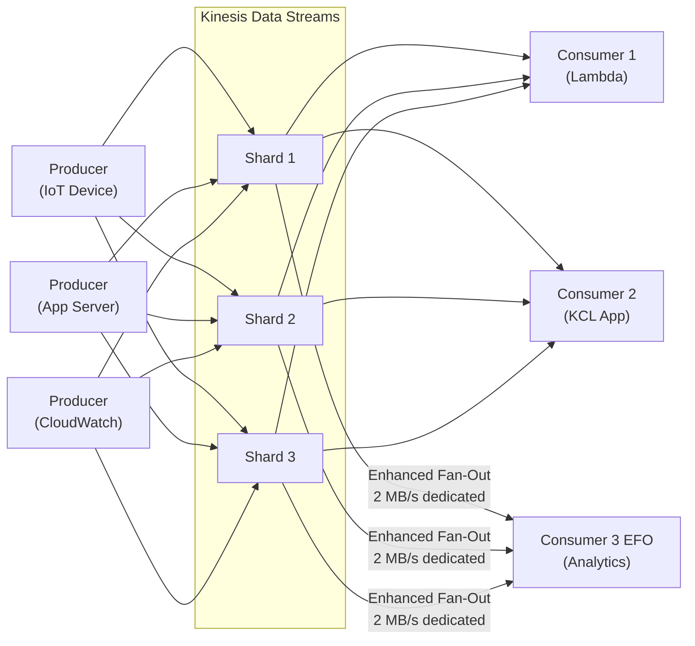

# Kinesis Data Streams — Senior Interview Guide

## Architecture

---

## Shards

- **Shard capacity**: 1 MB/s or 1,000 records/s (write); 2 MB/s or 10,000 records/s (read)
- **Partition key**: determines which shard; MD5 hash of partition key → shard
- **Sequence number**: unique per record within shard; monotonically increasing
- **Retention**: 24h default; up to 365 days (extended retention)
- **Record size**: max 1 MB
- **Ordering**: guaranteed within a shard; not across shards

---

## Standard vs Enhanced Fan-Out (EFO)

| Feature | Standard | Enhanced Fan-Out |
|---------|---------|-----------------|
| Throughput per shard | 2 MB/s shared across all consumers | 2 MB/s per consumer per shard |
| Latency | 200ms (polling) | ~70ms (push-based) |
| API | GetRecords (polling) | SubscribeToShard (streaming) |
| Cost | Free | $0.015/shard-hour + $0.013/GB |
| Consumers | Unlimited (share 2 MB/s) | Up to 20 registered consumers |
| Best for | 1-2 consumers | Multiple consumers, low latency |

---

## KCL (Kinesis Client Library)

- Open-source library for building consumer applications
- Handles: shard enumeration, checkpointing (via DynamoDB table), load balancing across workers
- KCL worker = one KCL application instance
- Each shard processed by exactly one worker at a time (lease-based)
- DynamoDB table: one row per shard; tracks lease holder + sequence number checkpoint

---

## KPL (Kinesis Producer Library)

- Aggregates multiple small records into single Kinesis record
- Up to 1,000 records or 1 MB per aggregated record
- Handles retries, batching, compression
- Consumers must use KCL or de-aggregate manually (KPL uses protobuf encoding)
- `RecordMaxBufferedTime`: max time to buffer before sending (default 100ms)

---

## Resharding

- **Split shard**: one shard → two shards (increases capacity)
- **Merge shards**: two adjacent shards → one (decreases capacity)
- Online operation: no data loss; brief window where new shards inherit from old
- KCL handles resharding automatically (discovers new shards)
- Lambda ESM handles resharding automatically

---

## Most Asked Senior Interview Questions

**Q1: Kinesis vs SQS — how do you choose?**
| Factor | Kinesis Data Streams | SQS |
|--------|---------------------|-----|
| Ordering | Per shard | FIFO queue only |
| Replay | Yes (retention up to 365 days) | No (once consumed, gone) |
| Multiple consumers | Yes (fan-out) | No (message claimed by one consumer) |
| Throughput | Controlled (shards) | Nearly unlimited |
| Routing | No | No |
| At-least-once | Yes | Yes |
| Exactly-once | No | SQS FIFO with dedup |
| Use Kinesis for | Real-time analytics, fan-out, replay | Task queues, decoupling, exactly-once |

**Q2: What causes a hot shard and how do you fix it?**
- Cause: low-cardinality partition key (e.g., all events with key "USA" → same shard)
- Symptoms: `WriteProvisionedThroughputExceeded` errors on specific shards; other shards idle
- Fix:
  1. Use high-cardinality PK (device ID, UUID)
  2. Add random suffix to PK: `deviceId-<random 0-9>`
  3. KPL aggregation to stay within throughput limits
  4. Split the hot shard

**Q3: Explain exactly-once processing with Kinesis**
- Kinesis guarantees at-least-once delivery (records can be delivered multiple times)
- For exactly-once: implement idempotency at consumer level
- Store processed sequence numbers in DynamoDB; check before processing
- KCL checkpointing: on failure, restart from last checkpoint (at-least-once within window)

**Q4: How does Lambda handle Kinesis stream failures?**
- Lambda retries failed batches until they succeed or records expire
- This blocks shard processing indefinitely (shard is ordered; can't skip)
- Solutions:
  1. `bisectBatchOnFunctionError: true` — halves batch to find bad record
  2. `maximumRetryAttempts`: limit retry attempts
  3. `destinationConfig.onFailure`: send failed batch metadata to DLQ/SNS
  4. `tumblingWindowInSeconds`: stateful windowed processing

**Q5: Kinesis Data Streams vs Kinesis Data Firehose — key differences?**
| Feature | KDS | Firehose |
|---------|-----|---------|
| Real-time | Yes (~70ms EFO) | Near-real-time (buffered) |
| Consumer code | Required | None (managed) |
| Destinations | Custom (Lambda, KCL, etc.) | S3, Redshift, OpenSearch, Splunk, HTTP |
| Replay | Yes | No |
| Auto-scale | No (manual sharding) | Yes (automatic) |
| Use KDS | Custom consumers, fan-out, replay | Delivery to S3/Redshift/etc. without code |

**Q6: What is the iterator age metric and why does it matter?**
- `GetRecords.IteratorAgeMilliseconds`: age of last record returned to consumer
- If consumer is keeping up: iterator age near 0
- If consumer is falling behind: iterator age increases
- Alarm threshold: typically 1-5 minutes for consumer lag SLA
- Resolution: scale out consumers; optimize processing; increase shards

**Q7: Can you decrease the number of shards? What's the impact?**
- Yes: merge adjacent shards (merge two adjacent hash-key-space shards)
- Impact: temporarily lower throughput; old shards stop accepting new records; data drains from old before merge complete
- KCL/Lambda ESM handle this automatically

**Q8: Kinesis record structure and what happens when a record exceeds 1 MB?**
- Record: partition key (max 256 bytes) + data blob (max 1 MB) + sequence number
- If data > 1 MB: `ValidationException` — must chunk before sending
- Solution: compress data; split large records; use S3 pointer pattern (store large payload in S3, send S3 key in Kinesis record)

---

## Scenario-Based Questions

**Scenario 1: IoT platform, 1 million devices, 10 events/sec each = 10M events/sec**
- Shards needed: 10M events/sec ÷ 1,000 records/shard = 10,000 shards
- Reality: each event probably small; 1 MB limit = calculate by throughput
- At 100 bytes/event: 100 bytes × 10M/s = 1 GB/s ÷ 1 MB/shard = 1,000 shards
- Partition key: device ID (high cardinality, prevents hot shards)
- Enhanced Fan-Out for multiple consumers (analytics, alerts, ML)
- KPL on device for aggregation (reduce API calls, stay within shard limits)

**Scenario 2: Real-time fraud detection, need to process with multiple independent pipelines**
- Solution:
  1. KDS with Enhanced Fan-Out
  2. Consumer 1 (Lambda): real-time fraud rules → block transactions
  3. Consumer 2 (KCL App): ML model inference → risk scoring
  4. Consumer 3 (Firehose): S3 archive for model retraining
  5. Each consumer gets dedicated 2 MB/s (EFO)
  6. Partition key: account ID (orders events per account for context)

---

## Real-world Failure Cases

**1. Consumer falling behind — growing iterator age**
- Cause: processing too slow for incoming volume
- Fix: scale out Lambda (more shards → more concurrent Lambdas); or optimize processing; or add EFO for dedicated bandwidth

**2. DynamoDB checkpointing table throttled (KCL)**
- KCL checkpoints to DynamoDB after each batch
- High shard count → high DynamoDB write volume
- Fix: increase DynamoDB capacity for KCL table; use batch checkpointing

**3. Records lost due to retention expiration**
- Consumer was down for 25+ hours (default 24h retention)
- Records expired before consumer caught up
- Fix: increase retention to 7-365 days for critical streams; alert on iterator age > 50% of retention

**4. Resharding caused duplicate processing**
- Split shard; KCL assigned new shards to same workers
- Brief window where records processed twice (once from old shard, once from new)
- Fix: idempotent consumers with deduplication on sequence number

---

## Cost Optimization

- **Shard cost**: $0.015/shard/hour; only provision what you need; use CloudWatch metrics to right-size
- **Extended retention**: $0.023/shard-hour for 7-365 days; only enable if replay needed
- **EFO cost**: $0.013/GB; only use when multiple consumers or low latency needed
- **KPL aggregation**: reduces PUT record costs (fewer API calls per record)
- **vs Managed Kafka (MSK)**: KDS cheaper for simple pipelines; MSK better for Kafka ecosystem compatibility

---

## Security Considerations

- **Encryption at rest**: SSE with KMS (CMK or AWS managed)
- **Encryption in transit**: HTTPS by default
- **IAM**: per-stream `kinesis:PutRecord`, `kinesis:GetRecords`; consumer should only read, not write
- **VPC endpoints**: keep Kinesis traffic within VPC (no internet/NAT)
- **CloudTrail**: audit control plane operations; Kinesis Data Streams doesn't log data plane to CT

---

## Quick Revision Bullets

- 1 shard = 1 MB/s write, 2 MB/s read, 1,000 records/s write
- Standard consumers share 2 MB/s per shard; EFO = 2 MB/s dedicated per consumer
- KCL checkpoints in DynamoDB; handles shard lease, rebalancing, resharding
- KPL aggregates up to 1,000 records into one Kinesis record (protobuf)
- Hot shard: low-cardinality PK; fix with high-cardinality or random suffix
- Iterator age = consumer lag metric; alarm on growing age
- Ordering guaranteed within shard; not across shards
- Lambda retries Kinesis failures blocking shard; use bisectBatchOnFunctionError
