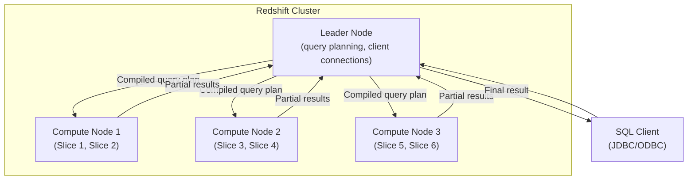

# Redshift — Senior Interview Guide

## MPP Architecture

- **Leader Node**: parses queries, builds execution plan, distributes work, aggregates results
- **Compute Nodes**: store data in slices; execute query segments in parallel
- **Slice**: unit of processing within compute node; one slice per vCPU

---

## Distribution Styles

| Style | Behavior | Best For |
|-------|---------|---------|
| KEY | Rows with same key on same node | JOINs on large tables (co-locate joined rows) |
| ALL | Copy to every node | Small dimension tables (no redistribution on JOIN) |
| EVEN | Round-robin across nodes | No dominant JOIN key; balanced distribution |
| AUTO | Redshift decides (starts ALL, switches to EVEN/KEY) | Let Redshift optimize |

**Query optimizer needs co-location**: if two large tables JOIN on different distribution keys, Redshift must redistribute data = network overhead = slow

---

## Sort Keys

| Type | Behavior | Best For |
|------|---------|---------|
| Compound | Ordered by columns in sequence (major + minor columns) | Range filters on first column; common query patterns |
| Interleaved | Equal weight to all columns (multiple sort trees) | Multiple different filter columns |

- Sort key determines block layout on disk
- Queries filter on sort key = Zone Map pruning (skip entire 1 MB blocks)
- **Compound**: `SORTKEY (date, region)` — queries filtering by date alone or date+region are fast; region alone is not
- **Interleaved**: any column filter benefits; but higher VACUUM cost

---

## Redshift Spectrum

- Query data directly in S3 (Parquet, ORC, CSV, JSON) without loading into Redshift
- Uses separate Redshift Spectrum layer (scales independently)
- Pricing: $5 per TB scanned
- Partition pruning via Glue Data Catalog
- Use case: query historical cold data in S3 + join with hot data in Redshift cluster

---

## Redshift Serverless

- No cluster management; automatically provisions capacity
- **RPU (Redshift Processing Units)**: capacity unit; base capacity 8-512 RPUs
- Pay per RPU-second when query runs
- Best for: intermittent analytics, variable workloads, testing
- Not for: sustained high-throughput BI (provisioned cluster + reserved more cost-effective)

---

## WLM (Workload Management)

- Manages query concurrency and memory allocation
- **Queue**: group of queries with memory % and concurrency slot count
- **Auto WLM**: Redshift automatically manages concurrency and memory (default)
- **Manual WLM**: define queues explicitly; useful for separating ETL from BI queries
- **Short-query acceleration (SQA)**: automatically detects and prioritizes short queries

---

## AQUA (Advanced Query Accelerator)

- Hardware-accelerated query cache for ra3 nodes
- Pushes compute to storage layer (AQUA nodes with FPGA)
- Results in 10x faster queries for large scans + aggregations
- Available on ra3.4xlarge and ra3.16xlarge
- Automatic; no configuration needed

---

## Most Asked Senior Interview Questions

**Q1: How do distribution keys affect query performance?**
- BAD: `DISTKEY (order_id)` on both orders table and order_items table — orders will co-locate well; joins with customers table won't
- GOOD: most common JOIN key as DISTKEY
- Example: orders DISTKEY(customer_id), customers DISTKEY(customer_id) → JOIN on customer_id = no redistribution = fast
- **Trap**: "What about tables with no dominant join key?" Use EVEN; let AUTO decide

**Q2: When should you use compound vs interleaved sort key?**
- Compound: typical time-series analytics — most queries filter by date range
  - `SORTKEY (event_date, region, user_id)`
  - Queries filtering by event_date alone: fast (Zone Map skips blocks)
  - Queries filtering by user_id alone: must scan all blocks
- Interleaved: many different query patterns, no dominant filter column
  - All columns weighted equally; VACUUM is more expensive
  - Best for: ad-hoc analytics, unknown future query patterns

**Q3: How does VACUUM work in Redshift and why is it important?**
- Redshift uses append-only storage; DELETEs/UPDATEs mark rows as deleted (not reclaim space)
- VACUUM: reclaims space, re-sorts unsorted rows, updates statistics
- `VACUUM FULL`: re-sort + reclaim; most thorough but slow
- `VACUUM DELETE ONLY`: just reclaim deleted space; faster
- Auto VACUUM: Redshift automatically vacuums when >5% rows unsorted
- **Trap**: "Do you need to manually run VACUUM?" Mostly no (auto VACUUM) but heavy ETL may require manual

**Q4: Redshift vs Athena — when do you choose each?**
| Scenario | Redshift | Athena |
|----------|---------|--------|
| Sustained BI/reporting | Yes | No |
| Ad-hoc queries on S3 | No | Yes |
| Complex JOINs, aggregations | Yes (optimized MPP) | Possible but slower |
| No ETL, query raw data | No | Yes |
| Cost at scale | Predictable (cluster) | Per-query ($5/TB) |
| Concurrency | High (WLM managed) | Limited (service limits) |

**Q5: How do you load data into Redshift efficiently?**
- COPY command: fastest; parallel loading from S3, Kinesis, DynamoDB
- COPY from S3: specify multiple files for parallel load (one file per slice ideal)
- INSERT: row-by-row; very slow at scale — avoid
- Use Firehose: buffers + delivers to S3 → COPY
- **Trap**: "Is JDBC INSERT acceptable for bulk load?" No — use COPY command always

**Q6: What is Concurrency Scaling and when does it help?**
- Automatically adds transient compute clusters during bursts
- Cost: 1 free hour/day of Concurrency Scaling credits per cluster; then charged
- Use case: predictable surge periods (end-of-month reporting, dashboards)
- **Trap**: "Is Concurrency Scaling always on?" No — WLM queue must have `concurrency_scaling = auto`

**Q7: How does Redshift handle materialized views?**
- Pre-computed query results stored as table
- Refresh: incremental (if base table changes tracked) or full
- Auto-refresh: Redshift automatically refreshes when base data changes
- Use cases: complex aggregations queried frequently; reduce repeated computation

---

## Scenario-Based Questions

**Scenario 1: 10 TB OLAP workload, 50 concurrent BI users, predictable load**
- Provisioned cluster: ra3.4xlarge (separate compute and storage)
- Distribution: KEY on most common JOIN column; ALL for small dimension tables
- Sort keys: on date + frequently filtered columns
- WLM: BI queue (high memory %) + ETL queue (separate)
- Concurrency Scaling: for peak hours
- Reserved nodes: 1-year reservation for 40% savings

**Scenario 2: Need to query 5 years of historical S3 data + current month in Redshift**
- Redshift Spectrum for S3 historical data (no load needed; $5/TB scanned)
- Current month data loaded in Redshift cluster (fast joins)
- External schema pointing to Glue Data Catalog (Parquet on S3)
- Partition pruning by year/month reduces Spectrum scan cost
- Single SQL JOIN between current (cluster) and historical (S3 via Spectrum)

---

## Real-world Failure Cases

**1. Slow queries due to data skew**
- All data on one node (bad distribution key with low cardinality)
- `SELECT COUNT(*) ... GROUP BY status` — status has 3 values; uneven distribution
- Fix: change DISTKEY to higher-cardinality column; or use EVEN distribution

**2. VACUUM not keeping up — performance degradation**
- Heavy ETL with many DELETEs; sorted rows < 50% → unsorted region too large
- Zone Map pruning ineffective; queries scan all blocks
- Fix: run `VACUUM FULL` during off-hours; increase auto vacuum threshold; reduce delete frequency (use partition swap pattern)

**3. WLM queue backup — queries stuck**
- BI queries using all concurrency slots; ETL queries queued indefinitely
- Fix: separate WLM queues with labels; ETL queries labeled → ETL queue; BI → BI queue

**4. Redshift COPY failing with manifest errors**
- S3 files listed in manifest are missing or inaccessible
- Fix: ensure S3 files exist before COPY; use IAM role with correct S3 permissions; validate manifest before COPY

---

## Cost Optimization

- **ra3 nodes**: separate compute + storage; pay for compute separately from S3 storage
- **Reserved nodes**: 1/3-year reservation; up to 75% discount
- **Redshift Serverless**: for ad-hoc/intermittent workloads; no idle cost
- **Pause/resume**: pause cluster when not in use (nights/weekends) — saves ~70%
- **Spectrum**: avoid loading historical cold data; query S3 at $5/TB

---

## Security Considerations

- **Encryption at rest**: HSM or KMS; enable at cluster creation
- **VPC-only**: deploy cluster in VPC; no public endpoint
- **Enhanced VPC Routing**: forces COPY/UNLOAD through VPC (not internet)
- **IAM roles**: attach to cluster for S3/Glue/Spectrum access
- **Column-level security**: grant/revoke access to specific columns
- **Row-level security**: filter rows based on user/group (RLS policies)
- **Audit logging**: CloudTrail for API; connection logging to S3

---

## Quick Revision Bullets

- MPP: leader node plans, compute nodes execute in parallel across slices
- Distribution: KEY (co-locate JOIN rows), ALL (small tables), EVEN (balanced), AUTO (Redshift decides)
- Sort key: Zone Map pruning; compound = prefix queries; interleaved = any column
- COPY command = bulk load from S3/Kinesis; never INSERT for bulk
- Spectrum = query S3 data without loading; $5/TB scanned; Parquet saves cost
- VACUUM: reclaims deleted space + re-sorts; Auto VACUUM handles routine; manual for heavy ETL
- WLM: separate queues for BI vs ETL; concurrency scaling for peak bursts
- ra3 nodes: compute and storage separate; pause/resume for cost savings
