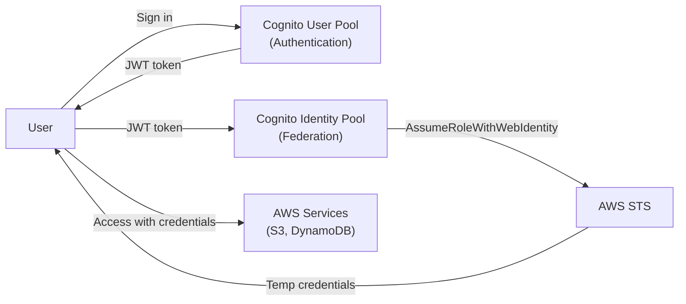

# Cognito — Senior Interview Guide

## User Pools vs Identity Pools

| Feature | User Pool | Identity Pool |
|---------|----------|--------------|
| Purpose | Authentication (who are you?) | Authorization (what can you access?) |
| Stores | User directory, credentials | AWS credential mapping |
| Issues | JWT tokens (ID, access, refresh) | Temporary AWS credentials (STS) |
| External IdP | Yes (Federation: Google, Facebook, SAML, OIDC) | Yes (+ User Pools) |
| Use case | App authentication | Grant AWS service access to users |



---

## User Pool Features

- Managed user directory with sign-up/sign-in
- MFA: SMS, TOTP (software token)
- Password policies, account recovery
- **Triggers**: Lambda pre/post authentication, pre/post sign-up, token customization
- **Hosted UI**: built-in OAuth 2.0/OIDC endpoint; customizable
- **Custom domain**: `auth.example.com`
- User groups with IAM role mapping (for Identity Pool federation)

### Token Types
| Token | Lifetime | Purpose |
|-------|---------|---------|
| ID Token | 1hr (configurable) | Identity claims (name, email, custom attributes) |
| Access Token | 1hr (configurable) | Authorizes API calls; M2M use |
| Refresh Token | 30 days (configurable) | Obtain new ID/Access tokens |

---

## Identity Pool (Federated Identities)

- Exchanges external identity tokens for temporary AWS credentials
- **Authenticated identities**: users from User Pool, Google, Facebook, SAML
- **Unauthenticated identities**: guest access with minimal permissions
- IAM roles: separate for authenticated vs unauthenticated; group-based roles

---

## ALB Authentication with Cognito

```
User → ALB → (redirect to Cognito) → User authenticates → token → ALB verifies → Forward to backend
```
- ALB listener rule: authenticate-cognito action
- Claims passed as headers to backend (no backend code for auth)
- Use for: web applications; not for API clients (redirect-based flow requires browser)

---

## Most Asked Senior Interview Questions

**Q1: User Pool vs Identity Pool — which do you need for a mobile app accessing S3?**
- User Pool: authenticate users (sign in, issue JWT)
- Identity Pool: exchange JWT for AWS temporary credentials
- **Both needed**: User Pool → JWT → Identity Pool → STS credentials → S3
- **Trap**: "Can you use User Pool alone to access S3?" No — User Pool issues JWTs, not AWS credentials; S3 needs STS credentials (from Identity Pool)

**Q2: How do Cognito Lambda triggers enable customization?**
- Pre-signup: custom validation, auto-confirm users, domain-based email restriction
- Post-confirmation: send welcome email, sync to database
- Pre-authentication: deny based on business logic (account suspended, geolocation)
- Post-authentication: log sign-in events
- Pre-token generation: add custom claims to JWT (group memberships, permissions)
- **Trap**: "What if Lambda trigger times out?" Default timeout 5s; if Lambda fails, Cognito denies the operation

**Q3: How do you implement per-user S3 isolation with Cognito Identity Pool?**
```json
{
  "Effect": "Allow",
  "Action": ["s3:GetObject", "s3:PutObject"],
  "Resource": "arn:aws:s3:::my-bucket/users/${cognito-identity.amazonaws.com:sub}/*"
}
```
- `${cognito-identity.amazonaws.com:sub}` = unique Cognito Identity ID per user
- Each user can only access their own prefix in S3
- Policy variable resolved at AssumeRole time by STS

**Q4: How does Cognito handle token refresh and expiry?**
- Access/ID tokens: 1hr default; app calls `InitiateAuth` with refresh token to get new tokens
- Refresh token: 30 days default; when expired, user must re-authenticate
- Token revocation: call `RevokeToken`; revokes refresh token and all associated tokens
- Alarm on failed token refreshes = session management issues

**Q5: SAML federation with Cognito — how does it work?**
- Company uses Okta/AD FS as SAML 2.0 IdP
- User Pool configured as SAML SP (Service Provider)
- Flow: User → Cognito Hosted UI → redirect to Okta → Okta SAML assertion → Cognito → JWT
- Attribute mapping: SAML attributes mapped to Cognito user pool attributes
- **Trap**: "Do SAML-federated users exist in User Pool?" Yes — they become Cognito users with IdP as source

---

## Security Considerations

- **Advanced security features**: adaptive authentication (block suspicious logins), compromised credentials check
- **HTTPS only**: enforce HTTPS for hosted UI and API calls
- **Token expiry**: short access token TTL (1hr); never expose refresh tokens in browser storage
- **MFA enforcement**: require MFA for all users via pool settings
- **App clients**: create separate app clients per application; disable unused auth flows

---

## Quick Revision Bullets

- User Pool = authentication, JWT tokens; Identity Pool = AWS credentials via STS
- Both needed for AWS service access from mobile/web apps
- Lambda triggers: pre/post sign-up, pre/post auth, token customization
- Per-user S3 isolation: IAM policy with `${cognito-identity.amazonaws.com:sub}` variable
- ALB auth: redirect-based; works for browsers; not for API clients
- SAML federation: User Pool acts as SAML SP; IdP (Okta) issues assertions → Cognito issues JWTs
