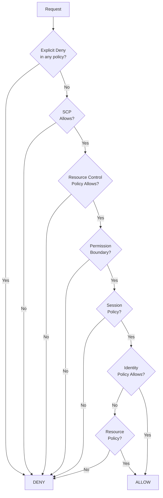
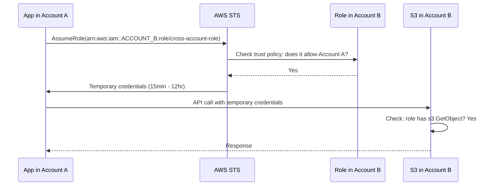
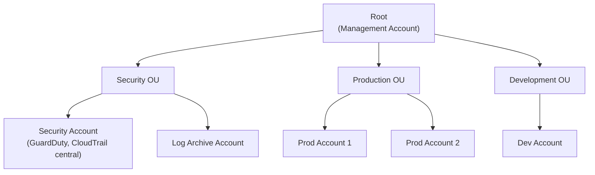

# IAM — Senior Interview Guide

## Core Concepts

- **Identity**: Users, Groups, Roles, Service Accounts
- **Policy**: JSON document defining permissions
- **Principal**: entity making a request (user, role, service, account)
- **Resource**: AWS object being acted on
- **Action**: API operation (e.g., s3:GetObject)
- **Condition**: additional constraints (MFA, IP, time)

### Policy Evaluation Logic



**Evaluation order** (simplified): Explicit Deny → SCP → Resource Control Policy → Permission Boundary → Session Policy → Identity Policy → Resource Policy

---

## Policy Types

| Type | Attached To | Cross-account | Use Case |
|------|------------|--------------|---------|
| Identity (managed/inline) | User/Group/Role | N/A | Grant permissions to principal |
| Resource | AWS resource (S3, SQS, KMS) | Yes | Cross-account + same-account access |
| SCP | OU/Account in Organizations | N/A | Guardrails; can only restrict |
| Permission Boundary | User/Role | N/A | Delegate admin with limits |
| Session | Assume Role with conditions | N/A | Restrict permissions in session |
| Resource Control Policy (RCP) | OU/Account | N/A | Centrally restrict resource access |

---

## Cross-Account Role Assumption



**Trust policy on Role in Account B:**
```json
{
  "Effect": "Allow",
  "Principal": {"AWS": "arn:aws:iam::ACCOUNT_A:root"},
  "Action": "sts:AssumeRole",
  "Condition": {
    "StringEquals": {"sts:ExternalId": "unique-external-id"},
    "Bool": {"aws:MultiFactorAuthPresent": "true"}
  }
}
```

**ExternalId**: prevents confused deputy attack in SaaS cross-account scenarios

---

## Permission Boundaries

- Set **maximum permissions** a role/user can have
- Identity policy AND permission boundary both must allow an action for it to be allowed
- Use case: delegate role creation to developers but prevent privilege escalation
- Example: dev team can create roles for their services, but boundary prevents creating admin roles

---

## Multi-Account Strategy with Organizations



### SCPs (Service Control Policies)
- Attached to OU or account; restrict what actions can be taken (even by root user of member account)
- **Management account is NOT restricted by SCPs** — keep management account clean
- SCPs don't grant permissions; they set guardrails
- Example SCPs:
  - Deny leaving organization
  - Deny disabling CloudTrail
  - Deny creating IAM users with console access
  - Require MFA for sensitive actions
  - Restrict to approved regions only

---

## IAM Best Practices

| Practice | Implementation |
|---------|---------------|
| Least privilege | Start with no permissions; add as needed |
| No long-term keys | Use roles + STS; IAM users only for CI/CD that can't use roles |
| MFA everywhere | Enforce MFA on human users; SCP requiring MFA for sensitive actions |
| Rotate credentials | 90-day rotation policy; use Secrets Manager |
| Permission boundaries | Delegate admin with guardrails |
| CloudTrail | All API calls logged; alert on sensitive actions |
| IAM Access Analyzer | Identify externally-accessible resources |

---

## Most Asked Senior Interview Questions

**Q1: Explain the IAM policy evaluation when both identity policy and resource policy exist**
- Same account: implicit allow from either identity OR resource policy is sufficient
- Cross-account: BOTH identity policy (in requester account) AND resource policy (on resource) must allow
- **Trap**: "If Account A user has S3:GetObject in identity policy but S3 bucket in Account B has no bucket policy, can they access it?" No — cross-account requires both

**Q2: What is the confused deputy attack and how does ExternalId prevent it?**
- Scenario: SaaS provider creates cross-account role for customer A; attacker in customer B tricks SaaS provider to access customer A's resources
- ExternalId: unique identifier that customer sets; trust policy requires ExternalId in AssumeRole call
- Attacker doesn't know Customer A's ExternalId = cannot spoof

**Q3: How do SCPs interact with admin users in member accounts?**
- Even an AdministratorAccess IAM user in a member account is restricted by SCPs
- If SCP denies `s3:DeleteBucket`, admin user cannot delete buckets regardless of IAM policy
- Exception: Management account (root account of org) — not restricted by SCPs
- **Trap**: "Can an account admin user override an SCP?" No — SCPs are organizational guardrails

**Q4: Explain ABAC (Attribute-Based Access Control) in IAM**
- Use tags on resources and principals to control access dynamically
- Example policy: `Condition: {"StringEquals": {"aws:ResourceTag/Project": "${aws:PrincipalTag/Project"}}`
- User tagged `Project=TeamA` can only access resources tagged `Project=TeamA`
- Scales well: no need to update policies when new resources added — just tag them

**Q5: How do you audit who has access to what in a large AWS organization?**
1. **IAM Access Analyzer**: identifies cross-account/external access; generates access findings
2. **IAM Credential Report**: all IAM users, when last used, MFA status
3. **CloudTrail**: audit all API calls; use Athena queries on CT logs
4. **Access Advisor**: service last accessed date per user/role
5. **AWS Config**: track IAM configuration changes over time; rules for compliance
6. **Resource Explorer**: inventory of all resources with access policies

**Q6: IAM Role vs IAM User — when do you use each?**
- **IAM User**: human long-term identity; avoid for applications
- **IAM Role**: assumed by services, EC2, Lambda, EKS pods, cross-account access; temporary credentials
- For applications: always use roles (EC2 instance profile, Lambda execution role, IRSA for EKS)
- **Trap**: "What if an application can't use a role?" Use IAM user with minimal permissions + Secrets Manager to store/rotate keys; but prefer roles always

**Q7: What is IAM Identity Center (SSO) and how does it improve security?**
- Central SSO for AWS accounts and SAML applications
- Integrates with AD/Okta/Azure AD (external IdP)
- Users log in once → access multiple accounts with minimal permission sets
- **Permission Sets**: IAM policies defined centrally; assigned to user+account combination
- Short-lived credentials: sessions expire; no long-term keys
- **vs IAM roles**: Identity Center manages the federation plumbing; simpler for multi-account orgs

---

## Scenario-Based Questions

**Scenario 1: Prevent developers from creating IAM roles with admin permissions**
- Solution: Permission Boundary
  1. Create a boundary policy allowing only specific services/actions
  2. SCP: require `iam:PassRole` only with boundary attached (`iam:PermissionsBoundary` condition)
  3. Allow developers to create roles BUT only if they attach the permission boundary
  4. Boundary prevents created roles from having more than boundary allows

**Scenario 2: Multi-account org — centralized security account needs to read all accounts' CloudTrail**
- CloudTrail Organization Trail: logs all accounts' events to central S3 in logging account
- Security account IAM role: cross-account role with access to logging account S3
- GuardDuty Organization: delegate to security account; all findings aggregated
- Security Hub: centralized security findings across all accounts

---

## Real-world Failure Cases

**1. Privilege escalation via iam:PassRole**
- Developer has `iam:PassRole` without condition on which roles they can pass
- Creates EC2 instance with AdminRole → gains admin access
- Fix: add condition `iam:PassedToService` + `iam:AssociatedResourceArn` to limit PassRole to specific services/roles

**2. Overly broad wildcard permissions**
- `"Action": "s3:*", "Resource": "*"` — developer can access all S3 in account
- Fix: regular IAM Access Analyzer review; AWS Config rule for overly permissive policies

**3. Forgotten IAM user access keys in production**
- Long-term access key not rotated for 2 years; leaked in GitHub
- Fix: enable IAM Credential Report monitoring; CloudTrail alert on key usage; rotate or delete unused keys; enforce 90-day rotation via Config rule

---

## Security Considerations

- **SCP guardrails**: deny region usage outside approved list; deny disabling security services
- **CloudTrail + CloudWatch**: alert on: root account usage, IAM policy changes, console login failures
- **IAM Access Analyzer**: run continuously; review external access findings weekly
- **Permission Boundaries**: delegate safely; prevent privilege escalation
- **Condition keys**: `aws:SourceIp`, `aws:RequestedRegion`, `aws:MultiFactorAuthPresent`, `aws:CalledVia`

---

## Quick Revision Bullets

- Evaluation: Explicit Deny → SCPs → Permission Boundary → Session Policy → Identity Policy → Resource Policy
- Cross-account: BOTH identity policy AND resource policy must allow
- SCPs: guardrails for member accounts; management account not restricted
- ExternalId: prevents confused deputy in cross-account SaaS scenarios
- Permission Boundary: maximum permissions cap on user/role; delegate admin safely
- ABAC: tag-based access; scales without policy updates when resources added
- IAM Identity Center: SSO for multi-account; short-lived credentials; external IdP integration
- Access Analyzer: finds external/cross-account resource access; critical for security audits
