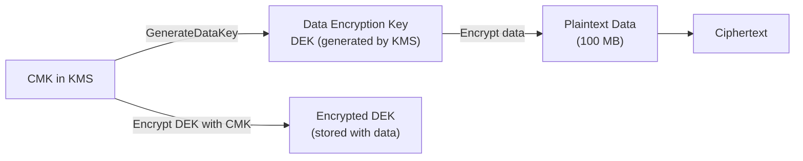

# KMS — Senior Interview Guide

## Key Types

| Type | Managed By | Rotation | Cost | Use Case |
|------|-----------|---------|------|---------|
| AWS Owned Key | AWS | AWS | Free | Default encryption (S3-SSE, etc.) |
| AWS Managed Key | AWS | Auto (yearly) | Free | Per-service keys (aws/s3, aws/rds) |
| Customer Managed Key (CMK) | Customer | Manual or auto (yearly) | $1/month + API | Compliance, cross-account, custom rotation |

---

## Key Material Origin

| Origin | Key Material | Import Allowed | Use Case |
|--------|-------------|---------------|---------|
| KMS | Generated by KMS | No | Standard |
| External (BYOK) | You import | Yes | BYOK compliance requirements |
| Custom Key Store (HSM) | CloudHSM | Yes | FIPS 140-2 Level 3 compliance |

---

## Key Policy vs IAM Policy

- KMS **requires** key policy to allow access — unlike most AWS services
- Even if IAM allows kms:Decrypt, if key policy doesn't allow it → access denied
- Default key policy: allows account root to manage; enables IAM delegation
- If default key policy not enabled: only key policy grants access; IAM cannot delegate

```json
{
  "Sid": "Enable IAM User Permissions",
  "Effect": "Allow",
  "Principal": {"AWS": "arn:aws:iam::ACCOUNT_ID:root"},
  "Action": "kms:*",
  "Resource": "*"
}
```
This statement enables IAM policies to control access — without it, only key policy controls access.

---

## Envelope Encryption



- **Why not encrypt everything with CMK directly?** CMK is only for small data (<4 KB); CMK operations are expensive + throttled
- Envelope encryption: generate DEK for large data; KMS only handles DEK (small, fast)
- **Decrypt flow**: decrypt DEK with CMK → use DEK to decrypt data

---

## Key Rotation

- **Auto rotation**: once per year; keeps old key material to decrypt existing ciphertext
- **Manual rotation**: create new key; update aliases to point to new key; retain old key for historical decryption
- **Alias**: logical name pointing to key ID; use aliases in code instead of key IDs
- After rotation: old key material retained for decryption; new material used for all new encryption

---

## Cross-Account Key Sharing

- Add cross-account principal to key policy: `"Principal": {"AWS": "arn:aws:iam::ACCOUNT_B:root"}`
- User in Account B needs IAM policy allowing KMS operations + key policy allowing Account B
- Use case: share encrypted S3 objects across accounts; cross-account RDS snapshot sharing

---

## KMS Throttling

| Operation | Default TPS |
|-----------|------------|
| Decrypt | 5,500 - 30,000 (varies by region) |
| GenerateDataKey | 5,500 |
| Encrypt | 5,500 |

- S3 with SSE-KMS: every S3 operation = KMS call → throttle at scale
- Fix: **S3 Bucket Key** (reduces KMS calls by ~99% for S3)
- Fix: **DEK caching** (cache decrypted DEK in memory for short period; AWS Encryption SDK)

---

## Most Asked Senior Interview Questions

**Q1: How does KMS protect against an AWS employee accessing your encrypted data?**
- KMS key material is generated and stored in HSMs within KMS service boundary
- AWS employees cannot access your key material or plaintext data
- KMS audit: all API calls logged in CloudTrail — including by whom, when, from where
- **Trap**: "Is CloudHSM more secure than KMS?" CloudHSM gives you single-tenant HSM control (FIPS 140-2 Level 3); KMS is multi-tenant but cryptographically isolated

**Q2: Explain the KMS key hierarchy in EBS encryption**
- CMK (in KMS) → encrypts DEK → DEK encrypts EBS volume data
- Each EBS volume has unique DEK
- DEK is stored encrypted alongside volume metadata
- On mount: EC2 requests KMS to decrypt DEK → DEK stored in instance hypervisor memory → EBS data decrypted/encrypted transparently

**Q3: When would you use a Custom Key Store?**
- Regulatory requirement: FIPS 140-2 Level 3 (CloudHSM provides; KMS standard = Level 2)
- Key material must stay in your controlled HSM
- FedRAMP High, PCI DSS Level 1 environments that require dedicated HSM
- Cost: CloudHSM cluster ~$1.60/hr (much more expensive than KMS)

**Q4: How do you implement KMS key rotation without application downtime?**
- Auto rotation: transparent — AWS rotates key material; old material kept; new material used going forward
- No application changes needed; KMS handles decryption with correct material automatically
- Manual rotation: create new key → update alias → old ciphertexts still decrypt via key ID
- **Trap**: "After rotation, can you decrypt old data?" Yes — KMS keeps all previous key versions for decryption

**Q5: How does KMS integrate with AWS services for encryption?**
- Services call KMS GenerateDataKey during encryption operations
- Services call KMS Decrypt to get DEK for decryption
- You control: which CMK to use; who has access via key policy; audit via CloudTrail
- **Trap**: "If you delete a CMK, what happens to encrypted data?" Data is permanently unrecoverable — schedule for deletion allows 7-30 day waiting period; never delete CMK immediately

**Q6: What are KMS grants and when do you use them?**
- Temporary, programmatic permissions on a CMK
- More flexible than key policy (can be created/revoked programmatically)
- Operations: Decrypt, Encrypt, GenerateDataKey, etc.
- Use case: AWS services create grants automatically (e.g., EC2 grants on EBS CMK); cross-account temporary access
- Grant tokens: used immediately after grant creation (before eventual consistency)

---

## Scenario-Based Questions

**Scenario 1: Multi-account environment — encrypt S3 buckets with central CMK managed in security account**
- Security account: create CMK; key policy allows production accounts
- Production accounts: IAM roles have KMS permissions + key policy allows them
- S3 bucket in prod account: SSE-KMS with security account CMK
- S3 Bucket Key: enable to reduce KMS API calls by 99%
- CloudTrail: all KMS access audited in both accounts

**Scenario 2: Compliance requirement — all data encrypted with CMKs you control; key rotation every 90 days**
- Create CMK with automatic rotation disabled (yearly only for auto)
- Manual rotation every 90 days: create new key → update aliases
- KMS key policy: allow only specific IAM roles to use key
- Config Rule: alert if any CMK hasn't been rotated in 90+ days
- CloudTrail: monitor all Decrypt/Encrypt operations

---

## Real-world Failure Cases

**1. Deleted CMK causing data loss**
- Developer deleted CMK that was encrypting RDS snapshots
- RDS snapshots now unrecoverable
- Fix: never delete CMKs used for encryption; set deletion waiting period max (30 days); use key usage CloudWatch alarm to detect active keys before deletion

**2. KMS throttling degrading application**
- Lambda processing 10K events/sec; each calling KMS Decrypt
- KMS throttle reached; Lambda invocations failing
- Fix: cache decrypted values in Lambda (ElastiCache or /tmp); use AWS Encryption SDK with DEK caching; S3 Bucket Key for S3 operations

**3. Cross-account access denied despite IAM allowing KMS**
- Key policy didn't have cross-account principal
- IAM policy alone is insufficient for KMS cross-account
- Fix: add cross-account account root to key policy; user in target account also needs IAM permission

---

## Cost Optimization

- AWS Managed Keys: free; suitable for most compliance requirements
- CMK: $1/month/key + $0.03/10,000 API calls
- S3 Bucket Key: reduces KMS calls by ~99%; major cost savings for S3-heavy workloads
- DEK caching: reduce KMS calls in application code (AWS Encryption SDK)
- Consolidate: fewer CMKs = lower monthly key cost; use aliases to separate logical namespaces

---

## Security Considerations

- **Key policy always required**: understand default key policy; never remove account root access
- **Least privilege on key usage**: separate keys for separate data classifications
- **CloudTrail monitoring**: alert on: CMK scheduled for deletion, unusual Decrypt volume, cross-account access
- **Key deletion**: always use waiting period; alert on any deletion attempt
- **Multi-region keys**: replicate CMK to multiple regions for cross-region encryption (same key material, different key ARN per region)

---

## Quick Revision Bullets

- AWS Owned = free/opaque; AWS Managed = free/auto-rotate yearly; CMK = $1/mo/key, full control
- Key policy required for CMK access — unlike IAM; key policy AND IAM must both allow
- Envelope encryption: CMK encrypts DEK; DEK encrypts data; CMK only handles small DEK
- S3 Bucket Key: reduces KMS calls by ~99% (batch requests per S3 bucket)
- Rotation: auto = yearly, transparent; manual = new key + alias update
- Never delete CMKs without verifying all encrypted data migrated
- CloudHSM custom key store: FIPS 140-2 Level 3; dedicated HSM; much more expensive
- Cross-account: key policy must allow other account + that account's IAM must allow
