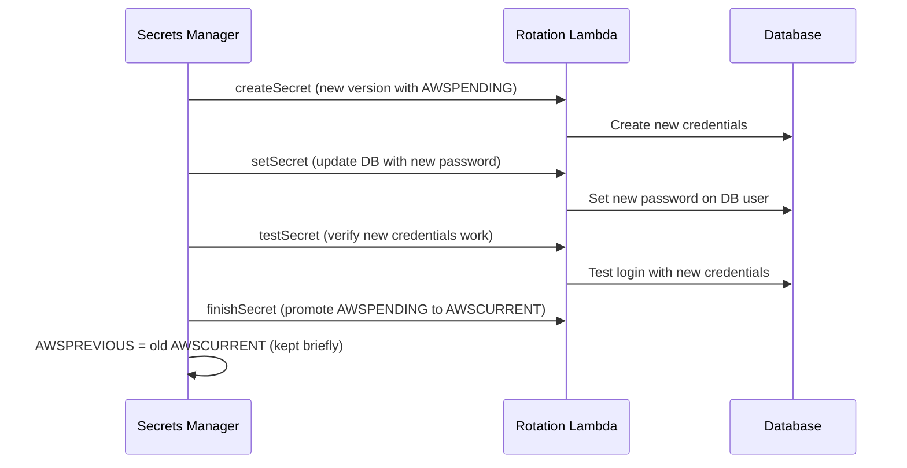

# Secrets Manager — Senior Interview Guide

## Core Features

- Store and manage secrets (DB credentials, API keys, OAuth tokens)
- **Automatic rotation**: built-in support for RDS, Aurora, Redshift, DocumentDB; custom Lambda for others
- **Encryption**: KMS CMK (or AWS managed key)
- **Versioning**: AWSCURRENT, AWSPENDING, AWSPREVIOUS staging labels
- **Cross-account access**: resource policy on secret

---

## Rotation Architecture

**Rotation period**: 1 day to 365 days; trigger immediately or on schedule

---

## vs SSM Parameter Store

| Feature | Secrets Manager | SSM Parameter Store |
|---------|----------------|---------------------|
| Rotation | Built-in | None (manual) |
| Cost | $0.40/secret/month + $0.05/10K API calls | Free (Standard), $0.05/10K (Advanced) |
| Size | 64 KB | 4 KB (Standard), 8 KB (Advanced) |
| Hierarchy | Flat with path naming | Path-based hierarchy |
| Cross-account | Resource policy | No (same account only) |
| Best for | DB passwords, API keys with rotation | Config, non-sensitive params, secrets without rotation |

---

## Most Asked Senior Interview Questions

**Q1: How do you ensure zero-downtime during secret rotation for RDS?**
- Dual-credential approach: create new DB user first; both old and new credentials valid during rotation window
- AWSPENDING contains new credentials; AWSCURRENT contains old
- After successful test: AWSCURRENT promoted (old becomes AWSPREVIOUS)
- AWSPREVIOUS available briefly for connections that cached old credentials
- **Trap**: "What if apps cache the old secret?" Apps should call `GetSecretValue` on connect or cache with short TTL; or use RDS Proxy (automatically gets new credentials after rotation)

**Q2: How do you handle high-frequency secret retrieval in Lambda?**
- Each Lambda invocation calling `GetSecretValue` = expensive + throttleable
- **Solution 1**: cache secret in Lambda global scope (outside handler) with TTL check
- **Solution 2**: use AWS Parameters and Secrets Lambda Extension (sidecar caches secrets; HTTP endpoint on localhost)
- **Solution 3**: RDS Proxy (no credential management in Lambda at all)
- Extension TTL: configurable (default 300s); balance between freshness and API calls

**Q3: Cross-account secret access — how do you configure?**
- Add resource policy to secret: allow cross-account principal
- Requester account: IAM policy allowing `secretsmanager:GetSecretValue`
- KMS key policy: must also allow cross-account if using CMK
- All three must align: secret resource policy + KMS key policy + IAM policy

**Q4: Secrets Manager vs Environment Variables — security comparison?**
- Env vars: visible in Lambda console, stored in plain text in config (except KMS-encrypted)
- Secrets Manager: secrets never in config files; audited access via CloudTrail; rotation
- **Best practice**: no secrets in env vars; reference secret ARN in env var; code calls Secrets Manager at startup

---

## Real-world Failure Cases

**1. Rotation failed — app can't connect to DB**
- Lambda rotation function failed mid-rotation; secret in inconsistent state
- Fix: check rotation Lambda CloudWatch logs; manually set AWSCURRENT to known-good credentials; fix Lambda function

**2. Secrets Manager throttling (10,000 req/10s limit)**
- Lambda cold start spike causing many simultaneous GetSecretValue calls
- Fix: Lambda extension caching; cache in application initialization code

---

## Security Considerations

- **Resource policy**: restrict which accounts/principals can access each secret
- **KMS CMK**: use CMK (not AWS managed) for audit trail + cross-account
- **CloudTrail**: audit all GetSecretValue calls; alert on unusual access patterns
- **Least access**: IAM policy with specific secret ARN (not wildcard)
- **Deletion protection**: enable deletion protection on critical secrets

---

## Quick Revision Bullets

- Rotation: AWSPENDING → test → AWSCURRENT (old becomes AWSPREVIOUS)
- Zero-downtime rotation: dual-user strategy; keep old user valid during transition
- Lambda extension: local cache for secrets; reduces API calls + latency
- Secrets Manager = rotation + audit; SSM Parameter = hierarchy + free for non-sensitive
- Cross-account: secret resource policy + KMS key policy + IAM all must allow
- $0.40/secret/month; cache aggressively to reduce API costs
