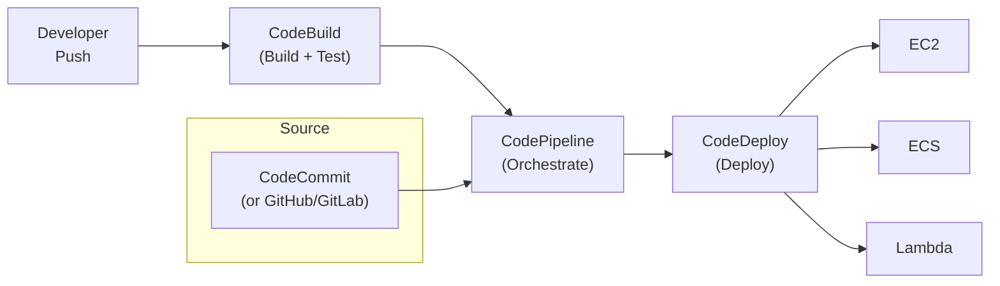

# CI/CD on AWS — Senior Interview Guide

## AWS Native CI/CD Pipeline



---

## CodeBuild

- Managed build service; runs in Docker containers
- `buildspec.yml`: defines phases (install, pre_build, build, post_build)
- Build environments: AWS-managed images or custom Docker image
- **Compute types**: `BUILD_GENERAL1_SMALL` to `BUILD_GENERAL1_2XLARGE`
- VPC support: build within VPC for private resource access
- Cache: S3 or local cache for dependencies (reduces build time)

### buildspec.yml Example
```yaml
version: 0.2
phases:
  install:
    runtime-versions:
      nodejs: 18
  pre_build:
    commands:
      - npm install
      - $(aws ecr get-login-password | docker login --username AWS --password-stdin $REPO)
  build:
    commands:
      - npm test
      - docker build -t $IMAGE_TAG .
      - docker push $IMAGE_TAG
  post_build:
    commands:
      - echo '{"ImageURI":"'$IMAGE_TAG'"}' > imageDefinitions.json
artifacts:
  files:
    - imageDefinitions.json
```

---

## CodeDeploy

### Deployment Types

| Strategy | Description | Zero Downtime | Rollback |
|----------|-------------|--------------|---------|
| In-place | Stop old, deploy new on same instance | No | Re-deploy old revision |
| Rolling | Replace instances in batches | Partial | Automatic |
| Rolling with additional batch | Add batch first, then replace | Yes | Automatic |
| Blue/Green (EC2) | New ASG, swap LB | Yes | Instant (re-swap) |
| Blue/Green (ECS) | New task set, shift traffic | Yes | Instant |
| Lambda (Canary) | % traffic to new version | Yes | Automatic |
| Lambda (Linear) | Gradual % increase | Yes | Automatic |
| Lambda (All-at-once) | 100% instantly | No | Re-deploy |

### Deployment Configuration
- **Minimum healthy hosts**: percentage or count that must remain healthy during deployment
- **Traffic shifting**: CodeDeploy shifts traffic using ALB target groups (ECS) or Lambda aliases
- **Lifecycle hooks**: BeforeInstall, AfterInstall, BeforeAllowTraffic, AfterAllowTraffic

---

## Most Asked Senior Interview Questions

**Q1: How do you implement zero-downtime ECS deployment with rollback?**
- CodeDeploy Blue/Green for ECS:
  1. Deploy new task set (Green) alongside existing (Blue)
  2. Shift small % traffic to Green (canary period)
  3. CloudWatch alarms monitor Green error rate
  4. Auto-rollback: if alarm triggers, CodeDeploy re-shifts to Blue instantly
  5. Validation: custom Lambda hooks for smoke tests
- Rollback = immediate (swap ALB target groups); no re-deployment needed

**Q2: How do you manage secrets in CodeBuild?**
- Never put secrets in buildspec.yml
- Store in SSM Parameter Store or Secrets Manager
- CodeBuild service role: grant access to specific parameters/secrets
- Access in build: `aws secretsmanager get-secret-value --secret-id my-secret`
- Or: environment variables referencing SSM: `name: DB_PASSWORD, valueFrom: arn:aws:ssm:region:account:parameter/db/password`

**Q3: How do you set up multi-environment pipeline (dev → staging → prod)?**
- CodePipeline stages: Source → Build → Deploy-Dev → Approval → Deploy-Staging → Approval → Deploy-Prod
- Manual approval actions between environments
- Per-environment parameters: SSM Parameter Store or CloudFormation parameter overrides
- Artifact passing: CodeBuild output artifact contains image tag; each deploy stage uses same artifact

**Q4: GitHub vs CodeCommit — which do you recommend?**
- CodeCommit: AWS-native, no additional cost, IAM auth, private by default
- GitHub: broader ecosystem (Actions, Marketplace), better developer UX, CODEOWNERS, PR workflows
- Modern recommendation: use GitHub/GitLab + CodePipeline (EventBridge trigger on push)
- **Trap**: "Is CodeCommit being deprecated?" AWS announced no new customers for CodeCommit (2024) — migrate to GitHub/GitLab

---

## Deployment Best Practices

- **Immutable deployments**: deploy to new instances/tasks; never patch in-place
- **Feature flags**: deploy code without enabling features; enable via config
- **Canary analysis**: deploy to 5% traffic; compare error rates; auto-promote or rollback
- **Artifact versioning**: tag Docker images with commit SHA (not `latest`)
- **Infrastructure as Code**: all deployment configs in version control

---

## Quick Revision Bullets

- CodeBuild: build + test; buildspec.yml; VPC support; cache dependencies
- CodeDeploy: Blue/Green = instant rollback; Canary/Linear for Lambda
- CodePipeline: orchestrator; connects source, build, test, deploy stages
- GitHub + CodePipeline via EventBridge: modern approach (CodeCommit no new customers 2024)
- Secrets in CodeBuild: SSM/Secrets Manager via environment variable references
- Multi-environment: pipeline stages with manual approvals between environments
