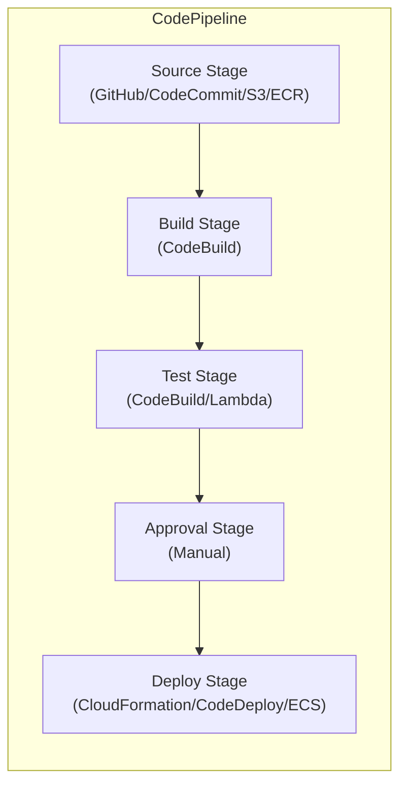

# CodePipeline — Senior Interview Guide

## Architecture

---

## Key Features

- **Event-driven**: triggers on source changes (EventBridge rules for GitHub, S3)
- **Parallel actions**: multiple actions within a stage run in parallel
- **Cross-account**: deploy to different AWS accounts (assume role)
- **Artifact store**: S3 bucket for passing artifacts between stages
- **Pipeline variables**: pass values between stages
- **V2 pipelines**: queue mode (prevents parallel runs), git tags/branches as triggers

---

## Most Asked Senior Interview Questions

**Q1: How do you implement cross-account deployments in CodePipeline?**
- Pipeline in tooling account
- Deploy stage: assume IAM role in target account (cross-account role)
- CloudFormation/CodeDeploy in target account uses cross-account role
- KMS key: pipeline artifact bucket key must allow target account role

**Q2: How do you trigger CodePipeline from GitHub?**
- Old way: CodeStar Connections + webhook
- Modern: GitHub App connection (CodeStar Connections v2); EventBridge trigger
- On push to main branch: EventBridge event → pipeline start
- Filter: branch filter, tag filter (for release pipelines)

**Q3: How do you handle pipeline failures and rollbacks?**
- CodeDeploy: automatic rollback on CloudWatch alarm trigger
- CloudFormation: automatic rollback on deploy failure
- Manual rollback: re-run previous successful pipeline execution
- Notifications: EventBridge rule → SNS → on FAILED pipeline state

**Q4: How do you speed up pipelines?**
- Parallel actions within stages (test unit + integration simultaneously)
- CodeBuild caching: S3 or local dependency cache
- Selective triggers: only run pipeline for relevant path changes
- Container layer caching in CodeBuild: pull existing layers

---

## CodePipeline vs GitHub Actions

| Feature | CodePipeline | GitHub Actions |
|---------|-------------|----------------|
| Hosting | AWS managed | GitHub |
| AWS integration | Native | Via OIDC or access keys |
| Approval gates | Built-in | Environment protection rules |
| Cost | $1/pipeline/month | Free/min-based |
| Ecosystem | AWS-focused | Any language/tool |
| Recommendation | AWS-centric teams | Modern default |

---

## Quick Revision Bullets

- CodePipeline: orchestrator; connects source, build, test, approval, deploy
- V2 pipelines: queue mode (no concurrent runs), tag-based triggers
- Cross-account: IAM role assumption in target account; KMS key sharing
- GitHub trigger: CodeStar Connections + EventBridge rule
- Pipeline artifacts stored in S3; encrypted with KMS
- Parallel actions within a stage reduce total pipeline time
