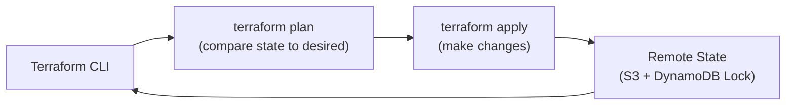

# Terraform on AWS — Senior Interview Guide

## Core Concepts

- **Providers**: plugins for AWS, GCP, Azure, Kubernetes, etc.
- **Resources**: infrastructure objects (`aws_instance`, `aws_s3_bucket`)
- **Data sources**: read existing infrastructure
- **State**: current infrastructure state (local or remote)
- **Modules**: reusable configuration blocks
- **Workspaces**: separate state per environment

---

## State Management



### Remote State Configuration
```hcl
terraform {
  backend "s3" {
    bucket         = "my-terraform-state"
    key            = "prod/network/terraform.tfstate"
    region         = "us-east-1"
    encrypt        = true
    dynamodb_table = "terraform-lock"
  }
}
```
- **S3**: stores state file; enable versioning for rollback
- **DynamoDB**: state locking (prevents concurrent apply)
- **Encryption**: SSE-KMS on S3 bucket

---

## Most Asked Senior Interview Questions

**Q1: Terraform vs CloudFormation — when do you choose Terraform?**
- Terraform: multi-cloud, multi-provider (Kubernetes, Datadog, GitHub), HCL more expressive, large community modules, better for platform teams managing non-AWS resources
- CloudFormation: AWS-native (faster for new AWS services), automatic rollback, no state management overhead, better for AWS-only shops
- **Trap**: "Is Terraform always better?" No — CloudFormation is simpler for AWS-only orgs; no state file to manage

**Q2: How do you handle sensitive values in Terraform?**
- Never hardcode secrets in .tf files
- Use `sensitive = true` on output/variable (masks in logs)
- Data source from Secrets Manager or SSM at plan/apply time
- Environment variables: `TF_VAR_db_password`
- Vault provider: HashiCorp Vault for dynamic secrets
- **Trap**: "Are sensitive values in state file?" Yes — state files may contain sensitive data in plaintext; encrypt S3 state bucket; restrict access to state

**Q3: How do you manage Terraform for multiple environments?**
- Option 1: Workspaces (separate state per workspace; same code)
- Option 2: Directory structure (separate terraform dirs per env; separate state)
- Option 3: Terragrunt (DRY wrapper; keep configuration DRY across envs)
- **Recommendation**: directory structure or Terragrunt for environments with significant config differences; workspaces for simple differences

**Q4: How do you safely destroy production infrastructure in Terraform?**
- `lifecycle { prevent_destroy = true }` on critical resources
- Remove from state instead of destroying: `terraform state rm`
- State backup: S3 versioning allows state recovery
- Require MFA or approval before `terraform destroy` in CI pipeline

**Q5: What happens with Terraform state drift and how do you handle it?**
- Drift: manual changes to infrastructure outside Terraform
- Detection: `terraform plan` shows drift as changes
- Resolution: `terraform import` to bring external resource under Terraform management; or `terraform refresh` to update state
- Prevention: IAM policies restricting console changes; all changes via Terraform

---

## Best Practices

- **State isolation**: separate state file per environment + service
- **Module versions**: pin module versions; never use floating `latest`
- **Plan before apply**: always review plan; integrate in CI/CD (Atlantis, GitHub Actions)
- **Secrets**: use Secrets Manager/Vault data sources; sensitive = true
- **Tagging**: use default tags in provider block; applied to all resources

---

## Quick Revision Bullets

- Remote state: S3 (storage) + DynamoDB (locking) = safe concurrent team use
- sensitive = true: masks output in logs but still stored in state file
- prevent_destroy lifecycle: prevents accidental resource deletion
- Workspaces vs directories: directories preferred for significant env differences
- terraform import: bring existing resource under Terraform management
- Plan in CI/CD: Atlantis or GitHub Actions; require approval for prod applies
