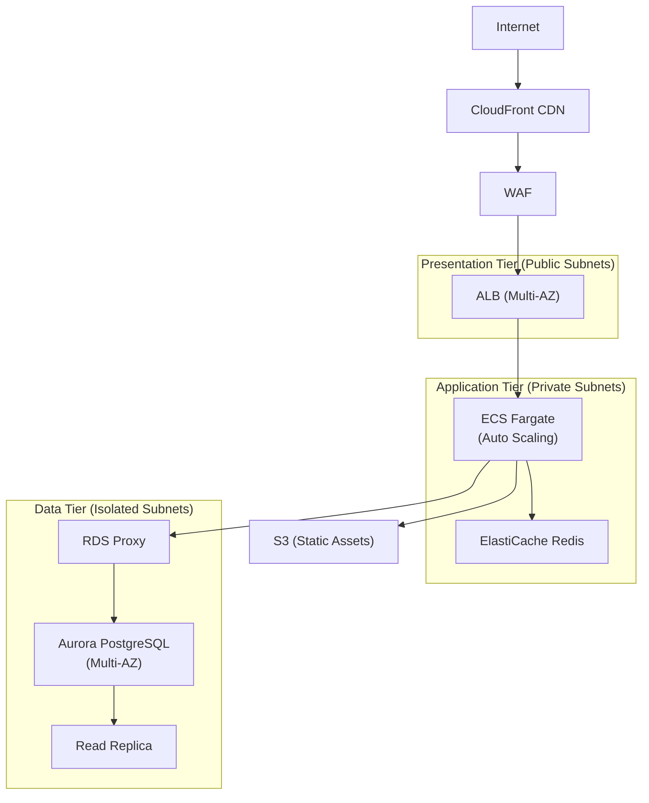

# Three-Tier Web Application Architecture

## Problem Statement
Design a highly available, scalable three-tier web application serving 1 million daily active users with < 200ms p99 latency.

## Architecture Diagram

## Component Explanation
- **CloudFront**: caches static content globally; reduces origin load
- **WAF**: OWASP Top 10 protection; rate limiting per IP
- **ALB**: routes HTTP/HTTPS; health checks; sticky sessions disabled (stateless app)
- **ECS Fargate**: stateless app containers; scales independently
- **ElastiCache Redis**: session store + read-through cache; reduces DB load
- **RDS Proxy**: connection pooling for Fargate tasks; reduces DB connections
- **Aurora PostgreSQL**: primary for writes; reader endpoint for non-critical reads

## Scaling Strategy
- Web tier: CloudFront scales automatically
- App tier: ECS Service Auto Scaling on CPU + ALB RequestCountPerTarget
- Cache tier: ElastiCache Cluster Mode Enabled; add replicas for read scaling
- DB tier: Aurora Auto Scaling readers; RDS Proxy absorbs connection spikes

## Security Considerations
- CloudFront → ALB: enforce `X-Origin-Verify` header; ALB only accepts CloudFront header
- App → DB: TLS in transit; IAM authentication via RDS Proxy
- All tiers in VPC; no public IPs on app/data tiers
- KMS encryption at rest: EBS, Aurora, ElastiCache, S3

## Cost Optimization
- Fargate Spot for non-prod environments (60% savings)
- CloudFront reduces origin data transfer costs
- ElastiCache reduces DB read load (fewer RCUs consumed)
- Reserved Aurora instances for predictable baseline

## Failure Handling
- AZ failure: Multi-AZ ALB + Fargate + Aurora; auto-failover
- DB failure: Aurora failover < 30s; RDS Proxy maintains connections
- Cache failure: app falls through to DB (cache-aside pattern)
- Deploy failure: CodeDeploy Blue/Green; instant rollback

## Interview Talking Points
- "I'd start by separating concerns into 3 tiers for independent scaling"
- "CloudFront is not just CDN — it's DDoS protection and reduces origin load"
- "RDS Proxy is critical for Lambda/Fargate — prevents connection exhaustion"
- "ElastiCache reduces Aurora load; but application must handle cache miss gracefully"

## Alternatives
- Serverless: API Gateway + Lambda + Aurora Serverless (lower ops, higher cold start risk)
- Kubernetes: EKS instead of ECS for K8s ecosystem portability
