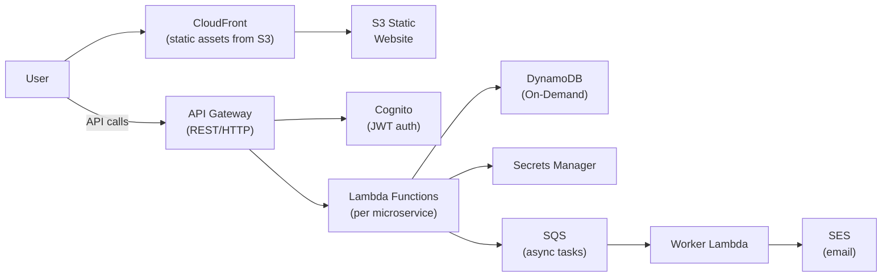

# Serverless Web Application Architecture

## Problem Statement
Design a fully serverless web application for a startup needing near-zero idle cost and automatic scaling from 0 to 100K requests/minute.

## Architecture Diagram

## Component Explanation
- **S3 + CloudFront**: static hosting (React/Vue); CloudFront SSL + caching
- **API Gateway**: managed API endpoint; throttling, auth, request validation
- **Cognito User Pool**: JWT authentication; social login
- **Lambda**: stateless business logic; per-function deployment
- **DynamoDB On-Demand**: no capacity planning; instant scale
- **SQS**: async task queue; decouples API response from background work

## Scaling Strategy
- Everything scales automatically to 0 (pay nothing when idle)
- Lambda: 1,000 concurrent executions default; request increase for higher load
- DynamoDB On-Demand: scales to any read/write volume; no throttling up to 2x peak
- API Gateway: 10,000 RPS default; request increase

## Security Considerations
- Cognito JWT validation by API Gateway (built-in authorizer)
- Lambda: execution role per function (least privilege)
- DynamoDB: VPC endpoint; encryption with CMK
- API Gateway resource policy: restrict to specific IP ranges or VPC if needed

## Cost Optimization
- True pay-per-use: costs $0 when no traffic
- Lambda free tier: 1M invocations/month free
- DynamoDB On-Demand: more expensive than provisioned at sustained high load; switch to provisioned when traffic stabilizes
- Caching at API Gateway: reduce Lambda invocations for read-heavy endpoints

## Failure Handling
- Lambda retry: async invocations retry 2x; configure DLQ
- DynamoDB: highly available by default; on-demand handles spikes without throttling
- SQS DLQ: failed worker messages retained for analysis
- Lambda SnapStart (Java): eliminate cold start for low-latency requirements

## Interview Talking Points
- "Serverless is a great fit for startups — zero idle cost, zero ops overhead"
- "But cold starts matter: JVM runtimes need SnapStart or Provisioned Concurrency"
- "DynamoDB On-Demand is ideal early on; switch to provisioned when traffic patterns stabilize"
- "SQS decouples the API from background work — don't do email sending synchronously"

## Alternatives
- App Runner: if you prefer container-based serverless (no Lambda cold start concern)
- Fargate: if workloads exceed Lambda limits (>15 min, >10 GB RAM)
