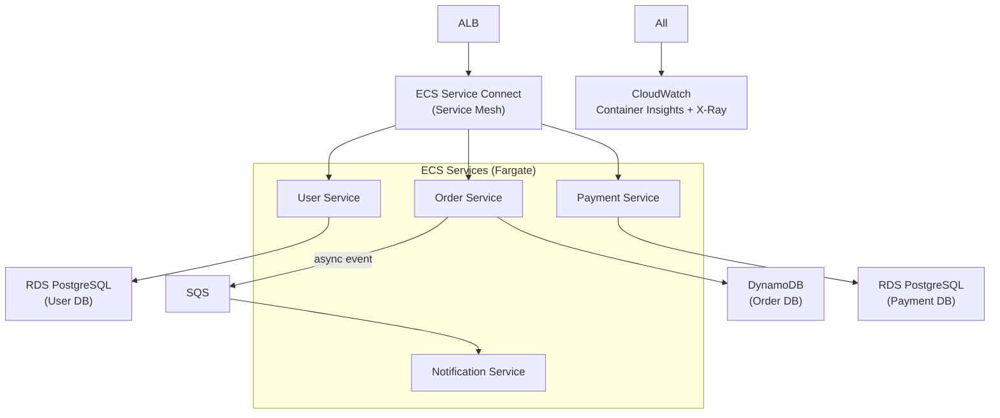

# Microservices on ECS Architecture

## Problem Statement
Decompose a monolith into microservices on ECS with independent deployability, service discovery, and centralized observability.

## Architecture Diagram

## Key Design Decisions
- **Database per service**: each service owns its data store
- **ECS Service Connect**: built-in service discovery + metrics; replaces Cloud Map DNS
- **Async communication**: SQS between services for non-blocking operations
- **ALB path routing**: `/api/users/*` → User Service; `/api/orders/*` → Order Service

## Scaling Strategy
- Per-service auto scaling (Application Auto Scaling)
- Target tracking: CPU or SQS queue depth per service
- Services scale independently; no coordinated scaling needed

## Security
- Task role per service: only accesses its own DB
- Service-to-service: mTLS via Service Connect or App Mesh
- Secrets Manager for DB credentials per service

## Interview Talking Points
- "Service per database is the core of microservices data isolation"
- "Synchronous calls via Service Connect; async via SQS for resilience"
- "ECS Service Connect replaces simple Cloud Map for built-in circuit breaking metrics"
