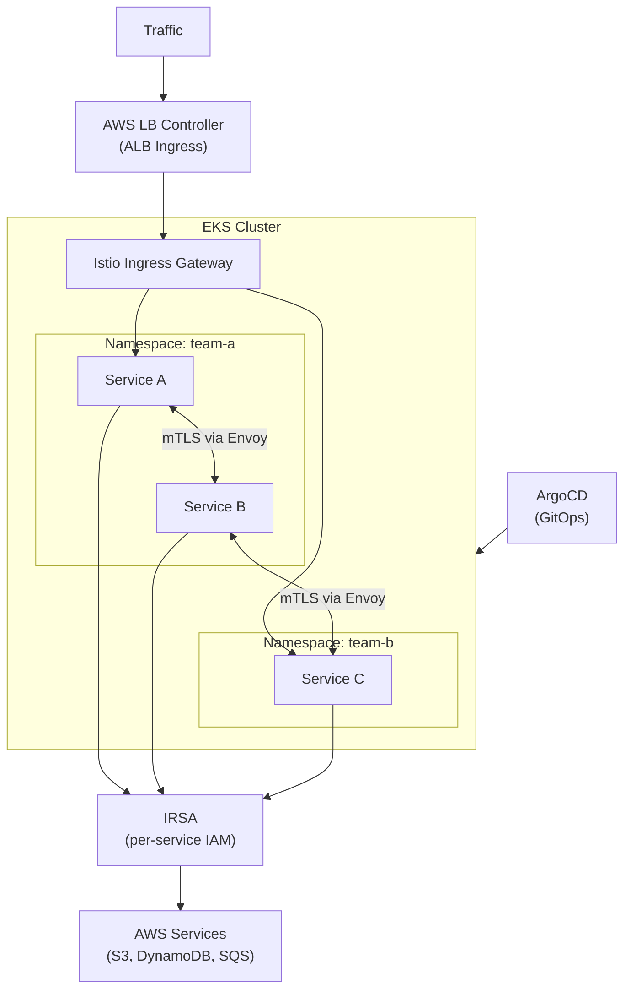

# Microservices on EKS Architecture

## Problem Statement
Deploy Kubernetes-based microservices on EKS with full observability, GitOps deployment, and service mesh.

## Architecture Diagram

## Key Design Decisions
- **IRSA**: per-service IAM roles via service accounts; no shared instance profiles
- **Istio service mesh**: mTLS between services, traffic management, circuit breaking
- **ArgoCD**: GitOps; desired state in Git; auto-reconcile to cluster
- **Namespace isolation**: team-based namespaces with network policies

## Scaling Strategy
- Karpenter: dynamic node provisioning with Spot + On-Demand mix
- HPA: Horizontal Pod Autoscaler on CPU/custom metrics
- KEDA: event-driven scaling (SQS queue depth, etc.)
- VPA: right-size pod resource requests

## Security
- OPA Gatekeeper: admission policies (no privileged, require resource limits)
- Network Policies (Cilium): deny-all default; explicit allow
- PSA: restricted mode for all production namespaces
- IRSA: no instance profile sharing

## Interview Talking Points
- "EKS for K8s ecosystem portability; ECS for AWS-native simplicity"
- "IRSA is the right way to give pods AWS access — never shared instance profiles"
- "ArgoCD GitOps: every deploy is a Git commit; full history and rollback"
- "Karpenter over Cluster Autoscaler: faster, smarter, any instance type"
