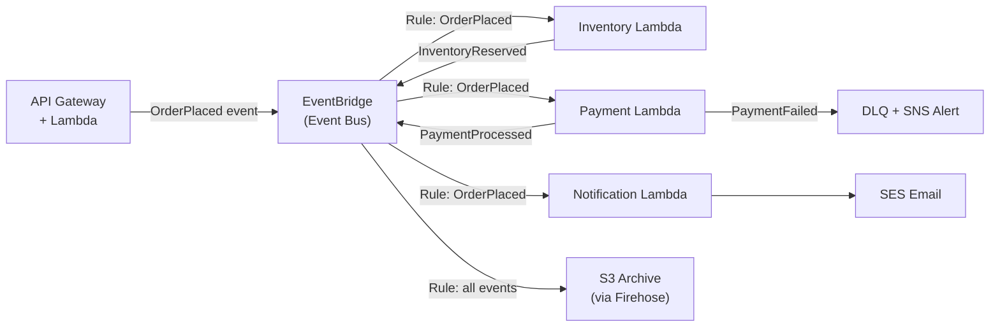

# Event-Driven Architecture

## Problem Statement
Design an event-driven system for an e-commerce platform: order placement triggers inventory, payment, and notification workflows asynchronously.

## Architecture Diagram

## Key Design Decisions
- **EventBridge**: central event bus; content-based routing; schema registry
- **Event schema**: standard envelope with `eventType`, `timestamp`, `correlationId`, `payload`
- **Decoupling**: producers don't know consumers; add new consumers without changing producers
- **Dead Letter Queue**: failed events captured; alert + manual review

## Patterns
- **Saga pattern**: compensating transactions on failure (inventory release if payment fails)
- **Outbox pattern**: DB write + event publish atomically via DynamoDB Streams → EventBridge
- **Event sourcing**: events as source of truth; rebuild state by replaying events

## Failure Handling
- Lambda retry: 2 automatic retries for async invocations
- DLQ: after max retries, send to SQS DLQ for investigation
- Correlation IDs: trace event flow across services
- EventBridge Archive + Replay: replay events to fix bugs or add new consumers retroactively

## Interview Talking Points
- "EventBridge over SNS/SQS for complex routing based on event content"
- "Outbox pattern ensures atomicity between DB write and event publish"
- "Correlation IDs are mandatory for event-driven debugging"
- "EventBridge Archive + Replay is a killer feature: replay historical events to new consumers"
