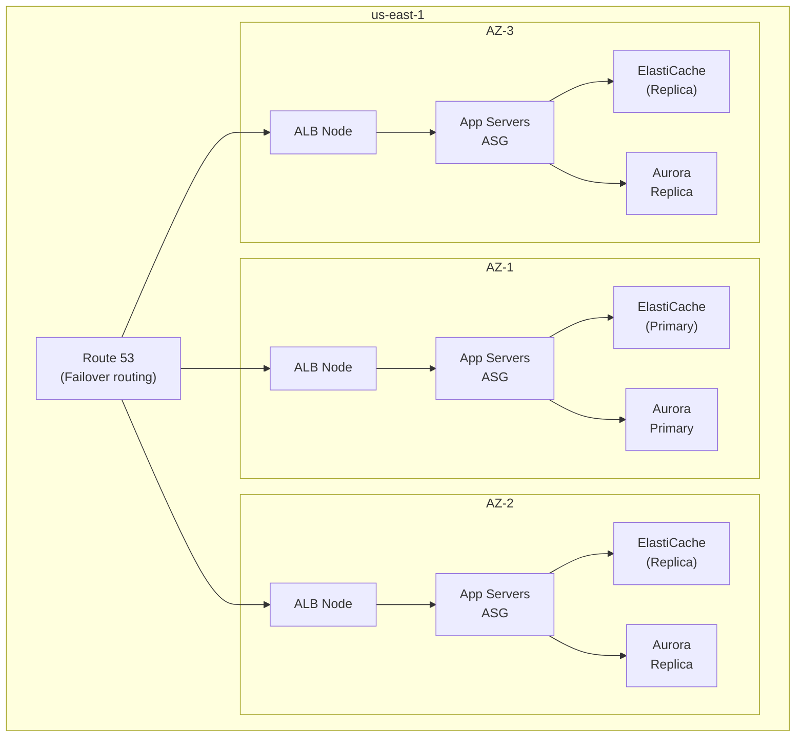

# High Availability Multi-AZ Architecture

## Problem Statement
Design a system achieving 99.99% availability (< 1hr downtime/year) within a single AWS region.

## Architecture Diagram

## High Availability Components

| Component | HA Mechanism | RTO |
|-----------|------------|-----|
| ALB | Multi-AZ native | 0 (auto) |
| EC2/ECS | ASG across 3 AZs | < 5 min |
| ElastiCache | Multi-AZ, auto-failover | < 1 min |
| Aurora | 3-AZ replica | < 30s |
| Route 53 | Health checks + failover | < 60s |
| NAT Gateway | One per AZ | AZ-isolated |

## Design Principles for 99.99%
- Minimum 3 AZs for all stateful services
- No single instance for any tier
- Health checks everywhere (ALB, Route 53, ASG)
- Auto-healing: ASG replaces unhealthy instances automatically
- DB: Aurora Multi-AZ with read replicas (not just Multi-AZ)
- Dependency: map all external dependencies; health check each one

## Interview Talking Points
- "99.99% = 52 min downtime/year; 99.999% = 5 min — know your math"
- "Single AZ failure is the most common scenario; design for it explicitly"
- "NAT Gateway is AZ-specific — one per AZ, not shared"
- "ALB is Multi-AZ automatically but you still need instances in multiple AZs"
