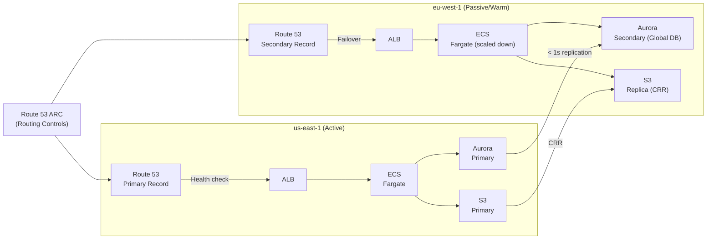

# Multi-Region Failover Architecture

## Problem Statement
Design a multi-region active-passive architecture with RPO < 1 minute and RTO < 5 minutes for a critical financial application.

## Architecture Diagram

## RPO/RTO Targets

| Data | Replication | RPO |
|------|------------|-----|
| Aurora | Global Database (storage-level) | < 1 second |
| S3 | CRR + RTC | < 15 minutes (RTC: guaranteed) |
| ElastiCache | Not replicated (re-warm on failover) | N/A (repopulates) |
| SQS | Messages lost in transit | Use Global Tables or re-send |

## Failover Process
1. Route 53 health check detects primary failure (< 60s)
2. ARC Routing Control: disable primary, enable secondary
3. Aurora Global DB: promote secondary to primary (< 1 min)
4. ECS in secondary: scale up to production capacity
5. DNS TTL: 60s; most traffic on new region within 2 min
- **Total RTO**: ~3-5 minutes

## Key Considerations
- **Data in flight**: requests being processed at failover moment may be lost; use SQS for async work
- **Warm standby**: secondary ECS scaled to 10-20% capacity; can scale up in < 2 min
- **Chaos engineering**: test failover quarterly; use AWS FIS (Fault Injection Simulator)
- **DNS TTL**: must be low (< 60s) before failover to avoid stale DNS caching

## Interview Talking Points
- "RPO and RTO are the first questions — they drive all architecture decisions"
- "Aurora Global Database is the best option for < 1s RPO across regions"
- "ARC Routing Controls give you a manual kill switch independent of health checks"
- "Don't forget about re-warming ElastiCache in secondary — cold cache = DB spike"
