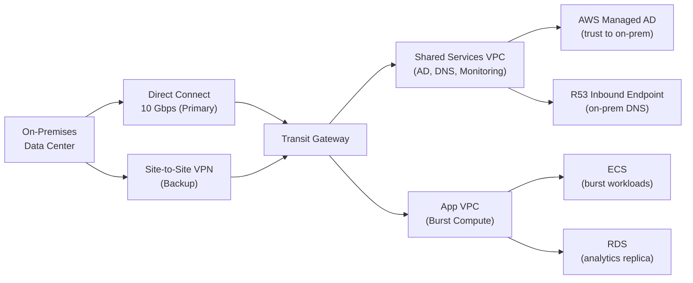

# Hybrid Cloud Architecture

## Problem Statement
Connect on-premises data center to AWS while maintaining data sovereignty, using AWS for burst compute and managed services.

## Architecture Diagram

## Key Design Decisions
- **DX as primary**: consistent low latency; 10 Gbps for heavy workloads
- **VPN as backup**: automatic BGP failover when DX fails
- **TGW**: single connectivity point for all VPCs; on-prem reaches all VPCs through one attachment
- **DNS**: Route 53 Inbound Endpoint for on-prem → AWS DNS resolution
- **Active Directory**: extend on-prem AD to AWS; users authenticate against same directory

## Security Considerations
- DX not encrypted by default; add MACsec (L2) or IPSec (L3)
- TGW route tables: isolate prod/dev/shared-services
- IAM Identity Center: federate with on-prem AD for AWS console access
- Data classification: determine what data can move to AWS vs must stay on-prem

## Interview Talking Points
- "Hybrid is not just connectivity — it's identity, DNS, security, and operational consistency"
- "DX primary + VPN backup: BGP makes failover automatic; test regularly"
- "TGW is the right hub for on-prem → multiple VPC connectivity"
