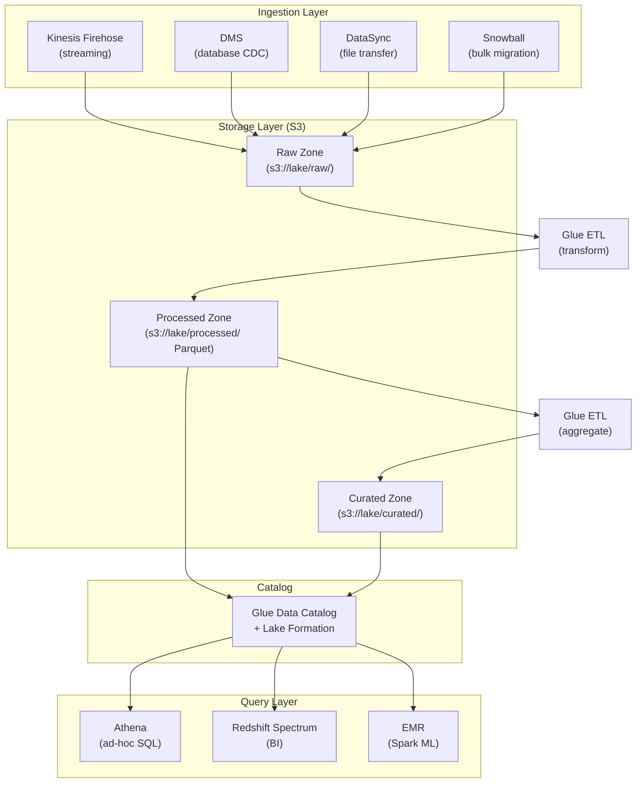

# Data Lake Architecture

## Problem Statement
Build a scalable data lake on AWS ingesting structured and unstructured data from multiple sources for analytics and ML.

## Architecture Diagram

## Zone Strategy
- **Raw**: exact copy of source; immutable; partitioned by source+date
- **Processed**: cleaned, deduplicated, converted to Parquet; schema enforced
- **Curated**: aggregated, joined, business-ready; optimized for specific access patterns

## Lake Formation Security
- Column-level and row-level security on Glue catalog
- Data filters: restrict which rows users see based on IAM attributes
- Cross-account: share catalog databases with other accounts via RAM

## Interview Talking Points
- "Zone design is critical: raw preserves data lineage; processed enables fast queries"
- "Parquet conversion in Glue ETL reduces Athena query costs by 80-95%"
- "Lake Formation is the right access control layer — not just S3 bucket policies"
- "Partition strategy drives query performance: year/month/day for time-series"
