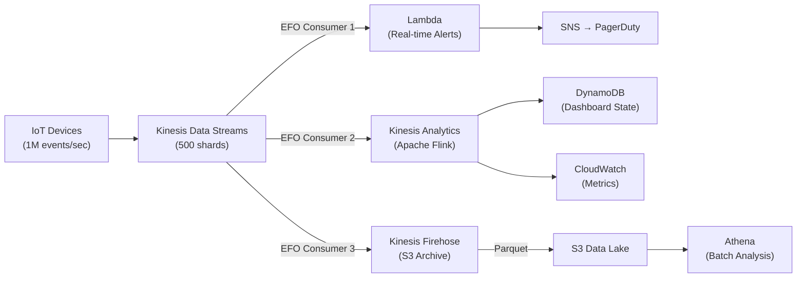

# Streaming Data Pipeline Architecture

## Problem Statement
Process 1 million events per second from IoT devices: real-time alerting, near-real-time dashboards, and archival.

## Architecture Diagram

## Key Design Decisions
- **Kinesis Data Streams**: ordered per-device events; 500 shards = 500 MB/s ingest
- **Enhanced Fan-Out (EFO)**: 3 consumers each get 500 MB/s dedicated (not shared 2 MB/s)
- **Flink (Kinesis Analytics)**: stateful stream processing; windowed aggregations
- **Firehose**: managed delivery to S3; Parquet conversion; no consumer code needed
- **Partition key**: device ID (high cardinality; prevents hot shards)

## Windowed Aggregations with Flink
- Tumbling window: metrics every 1 minute per device
- Sliding window: 5-min average for anomaly detection
- Session window: group events per device session

## Interview Talking Points
- "EFO gives each consumer 2 MB/s per shard — at 500 shards, that's 1 GB/s per consumer"
- "Flink is the right choice for stateful stream processing with exactly-once semantics"
- "Firehose handles the S3 archival path with zero consumer code"
- "Partition key = device ID; never use time-based PK or you'll hot-shard on one time bucket"
