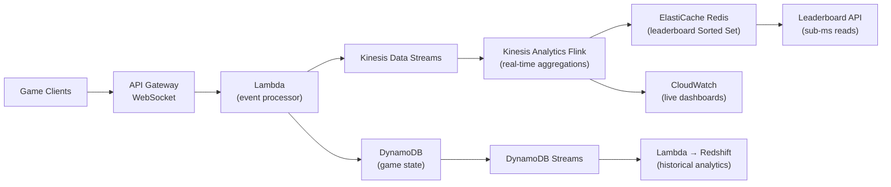

# Real-Time Analytics Architecture

## Problem Statement
Build a real-time analytics platform for a gaming company: leaderboards, session analytics, live event tracking for 10 million concurrent players.

## Architecture Diagram



## Leaderboard with Redis Sorted Sets
```
ZADD leaderboard:global <score> <player_id>   # O(log N)
ZREVRANK leaderboard:global <player_id>        # player's global rank
ZREVRANGE leaderboard:global 0 99 WITHSCORES  # top 100
ZINCRBY leaderboard:global <delta> <player_id> # score update
```

## Scaling at 10M Concurrent Players
- API Gateway WebSocket: horizontal auto-scale
- Lambda: 1,000+ concurrent; request limit increase
- DynamoDB: On-Demand; partition key = player_id (high cardinality)
- Redis: Cluster Mode Enabled; 50 shards × 16,384 slots
- Flink: auto-scaling application (Kinesis Analytics)

## Interview Talking Points
- "Redis Sorted Sets are purpose-built for leaderboards: O(log N) all operations"
- "DynamoDB On-Demand for gaming: spikes at event launch are unpredictable"
- "WebSocket API Gateway for push-based updates without polling"
