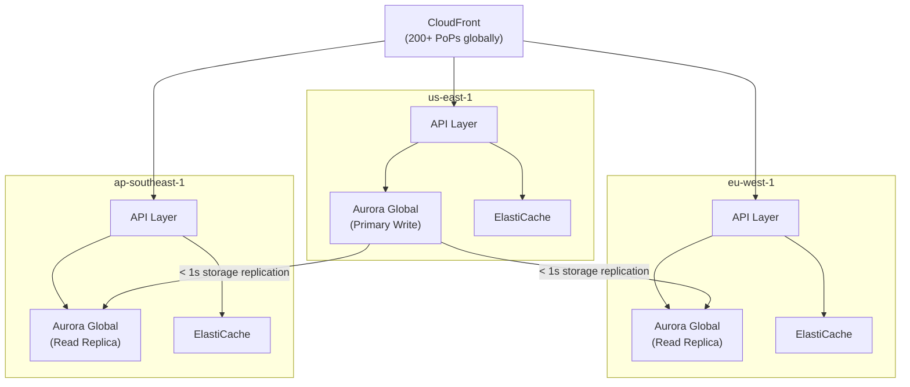

# Global Application Architecture

## Problem Statement
Design a globally distributed application serving users in North America, Europe, and Asia-Pacific with < 50ms latency globally.

## Architecture Diagram

## Latency Optimization
- **CloudFront**: static assets < 5ms from edge PoP
- **Dynamic API**: latency-based Route 53 routing → nearest region
- **Aurora Global DB reads**: EU users read from EU replica (< 1s behind primary)
- **Write routing**: all writes → us-east-1 primary (or use write forwarding)

## Consistency Tradeoffs
- Aurora Global replica: < 1s behind primary
- Users who write then immediately read in different region may see stale data
- Mitigation: session pinning (route user to same region for duration of session); or write forwarding

## Interview Talking Points
- "CloudFront + latency routing + Aurora Global = the global stack"
- "Aurora Global replicas have < 1s lag; acceptable for most reads"
- "Write forwarding adds latency (cross-region write); most apps have way more reads than writes"
- "Consider data residency: EU data must stay in EU for GDPR — regional isolation needed"
