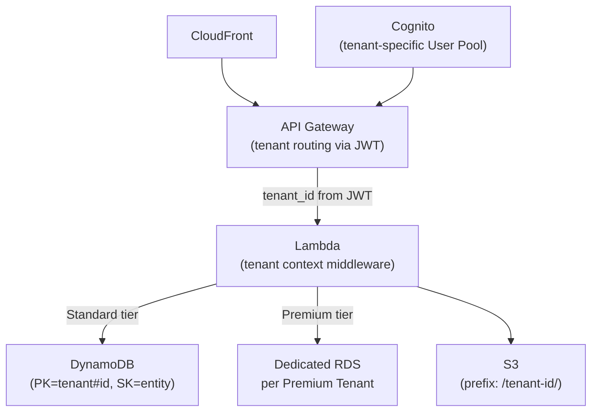

# SaaS Multi-Tenant Architecture

## Problem Statement
Design a multi-tenant SaaS platform with strong tenant isolation, flexible pricing tiers, and shared infrastructure efficiency.

## Tenancy Models

| Model | Isolation | Cost Efficiency | Complexity |
|-------|----------|----------------|-----------|
| Silo | Full (dedicated infra per tenant) | Low | High |
| Pool | Shared infra; logical isolation | High | Medium |
| Bridge | Tiered: premium = silo, standard = pool | Medium | High |

## Architecture Diagram



## Pool Model Data Isolation (DynamoDB)
```
Table: TenantData
PK = TENANT#<tenant_id>
SK = ENTITY#<entity_type>#<entity_id>

IAM Condition (row-level access):
StringEquals: dynamodb:LeadingKeys: "${jwt:tenant_id}"
```
- Every tenant's data has tenant_id as partition key prefix
- IAM policy with `dynamodb:LeadingKeys` condition enforces tenant isolation
- No inter-tenant access possible even with bugs

## Cost Allocation
- Tag all resources with `TenantId`, `Tier`
- Cost Explorer + Cost Allocation Tags: per-tenant cost report
- Tiered pricing: Free = Lambda + DynamoDB On-Demand; Pro = dedicated resources

## Interview Talking Points
- "Pool model is most cost-efficient but requires strict application-level isolation"
- "DynamoDB partition key prefix + IAM LeadingKeys condition = strong row-level isolation"
- "Multi-tenant auth: tenant claim in JWT; validate on every request"
- "Always have a migration path: pool tenant can upgrade to silo (dedicated) tier"
