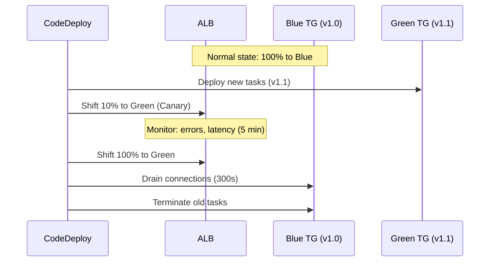

# Blue/Green Deployment Architecture

## Problem Statement
Implement zero-downtime deployments for an ECS application with instant rollback capability.

## Architecture Diagram



## Configuration
```json
{
  "deploymentConfigName": "CodeDeployDefault.ECSCanary10Percent5Minutes",
  "trafficRoutingConfig": {
    "type": "TimeBasedCanary",
    "timeBasedCanary": {
      "canaryPercentage": 10,
      "canaryInterval": 5
    }
  }
}
```

## Rollback Strategy
- **Auto rollback**: CloudWatch alarm on error rate > 1% → CodeDeploy re-shifts to Blue instantly
- **Manual rollback**: rollback in CodeDeploy console → < 30 seconds
- Rollback = re-swap ALB target groups; no re-deploy needed

## Key Decisions
- **Test in canary**: synthetic monitoring, CloudWatch Canaries run against Green during bake time
- **Connection draining**: set `deregistrationDelay` to match app's connection lifetime
- **Validation Lambda hook**: custom smoke test Lambda invoked after canary shift

## Interview Talking Points
- "Blue/green is my default for any production deployment — instant rollback changes everything"
- "The canary period is where you catch issues before full traffic shift"
- "CloudWatch alarms wired to CodeDeploy = automatic rollback on business metrics"
