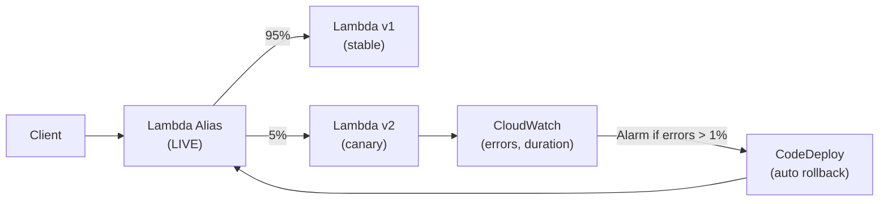

# Canary Deployment for Lambda

## Problem Statement
Deploy Lambda function updates with gradual traffic shifting and automatic rollback based on error rates.

## Architecture Diagram



## Lambda Alias Traffic Splitting
```bash
aws lambda update-alias \
  --function-name my-function \
  --name LIVE \
  --routing-config AdditionalVersionWeights={"2"=0.05}
```

## Deployment Configurations
| Config | Traffic Shift | Use Case |
|--------|-------------|---------|
| AllAtOnce | 100% immediately | Dev/test |
| Canary10Percent5Minutes | 10% → 100% (5 min bake) | Standard production |
| Linear10PercentEvery1Minute | 10% more per minute | Gradual risk |
| Custom | Any% + any interval | Fine-grained control |

## Monitoring During Canary
- CloudWatch Alarm: `Errors` metric on v2 alias > threshold
- X-Ray: compare traces between v1 and v2
- Custom metric: business metrics (conversion rate, error rate)

## Interview Talking Points
- "Lambda alias + CodeDeploy = production-grade canary with 4 lines of config"
- "X-Ray trace comparison between versions is underrated — see latency differences at function level"
- "Auto rollback via CloudWatch alarm = sleep better during deployments"
