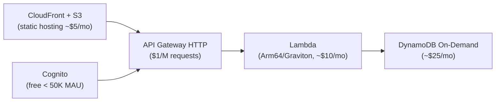

# Cost-Optimized Startup Architecture

## Problem Statement
Launch a startup product on AWS with < $500/month infrastructure cost for first 10,000 users.

## Architecture (Phase 1: 0-10K Users, < $500/month)

**Estimated Monthly Cost:**
| Service | Cost |
|---------|------|
| S3 + CloudFront | $5 |
| API Gateway HTTP | $10 |
| Lambda (Arm64) | $15 |
| DynamoDB On-Demand | $30 |
| Cognito (<50K MAU) | $0 |
| Route 53 | $1 |
| **Total** | **~$61/month** |

## Phase 2: 10K-100K Users (~$500-2000/month)
- Add ElastiCache (t4g.micro = $12/mo)
- Move to ECS Fargate + Spot (lower cost than Lambda at sustained load)
- DynamoDB: consider switching to provisioned + auto-scaling
- Add RDS (t4g.micro = $15/mo for secondary data store)

## Phase 3: 100K-1M Users (~$2000-20K/month)
- ECS Fargate on-demand + Spot mix
- Aurora Serverless v2 (scales 0.5 ACU minimum)
- CloudFront with WAF ($5/WebACL)
- Consider Reserved Instances/Savings Plans

## Cost Optimization Principles
- Start serverless: $0 when not in use
- Graviton/Arm64 everywhere: 20% cheaper
- On-Demand → Reserved when traffic stabilizes (40-60% savings)
- Right-size with CloudWatch metrics before purchasing reservations

## Interview Talking Points
- "Serverless-first for startups: zero idle cost, zero ops"
- "Graviton is a no-brainer: same API, 20% cheaper, often faster"
- "Don't buy Reserved Instances until you know your traffic pattern — wait 3 months"
