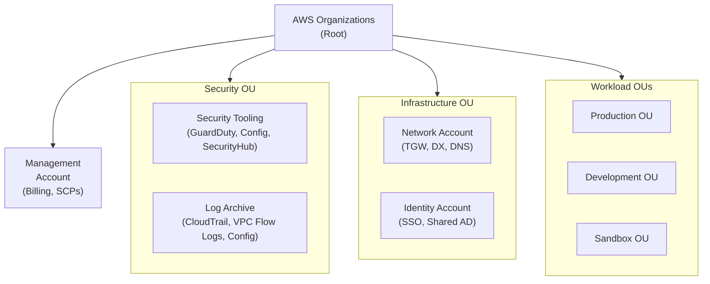

# Enterprise Landing Zone Architecture

## Problem Statement
Design an AWS multi-account landing zone for a 500-person enterprise with security, compliance, and governance.

## Architecture Diagram

## Account Vending Machine (via Control Tower)
- AWS Control Tower: automates landing zone setup
- Account Factory (via Service Catalog or Terraform): self-service account creation
- Baseline: automatically apply SCPs, baseline IAM, GuardDuty enrollment, Config rules

## SCP Guardrails

| Guardrail | SCP |
|----------|-----|
| Deny root access | Deny all actions for root user |
| Require MFA | Deny non-MFA actions for IAM users |
| Restrict regions | Deny actions outside approved regions |
| Deny leaving Org | Deny organizations:LeaveOrganization |
| Immutable logs | Deny CloudTrail delete/stop |
| Cost control | Deny large instance types in sandbox |

## Network Architecture
- TGW in Network account (shared via RAM)
- Each workload account VPC attached to TGW
- DX in Network account; all accounts access on-prem via TGW
- Egress VPC: centralized NAT + inspection

## Interview Talking Points
- "Management account must be clean: no workloads, just billing and Organization management"
- "SCPs are guardrails, not permission grants — they restrict what member accounts can do"
- "Centralized logging is non-negotiable: CloudTrail org trail → immutable S3 in log account"
- "Control Tower automates landing zone setup but understand what it's doing"
