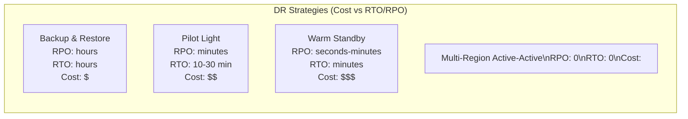
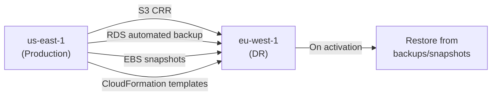

# Disaster Recovery Strategy

## DR Strategies Comparison

| Strategy | Description | When to Use |
|----------|-------------|-------------|
| Backup & Restore | Restore from backups in DR region | Non-critical; RPO/RTO hours acceptable |
| Pilot Light | Core services running minimal in DR; scale up on activation | Moderate criticality; < 30 min RTO |
| Warm Standby | Scaled-down production running in DR; scale up in minutes | High criticality; < 15 min RTO |
| Active-Active | Full production in both regions; instant failover | Mission-critical; < 1 min RTO |

## Backup & Restore Architecture

## Key Services for DR
- **AWS Backup**: centralized backup for EC2, RDS, DynamoDB, EFS, S3
- **Aurora Global Database**: < 1s RPO; promote secondary in < 1 min
- **S3 CRR**: cross-region object replication; RTC for 15-min SLA
- **Route 53**: DNS-based failover; health checks; ARC routing controls
- **CloudFormation/Terraform**: infrastructure as code = reproducible environments
- **DRS (Elastic Disaster Recovery)**: continuous block-level replication of servers

## DR Testing (Critical)
- Run DR failover drill quarterly
- AWS FIS (Fault Injection Simulator): inject failures systematically
- Document RTO/RPO actual measurements; compare to targets
- Chaos engineering: controlled production failure injection

## Interview Talking Points
- "Most teams pick the wrong DR strategy because they don't account for RTO testing"
- "Backup & Restore is cheap but RTO is hours — know your SLA before choosing"
- "Aurora Global DB is the best Aurora DR option: < 1s RPO, managed failover"
- "DR that's never been tested is not DR — quarterly drills are mandatory"
