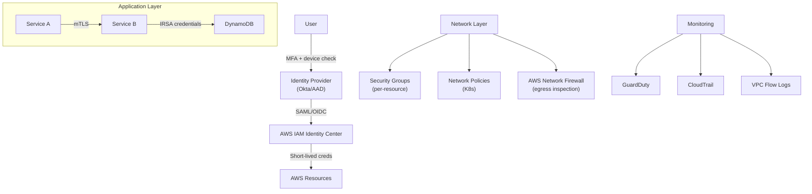

# Zero Trust Networking Architecture

## Problem Statement
Implement zero trust network architecture on AWS: never trust, always verify, regardless of network location.

## Zero Trust Principles Applied to AWS

| Principle | AWS Implementation |
|-----------|-------------------|
| Verify explicitly | IAM, Cognito, mTLS, service mesh |
| Least privilege | IAM least privilege, SGs, NACLs, OPA |
| Assume breach | GuardDuty, CloudTrail, VPC Flow Logs, X-Ray |
| Micro-segmentation | SGs per resource, Network Policies (K8s) |
| Encrypt everything | TLS in transit, KMS at rest |

## Architecture Diagram

## Key Controls
- **Identity**: MFA enforced; short-lived credentials (< 1hr); no long-term access keys
- **Network**: default deny; explicit allow; micro-segmentation via SGs per resource
- **Data**: encrypt at rest (KMS) and in transit (TLS 1.2+); no plaintext transmission
- **Monitoring**: log everything; alert on anomalies; assume breach mindset

## Interview Talking Points
- "Zero trust is a mindset, not a product — it's about continuous verification"
- "SGs per resource (not per tier) is micro-segmentation in AWS"
- "IMDSv2 + no long-term keys + IRSA = zero trust for workload identity"
- "Assume breach: GuardDuty + CloudTrail + X-Ray = detect lateral movement"
