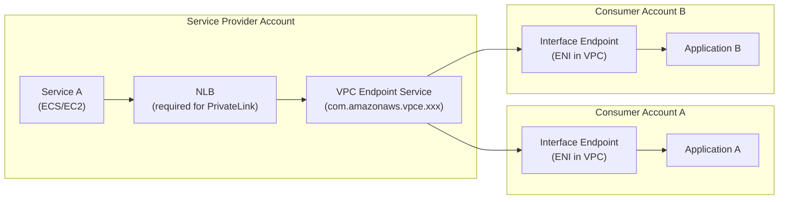

# AWS PrivateLink Architecture

## Problem Statement
Expose internal microservices to consumers (same account, cross-account, or partner accounts) securely without VPC peering or public exposure.

## Architecture Diagram

## How PrivateLink Works
1. Provider creates NLB in front of service
2. Provider creates VPC Endpoint Service linked to NLB
3. Consumer creates Interface VPC Endpoint (gets private DNS)
4. Consumer accesses service via private IP (stays within AWS network)
5. No route table changes, no peering, no CIDR conflicts

## Key Advantages over VPC Peering
- Works with overlapping CIDRs
- Expose only specific service (not entire VPC)
- No transitive routing concerns
- Scale to millions of consumers

## Use Cases
- AWS marketplace products
- SaaS providers exposing APIs to customers
- Internal platform services (centralized auth, logging APIs)
- Cross-account service sharing without full VPC peering

## Interview Talking Points
- "PrivateLink = service-level sharing; VPC Peering = network-level sharing"
- "PrivateLink solves the overlapping CIDR problem that blocks VPC peering"
- "NLB is required between your service and the endpoint service — it's the load balancer for PrivateLink"
- "Interface endpoints cost $0.01/hr + $0.01/GB — factor into SaaS cost model"
