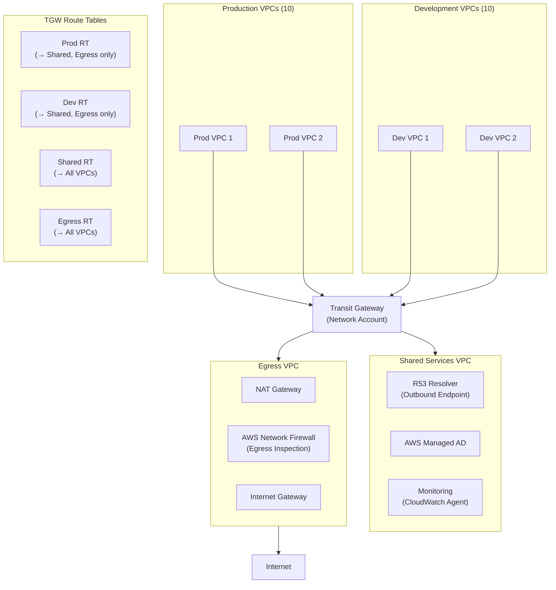

# Transit Gateway Hub-Spoke Architecture

## Problem Statement
Connect 50+ VPCs across 3 AWS accounts with centralized egress, inspection, and DNS.

## Architecture Diagram

## Route Table Segmentation
- **Prod RT**: propagates Shared + Egress only; Prod VPCs cannot reach Dev
- **Dev RT**: propagates Shared + Egress only; Dev VPCs cannot reach Prod
- **Shared RT**: propagates all VPCs; Shared Services reachable from everyone
- **Egress RT**: propagates all VPCs; Egress VPC reachable from everyone

## Centralized Egress with Inspection
1. All VPCs: `0.0.0.0/0 → TGW`
2. TGW routes to Egress VPC
3. Egress VPC: traffic hits Network Firewall → NAT Gateway → IGW
4. Network Firewall: DNS filtering, domain-based allow/deny, TLS inspection

## Interview Talking Points
- "Centralized egress = single NAT Gateway (cost savings) + single inspection point"
- "TGW route tables are the segmentation mechanism; not ACLs or SGs"
- "Shared Services VPC is accessible from all; Prod and Dev cannot reach each other"
- "RAM sharing: one TGW serves multiple accounts — owner manages route tables"
